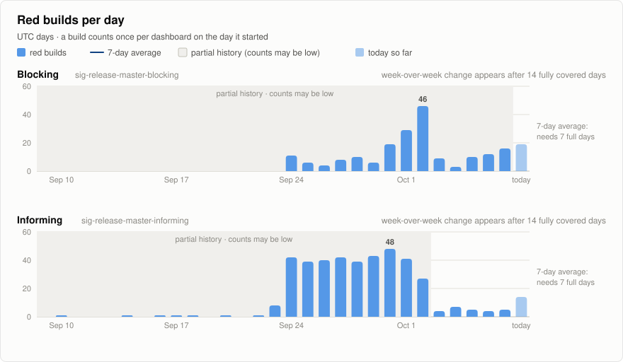
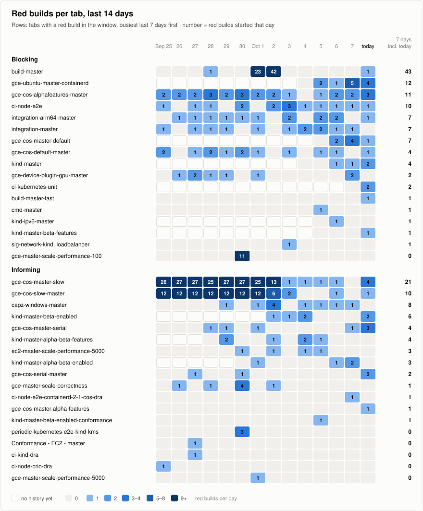

# Red TestGrid builds

Updated 2026-10-09T03:16:05Z. Every build with a red cell on sig-release-master-blocking and sig-release-master-informing; times are UTC. Each run's downloads are in its own folder under [runs/](runs/). A file marked provisional was taken before Prow finished uploading; it is compared with GCS on every run and fetched again if GCS changes.

<picture>
  <source media="(prefers-color-scheme: dark)" srcset="charts/trend-dark.svg">
  
</picture>

<picture>
  <source media="(prefers-color-scheme: dark)" srcset="charts/tabs-dark.svg">
  
</picture>

Red builds per tab (table)

| Dashboard | Tab | 7 days incl. today | 14 days |
|---|---|---:|---:|
| Blocking | gce-ubuntu-master-containerd | 13 | 13 |
| Blocking | gce-cos-alphafeatures-master | 10 | 26 |
| Blocking | ci-node-e2e | 8 | 14 |
| Blocking | integration-master | 8 | 12 |
| Blocking | integration-arm64-master | 7 | 13 |
| Blocking | gce-cos-master-default | 7 | 7 |
| Blocking | gce-cos-default-master | 4 | 11 |
| Blocking | kind-master | 4 | 4 |
| Blocking | gce-device-plugin-gpu-master | 2 | 8 |
| Blocking | ci-kubernetes-unit | 2 | 2 |
| Blocking | kind-master-beta-features | 2 | 2 |
| Blocking | build-master | 1 | 67 |
| Blocking | build-master-fast | 1 | 1 |
| Blocking | cmd-master | 1 | 1 |
| Blocking | kind-ipv6-master | 1 | 1 |
| Blocking | sig-network-kind, loadbalancer | 1 | 1 |
| Blocking | gce-master-scale-performance-100 | 0 | 11 |
| Informing | gce-cos-master-slow | 9 | 180 |
| Informing | gce-cos-master-serial | 6 | 9 |
| Informing | capz-windows-master | 5 | 11 |
| Informing | kind-master-beta-enabled | 5 | 6 |
| Informing | gce-cos-slow-master | 4 | 82 |
| Informing | kind-master-alpha-beta-enabled | 4 | 5 |
| Informing | kind-master-alpha-beta-features | 3 | 6 |
| Informing | gce-cos-serial-master | 3 | 5 |
| Informing | ec2-master-scale-performance-5000 | 2 | 4 |
| Informing | ci-node-e2e-containerd-2-1-cos-dra | 1 | 1 |
| Informing | gce-cos-master-alpha-features | 1 | 1 |
| Informing | kind-master-beta-enabled-conformance | 1 | 1 |
| Informing | gce-master-scale-correctness | 0 | 7 |
| Informing | periodic-kubernetes-e2e-kind-kms | 0 | 3 |
| Informing | Conformance - EC2 - master | 0 | 1 |
| Informing | ci-kind-dra | 0 | 1 |
| Informing | gce-master-scale-performance-5000 | 0 | 1 |

Daily counts (table)

| Day (UTC) | Blocking | Informing |
|---|---:|---:|
| 2026-10-09 | 0 (today so far) | 2 (today so far) |
| 2026-10-08 | 22 (partial) | 17 (partial) |
| 2026-10-07 | 16 (partial) | 5 |
| 2026-10-06 | 12 (partial) | 4 |
| 2026-10-05 | 10 (partial) | 5 |
| 2026-10-04 | 3 (partial) | 7 |
| 2026-10-03 | 9 (partial) | 4 |
| 2026-10-02 | 46 (partial) | 27 (partial) |
| 2026-10-01 | 29 (partial) | 41 (partial) |
| 2026-09-30 | 19 (partial) | 48 (partial) |
| 2026-09-29 | 6 (partial) | 43 (partial) |
| 2026-09-28 | 10 (partial) | 39 (partial) |
| 2026-09-27 | 8 (partial) | 42 (partial) |
| 2026-09-26 | 4 (partial) | 40 (partial) |
| 2026-09-25 | 6 (partial) | 39 (partial) |
| 2026-09-24 | 11 (partial) | 42 (partial) |
| 2026-09-23 | 0 (partial) | 8 (partial) |
| 2026-09-22 | 0 (partial) | 1 (partial) |
| 2026-09-21 | 0 (partial) | 0 (partial) |
| 2026-09-20 | 0 (partial) | 1 (partial) |
| 2026-09-19 | 0 (partial) | 0 (partial) |
| 2026-09-18 | 0 (partial) | 1 (partial) |
| 2026-09-17 | 0 (partial) | 1 (partial) |
| 2026-09-16 | 0 (partial) | 1 (partial) |
| 2026-09-15 | 0 (partial) | 0 (partial) |
| 2026-09-14 | 0 (partial) | 1 (partial) |
| 2026-09-13 | 0 (partial) | 0 (partial) |
| 2026-09-12 | 0 (partial) | 0 (partial) |
| 2026-09-11 | 0 (partial) | 0 (partial) |
| 2026-09-10 | 0 (partial) | 1 (partial) |

## Runs in the last 14 days

| Run (UTC) | New builds | Updated | Result |
|---|---:|---:|---|
| [2026-10-09 03:15:54](runs/2026-10/2026-10-09T031554Z/) | 8 | 0 | ok |
| [2026-10-08 20:39:58](runs/2026-10/2026-10-08T203958Z/) | 2 | 0 | ok |
| [2026-10-08 19:44:35](runs/2026-10/2026-10-08T194435Z/) | 0 | 0 | ok |
| [2026-10-08 19:25:22](runs/2026-10/2026-10-08T192522Z/) | 621 | 0 | ok |

## Builds from the last 14 days

518 archived builds that started since 2026-09-26 (UTC), newest first.

### 2026-10-09

| Time | Tab | Build | Red tests | Files |
|---|---|---|---|---|
| 01:20 | informing#kind-master-alpha-beta-enabled | [ci-kubernetes-e2e-kind-alpha-beta-enabled 2108366866593353728](https://prow.k8s.io/view/gs/kubernetes-ci-logs/logs/ci-kubernetes-e2e-kind-alpha-beta-enabled/2108366866593353728) | ci-kubernetes-e2e-kind-alpha-beta-enabled.Overall | [build-log.txt.gz](runs/2026-10/2026-10-09T031554Z/ci-kubernetes-e2e-kind-alpha-beta-enabled/2108366866593353728/build-log.txt.gz) (provisional) |
| 01:11 | informing#capz-windows-master | [ci-kubernetes-e2e-capz-master-windows 2108364602046681088](https://prow.k8s.io/view/gs/kubernetes-ci-logs/logs/ci-kubernetes-e2e-capz-master-windows/2108364602046681088) | Kubernetes e2e suite.\[It\] \[sig-auth\] \[FeatureGate:ClusterTrustBundle\] \[FeatureGate:Cluster (+1) | [build-log.txt.gz](runs/2026-10/2026-10-09T031554Z/ci-kubernetes-e2e-capz-master-windows/2108364602046681088/build-log.txt.gz) (provisional) |

### 2026-10-08

| Time | Tab | Build | Red tests | Files |
|---|---|---|---|---|
| 21:39 | blocking#integration-master | [ci-kubernetes-integration-master 2108311249702883328](https://prow.k8s.io/view/gs/kubernetes-ci-logs/logs/ci-kubernetes-integration-master/2108311249702883328) | \[sig-auth\] k8s.io/kubernetes/test/integration.auth (+1) | [build-log.txt.gz](runs/2026-10/2026-10-09T031554Z/ci-kubernetes-integration-master/2108311249702883328/build-log.txt.gz) |
| 21:22 | blocking#gce-ubuntu-master-containerd | [ci-kubernetes-e2e-ubuntu-gce-containerd 2108306969688281088](https://prow.k8s.io/view/gs/kubernetes-ci-logs/logs/ci-kubernetes-e2e-ubuntu-gce-containerd/2108306969688281088) | kubetest.diffResources (+1) | [build-log.txt.gz](runs/2026-10/2026-10-09T031554Z/ci-kubernetes-e2e-ubuntu-gce-containerd/2108306969688281088/build-log.txt.gz) |
| 21:16 | informing#gce-cos-master-serial | [ci-kubernetes-e2e-gci-gce-serial 2108305461039075328](https://prow.k8s.io/view/gs/kubernetes-ci-logs/logs/ci-kubernetes-e2e-gci-gce-serial/2108305461039075328) | Kubernetes e2e suite.\[It\] \[sig-storage\] CSI Volumes \[Driver: pd.csi.storage.gke.io\] \[Provi (+2) | [build-log.txt.gz](runs/2026-10/2026-10-09T031554Z/ci-kubernetes-e2e-gci-gce-serial/2108305461039075328/build-log.txt.gz) (provisional) |
| 19:58 | blocking#gce-cos-alphafeatures-master | [ci-kubernetes-e2e-gce-cos-alphafeatures-master 2108285830593253376](https://prow.k8s.io/view/gs/kubernetes-ci-logs/logs/ci-kubernetes-e2e-gce-cos-alphafeatures-master/2108285830593253376) | kubetest.TearDown (+2) | [build-log.txt.gz](runs/2026-10/2026-10-09T031554Z/ci-kubernetes-e2e-gce-cos-alphafeatures-master/2108285830593253376/build-log.txt.gz) |
| 19:41 | blocking#kind-master-beta-features | [ci-kubernetes-e2e-kind-beta-features 2108281300413583360](https://prow.k8s.io/view/gs/kubernetes-ci-logs/logs/ci-kubernetes-e2e-kind-beta-features/2108281300413583360) | Kubernetes e2e suite.\[It\] \[sig-storage\] PersistentVolumes NFS with multiple PVs and PVCs a (+1) | [build-log.txt.gz](runs/2026-10/2026-10-08T203958Z/ci-kubernetes-e2e-kind-beta-features/2108281300413583360/build-log.txt.gz) |
| 19:13 | informing#gce-cos-master-slow | [ci-kubernetes-e2e-gci-gce-slow 2108274507192995840](https://prow.k8s.io/view/gs/kubernetes-ci-logs/logs/ci-kubernetes-e2e-gci-gce-slow/2108274507192995840) | Kubernetes e2e suite.\[It\] \[sig-network\] LoadBalancers ExternalTrafficPolicy: Local \[Featur (+2) | [build-log.txt.gz](runs/2026-10/2026-10-08T203958Z/ci-kubernetes-e2e-gci-gce-slow/2108274507192995840/build-log.txt.gz) |
| 18:12 | informing#gce-cos-master-slow | [ci-kubernetes-e2e-gci-gce-slow 2108259154840784896](https://prow.k8s.io/view/gs/kubernetes-ci-logs/logs/ci-kubernetes-e2e-gci-gce-slow/2108259154840784896) | Kubernetes e2e suite.\[It\] \[sig-network\] LoadBalancers \[Feature:LoadBalancer\] should be abl (+2) | [build-log.txt.gz](runs/2026-10/2026-10-08T192522Z/ci-kubernetes-e2e-gci-gce-slow/2108259154840784896/build-log.txt.gz) |
| 17:56 | blocking#gce-ubuntu-master-containerd | [ci-kubernetes-e2e-ubuntu-gce-containerd 2108255127948234752](https://prow.k8s.io/view/gs/kubernetes-ci-logs/logs/ci-kubernetes-e2e-ubuntu-gce-containerd/2108255127948234752) | ci-kubernetes-e2e-ubuntu-gce-containerd.Overall | [build-log.txt.gz](runs/2026-10/2026-10-08T192522Z/ci-kubernetes-e2e-ubuntu-gce-containerd/2108255127948234752/build-log.txt.gz) |
| 17:11 | informing#gce-cos-serial-master | [ci-kubernetes-e2e-gce-cos-serial-master 2108243802819923968](https://prow.k8s.io/view/gs/kubernetes-ci-logs/logs/ci-kubernetes-e2e-gce-cos-serial-master/2108243802819923968) | Kubernetes e2e suite.\[It\] \[sig-apps\] Daemon set should surge pods onto nodes when spec was (+2) | [build-log.txt.gz](runs/2026-10/2026-10-09T031554Z/ci-kubernetes-e2e-gce-cos-serial-master/2108243802819923968/build-log.txt.gz) |
| 16:57 | informing#kind-master-beta-enabled | [ci-kubernetes-e2e-kind-beta-enabled 2108240282037260289](https://prow.k8s.io/view/gs/kubernetes-ci-logs/logs/ci-kubernetes-e2e-kind-beta-enabled/2108240282037260289) | ci-kubernetes-e2e-kind-beta-enabled.Pod (+1) | [podinfo.json](runs/2026-10/2026-10-08T192522Z/ci-kubernetes-e2e-kind-beta-enabled/2108240282037260289/podinfo.json) |
| 16:47 | blocking#integration-arm64-master | [ci-kubernetes-integration-arm64-master 2108237764653748224](https://prow.k8s.io/view/gs/kubernetes-ci-logs/logs/ci-kubernetes-integration-arm64-master/2108237764653748224) | ci-kubernetes-integration-arm64-master.Pod (+1) | [podinfo.json](runs/2026-10/2026-10-08T192522Z/ci-kubernetes-integration-arm64-master/2108237764653748224/podinfo.json) |
| 16:07 | informing#gce-cos-master-alpha-features | [ci-kubernetes-e2e-gci-gce-alpha-features 2108227697611116544](https://prow.k8s.io/view/gs/kubernetes-ci-logs/logs/ci-kubernetes-e2e-gci-gce-alpha-features/2108227697611116544) | kubetest.Up (+1) | [build-log.txt.gz](runs/2026-10/2026-10-08T192522Z/ci-kubernetes-e2e-gci-gce-alpha-features/2108227697611116544/build-log.txt.gz) |
| 16:06 | informing#gce-cos-master-serial | [ci-kubernetes-e2e-gci-gce-serial 2108227445176930304](https://prow.k8s.io/view/gs/kubernetes-ci-logs/logs/ci-kubernetes-e2e-gci-gce-serial/2108227445176930304) | Kubernetes e2e suite.\[It\] \[sig-storage\] CSI Volumes \[Driver: pd.csi.storage.gke.io\] \[Provi (+2) | [build-log.txt.gz](runs/2026-10/2026-10-09T031554Z/ci-kubernetes-e2e-gci-gce-serial/2108227445176930304/build-log.txt.gz) |
| 15:54 | blocking#build-master | [ci-kubernetes-build 2108224426771222528](https://prow.k8s.io/view/gs/kubernetes-ci-logs/logs/ci-kubernetes-build/2108224426771222528) | ci-kubernetes-build.Pod (+1) | [podinfo.json](runs/2026-10/2026-10-08T192522Z/ci-kubernetes-build/2108224426771222528/podinfo.json) |
| 15:50 | blocking#gce-cos-alphafeatures-master | [ci-kubernetes-e2e-gce-cos-alphafeatures-master 2108223423254630400](https://prow.k8s.io/view/gs/kubernetes-ci-logs/logs/ci-kubernetes-e2e-gce-cos-alphafeatures-master/2108223423254630400) | kubetest.TearDown (+2) | [build-log.txt.gz](runs/2026-10/2026-10-08T192522Z/ci-kubernetes-e2e-gce-cos-alphafeatures-master/2108223423254630400/build-log.txt.gz) |
| 15:44 | blocking#build-master-fast | [ci-kubernetes-build-fast 2108221405156872192](https://prow.k8s.io/view/gs/kubernetes-ci-logs/logs/ci-kubernetes-build-fast/2108221405156872192) | ci-kubernetes-build-fast.Pod (+1) | [podinfo.json](runs/2026-10/2026-10-08T192522Z/ci-kubernetes-build-fast/2108221405156872192/podinfo.json) |
| 15:41 | blocking#kind-master-beta-features | [ci-kubernetes-e2e-kind-beta-features 2108220901790060544](https://prow.k8s.io/view/gs/kubernetes-ci-logs/logs/ci-kubernetes-e2e-kind-beta-features/2108220901790060544) | ci-kubernetes-e2e-kind-beta-features.Pod (+1) | [podinfo.json](runs/2026-10/2026-10-08T192522Z/ci-kubernetes-e2e-kind-beta-features/2108220901790060544/podinfo.json) |
| 14:28 | blocking#gce-cos-default-master | [ci-kubernetes-e2e-gce-cos-default-master 2108202783202086912](https://prow.k8s.io/view/gs/kubernetes-ci-logs/logs/ci-kubernetes-e2e-gce-cos-default-master/2108202783202086912) | kubetest.diffResources (+1) | [build-log.txt.gz](runs/2026-10/2026-10-08T192522Z/ci-kubernetes-e2e-gce-cos-default-master/2108202783202086912/build-log.txt.gz) |
| 14:22 | informing#gce-cos-master-slow | [ci-kubernetes-e2e-gci-gce-slow 2108201272271179776](https://prow.k8s.io/view/gs/kubernetes-ci-logs/logs/ci-kubernetes-e2e-gci-gce-slow/2108201272271179776) | Kubernetes e2e suite.\[It\] \[sig-network\] LoadBalancers ExternalTrafficPolicy: Local \[Featur (+2) | [build-log.txt.gz](runs/2026-10/2026-10-08T192522Z/ci-kubernetes-e2e-gci-gce-slow/2108201272271179776/build-log.txt.gz) |
| 13:52 | informing#gce-cos-master-slow | [ci-kubernetes-e2e-gci-gce-slow 2108193724059095040](https://prow.k8s.io/view/gs/kubernetes-ci-logs/logs/ci-kubernetes-e2e-gci-gce-slow/2108193724059095040) | kubetest.Up (+1) | [build-log.txt.gz](runs/2026-10/2026-10-08T192522Z/ci-kubernetes-e2e-gci-gce-slow/2108193724059095040/build-log.txt.gz) |
| 13:50 | blocking#gce-cos-alphafeatures-master | [ci-kubernetes-e2e-gce-cos-alphafeatures-master 2108193219895365632](https://prow.k8s.io/view/gs/kubernetes-ci-logs/logs/ci-kubernetes-e2e-gce-cos-alphafeatures-master/2108193219895365632) | kubetest.Up (+1) | [build-log.txt.gz](runs/2026-10/2026-10-08T192522Z/ci-kubernetes-e2e-gce-cos-alphafeatures-master/2108193219895365632/build-log.txt.gz) |
| 13:17 | blocking#kind-master | [ci-kubernetes-e2e-kind 2108184663477456896](https://prow.k8s.io/view/gs/kubernetes-ci-logs/logs/ci-kubernetes-e2e-kind/2108184663477456896) | Kubernetes e2e suite.\[It\] \[sig-storage\] PersistentVolumes NFS with Single PV - PVC pairs c (+1) | [build-log.txt.gz](runs/2026-10/2026-10-08T192522Z/ci-kubernetes-e2e-kind/2108184663477456896/build-log.txt.gz) |
| 13:00 | blocking#gce-cos-master-default | [ci-kubernetes-e2e-gci-gce 2108180654662356992](https://prow.k8s.io/view/gs/kubernetes-ci-logs/logs/ci-kubernetes-e2e-gci-gce/2108180654662356992) | kubetest.Up (+1) | [build-log.txt.gz](runs/2026-10/2026-10-08T192522Z/ci-kubernetes-e2e-gci-gce/2108180654662356992/build-log.txt.gz) |
| 12:26 | informing#gce-cos-serial-master | [ci-kubernetes-e2e-gce-cos-serial-master 2108172083153342464](https://prow.k8s.io/view/gs/kubernetes-ci-logs/logs/ci-kubernetes-e2e-gce-cos-serial-master/2108172083153342464) | Kubernetes e2e suite.\[It\] \[sig-storage\] CSI Volumes \[Driver: pd.csi.storage.gke.io\] \[Provi (+4) | [build-log.txt.gz](runs/2026-10/2026-10-08T192522Z/ci-kubernetes-e2e-gce-cos-serial-master/2108172083153342464/build-log.txt.gz) |
| 11:16 | blocking#kind-master | [ci-kubernetes-e2e-kind 2108154464115363840](https://prow.k8s.io/view/gs/kubernetes-ci-logs/logs/ci-kubernetes-e2e-kind/2108154464115363840) | Kubernetes e2e suite.\[It\] \[sig-api-machinery\] Garbage collector should support orphan dele (+2) | [build-log.txt.gz](runs/2026-10/2026-10-08T192522Z/ci-kubernetes-e2e-kind/2108154464115363840/build-log.txt.gz) |
| 10:46 | informing#gce-cos-master-serial | [ci-kubernetes-e2e-gci-gce-serial 2108146913382502400](https://prow.k8s.io/view/gs/kubernetes-ci-logs/logs/ci-kubernetes-e2e-gci-gce-serial/2108146913382502400) | Kubernetes e2e suite.\[It\] \[sig-storage\] CSI Volumes \[Driver: pd.csi.storage.gke.io\] \[Provi (+2) | [build-log.txt.gz](runs/2026-10/2026-10-08T192522Z/ci-kubernetes-e2e-gci-gce-serial/2108146913382502400/build-log.txt.gz) |
| 10:43 | blocking#ci-node-e2e | [ci-kubernetes-node-e2e-containerd 2108146159338917888](https://prow.k8s.io/view/gs/kubernetes-ci-logs/logs/ci-kubernetes-node-e2e-containerd/2108146159338917888) | kubetest.Node Tests (+1) | [build-log.txt.gz](runs/2026-10/2026-10-08T192522Z/ci-kubernetes-node-e2e-containerd/2108146159338917888/build-log.txt.gz) |
| 07:53 | informing#gce-cos-slow-master | [ci-kubernetes-e2e-gce-cos-slow-master 2108103376502788096](https://prow.k8s.io/view/gs/kubernetes-ci-logs/logs/ci-kubernetes-e2e-gce-cos-slow-master/2108103376502788096) | Kubernetes e2e suite.\[It\] \[sig-network\] LoadBalancers ExternalTrafficPolicy: Local \[Featur (+2) | [build-log.txt.gz](runs/2026-10/2026-10-08T192522Z/ci-kubernetes-e2e-gce-cos-slow-master/2108103376502788096/build-log.txt.gz) |
| 07:35 | blocking#ci-kubernetes-unit | [ci-kubernetes-unit 2108098342939529216](https://prow.k8s.io/view/gs/kubernetes-ci-logs/logs/ci-kubernetes-unit/2108098342939529216) | \[sig-api-machinery\] k8s.io/client-go/tools.remotecommand (+1) | [build-log.txt.gz](runs/2026-10/2026-10-08T192522Z/ci-kubernetes-unit/2108098342939529216/build-log.txt.gz) |
| 06:56 | informing#kind-master-beta-enabled | [ci-kubernetes-e2e-kind-beta-enabled 2108088780979179520](https://prow.k8s.io/view/gs/kubernetes-ci-logs/logs/ci-kubernetes-e2e-kind-beta-enabled/2108088780979179520) | Kubernetes e2e suite.\[It\] \[sig-storage\] PersistentVolumes NFS with multiple PVs and PVCs a (+1) | [build-log.txt.gz](runs/2026-10/2026-10-08T192522Z/ci-kubernetes-e2e-kind-beta-enabled/2108088780979179520/build-log.txt.gz) |
| 06:32 | blocking#ci-kubernetes-unit | [ci-kubernetes-unit 2108082993485582336](https://prow.k8s.io/view/gs/kubernetes-ci-logs/logs/ci-kubernetes-unit/2108082993485582336) | \[sig-api-machinery\] k8s.io/client-go/tools.remotecommand (+1) | [build-log.txt.gz](runs/2026-10/2026-10-08T192522Z/ci-kubernetes-unit/2108082993485582336/build-log.txt.gz) |
| 05:55 | blocking#gce-ubuntu-master-containerd | [ci-kubernetes-e2e-ubuntu-gce-containerd 2108073680289402880](https://prow.k8s.io/view/gs/kubernetes-ci-logs/logs/ci-kubernetes-e2e-ubuntu-gce-containerd/2108073680289402880) | Kubernetes e2e suite.\[It\] \[sig-apps\] Deployment should not disrupt a cloud load-balancer's (+2) | [build-log.txt.gz](runs/2026-10/2026-10-08T192522Z/ci-kubernetes-e2e-ubuntu-gce-containerd/2108073680289402880/build-log.txt.gz) |
| 05:48 | blocking#gce-cos-alphafeatures-master | [ci-kubernetes-e2e-gce-cos-alphafeatures-master 2108071920288141312](https://prow.k8s.io/view/gs/kubernetes-ci-logs/logs/ci-kubernetes-e2e-gce-cos-alphafeatures-master/2108071920288141312) | kubetest.Timeout (+2) | [build-log.txt.gz](runs/2026-10/2026-10-08T192522Z/ci-kubernetes-e2e-gce-cos-alphafeatures-master/2108071920288141312/build-log.txt.gz) |
| 05:36 | informing#gce-cos-master-slow | [ci-kubernetes-e2e-gci-gce-slow 2108068900443787264](https://prow.k8s.io/view/gs/kubernetes-ci-logs/logs/ci-kubernetes-e2e-gci-gce-slow/2108068900443787264) | Kubernetes e2e suite.\[It\] \[sig-network\] LoadBalancers \[Feature:LoadBalancer\] should be abl (+2) | [build-log.txt.gz](runs/2026-10/2026-10-08T192522Z/ci-kubernetes-e2e-gci-gce-slow/2108068900443787264/build-log.txt.gz) |
| 05:24 | informing#gce-cos-master-serial | [ci-kubernetes-e2e-gci-gce-serial 2108065878695219200](https://prow.k8s.io/view/gs/kubernetes-ci-logs/logs/ci-kubernetes-e2e-gci-gce-serial/2108065878695219200) | Kubernetes e2e suite.\[It\] \[sig-storage\] \[Provider:gce\] \[LinuxOnly\] NonGracefulNodeShutdown (+2) | [build-log.txt.gz](runs/2026-10/2026-10-08T192522Z/ci-kubernetes-e2e-gci-gce-serial/2108065878695219200/build-log.txt.gz) |
| 05:14 | blocking#gce-ubuntu-master-containerd | [ci-kubernetes-e2e-ubuntu-gce-containerd 2108063362054098944](https://prow.k8s.io/view/gs/kubernetes-ci-logs/logs/ci-kubernetes-e2e-ubuntu-gce-containerd/2108063362054098944) | Kubernetes e2e suite.\[It\] \[sig-apps\] Deployment should not disrupt a cloud load-balancer's (+2) | [build-log.txt.gz](runs/2026-10/2026-10-08T192522Z/ci-kubernetes-e2e-ubuntu-gce-containerd/2108063362054098944/build-log.txt.gz) |
| 02:28 | informing#gce-cos-serial-master | [ci-kubernetes-e2e-gce-cos-serial-master 2108021599901847552](https://prow.k8s.io/view/gs/kubernetes-ci-logs/logs/ci-kubernetes-e2e-gce-cos-serial-master/2108021599901847552) | Kubernetes e2e suite.\[It\] \[sig-storage\] CSI Volumes \[Driver: pd.csi.storage.gke.io\] \[Provi (+2) | [build-log.txt.gz](runs/2026-10/2026-10-08T192522Z/ci-kubernetes-e2e-gce-cos-serial-master/2108021599901847552/build-log.txt.gz) |
| 00:55 | blocking#gce-ubuntu-master-containerd | [ci-kubernetes-e2e-ubuntu-gce-containerd 2107998181609443328](https://prow.k8s.io/view/gs/kubernetes-ci-logs/logs/ci-kubernetes-e2e-ubuntu-gce-containerd/2107998181609443328) | kubetest.Up (+1) | [build-log.txt.gz](runs/2026-10/2026-10-08T192522Z/ci-kubernetes-e2e-ubuntu-gce-containerd/2107998181609443328/build-log.txt.gz) |
| 00:12 | informing#gce-cos-master-serial | [ci-kubernetes-e2e-gci-gce-serial 2107987361420808192](https://prow.k8s.io/view/gs/kubernetes-ci-logs/logs/ci-kubernetes-e2e-gci-gce-serial/2107987361420808192) | Kubernetes e2e suite.\[It\] \[sig-storage\] CSI Volumes \[Driver: pd.csi.storage.gke.io\] \[Provi (+2) | [build-log.txt.gz](runs/2026-10/2026-10-08T192522Z/ci-kubernetes-e2e-gci-gce-serial/2107987361420808192/build-log.txt.gz) |

### 2026-10-07

| Time | Tab | Build | Red tests | Files |
|---|---|---|---|---|
| 23:43 | blocking#gce-cos-alphafeatures-master | [ci-kubernetes-e2e-gce-cos-alphafeatures-master 2107980062216163328](https://prow.k8s.io/view/gs/kubernetes-ci-logs/logs/ci-kubernetes-e2e-gce-cos-alphafeatures-master/2107980062216163328) | kubetest.TearDown (+2) | [build-log.txt.gz](runs/2026-10/2026-10-08T192522Z/ci-kubernetes-e2e-gce-cos-alphafeatures-master/2107980062216163328/build-log.txt.gz) |
| 21:30 | blocking#gce-device-plugin-gpu-master | [ci-kubernetes-e2e-gce-device-plugin-gpu 2107946591313727488](https://prow.k8s.io/view/gs/kubernetes-ci-logs/logs/ci-kubernetes-e2e-gce-device-plugin-gpu/2107946591313727488) | Kubernetes e2e suite.\[It\] \[sig-node\] \[Feature:GPUDevicePlugin\] Sanity test using nvidia-sm (+2) | [build-log.txt.gz](runs/2026-10/2026-10-08T192522Z/ci-kubernetes-e2e-gce-device-plugin-gpu/2107946591313727488/build-log.txt.gz) |
| 20:23 | blocking#gce-cos-master-default | [ci-kubernetes-e2e-gci-gce 2107929729767051264](https://prow.k8s.io/view/gs/kubernetes-ci-logs/logs/ci-kubernetes-e2e-gci-gce/2107929729767051264) | Kubernetes e2e suite.\[It\] \[sig-api-machinery\] CustomResourceDefinition resources \[Privileg (+2) | [build-log.txt.gz](runs/2026-10/2026-10-08T192522Z/ci-kubernetes-e2e-gci-gce/2107929729767051264/build-log.txt.gz) |
| 20:00 | blocking#gce-ubuntu-master-containerd | [ci-kubernetes-e2e-ubuntu-gce-containerd 2107923944337051648](https://prow.k8s.io/view/gs/kubernetes-ci-logs/logs/ci-kubernetes-e2e-ubuntu-gce-containerd/2107923944337051648) | Kubernetes e2e suite.\[It\] \[sig-apps\] Deployment should not disrupt a cloud load-balancer's (+2) | [build-log.txt.gz](runs/2026-10/2026-10-08T192522Z/ci-kubernetes-e2e-ubuntu-gce-containerd/2107923944337051648/build-log.txt.gz) |
| 18:11 | informing#ci-node-e2e-containerd-2-1-cos-dra | [ci-node-e2e-containerd-2-1-cos-dra 2107896510585769984](https://prow.k8s.io/view/gs/kubernetes-ci-logs/logs/ci-node-e2e-containerd-2-1-cos-dra/2107896510585769984) | kubetest2.Test (+1) | [build-log.txt.gz](runs/2026-10/2026-10-08T192522Z/ci-node-e2e-containerd-2-1-cos-dra/2107896510585769984/build-log.txt.gz) |
| 16:31 | blocking#gce-cos-master-default | [ci-kubernetes-e2e-gci-gce 2107871344631746560](https://prow.k8s.io/view/gs/kubernetes-ci-logs/logs/ci-kubernetes-e2e-gci-gce/2107871344631746560) | Kubernetes e2e suite.\[It\] \[sig-storage\] PersistentVolumes NFS with Single PV - PVC pairs c (+2) | [build-log.txt.gz](runs/2026-10/2026-10-08T192522Z/ci-kubernetes-e2e-gci-gce/2107871344631746560/build-log.txt.gz) |
| 16:07 | informing#capz-windows-master | [ci-kubernetes-e2e-capz-master-windows 2107865305916116992](https://prow.k8s.io/view/gs/kubernetes-ci-logs/logs/ci-kubernetes-e2e-capz-master-windows/2107865305916116992) | Kubernetes e2e suite.\[It\] \[sig-auth\] Projected PodCertificate \[FeatureGate:PodCertificateR (+6) | [build-log.txt.gz](runs/2026-10/2026-10-08T192522Z/ci-kubernetes-e2e-capz-master-windows/2107865305916116992/build-log.txt.gz) |
| 15:43 | blocking#gce-cos-alphafeatures-master | [ci-kubernetes-e2e-gce-cos-alphafeatures-master 2107859265711509504](https://prow.k8s.io/view/gs/kubernetes-ci-logs/logs/ci-kubernetes-e2e-gce-cos-alphafeatures-master/2107859265711509504) | Kubernetes e2e suite.\[It\] \[sig-network\] Networking Granular Checks: Services should update (+2) | [build-log.txt.gz](runs/2026-10/2026-10-08T192522Z/ci-kubernetes-e2e-gce-cos-alphafeatures-master/2107859265711509504/build-log.txt.gz) |
| 15:15 | informing#kind-master-alpha-beta-enabled | [ci-kubernetes-e2e-kind-alpha-beta-enabled 2107852218718752768](https://prow.k8s.io/view/gs/kubernetes-ci-logs/logs/ci-kubernetes-e2e-kind-alpha-beta-enabled/2107852218718752768) | Kubernetes e2e suite.\[It\] \[sig-storage\] PersistentVolumes-local \[LocalVolumeType: dir\] One (+1) | [build-log.txt.gz](runs/2026-10/2026-10-08T192522Z/ci-kubernetes-e2e-kind-alpha-beta-enabled/2107852218718752768/build-log.txt.gz) |
| 14:39 | informing#gce-cos-master-serial | [ci-kubernetes-e2e-gci-gce-serial 2107843159600926720](https://prow.k8s.io/view/gs/kubernetes-ci-logs/logs/ci-kubernetes-e2e-gci-gce-serial/2107843159600926720) | Kubernetes e2e suite.\[It\] \[sig-storage\] \[Provider:gce\] \[LinuxOnly\] NonGracefulNodeShutdown (+2) | [build-log.txt.gz](runs/2026-10/2026-10-08T192522Z/ci-kubernetes-e2e-gci-gce-serial/2107843159600926720/build-log.txt.gz) |
| 14:09 | blocking#gce-ubuntu-master-containerd | [ci-kubernetes-e2e-ubuntu-gce-containerd 2107835614316466176](https://prow.k8s.io/view/gs/kubernetes-ci-logs/logs/ci-kubernetes-e2e-ubuntu-gce-containerd/2107835614316466176) | Kubernetes e2e suite.\[It\] \[sig-node\] Pods Extended (pod generation) Pod Generation pod gen (+2) | [build-log.txt.gz](runs/2026-10/2026-10-08T192522Z/ci-kubernetes-e2e-ubuntu-gce-containerd/2107835614316466176/build-log.txt.gz) |
| 13:30 | blocking#gce-ubuntu-master-containerd | [ci-kubernetes-e2e-ubuntu-gce-containerd 2107825794939097088](https://prow.k8s.io/view/gs/kubernetes-ci-logs/logs/ci-kubernetes-e2e-ubuntu-gce-containerd/2107825794939097088) | Kubernetes e2e suite.\[It\] \[sig-api-machinery\] Aggregator Should be able to support the 1.1 (+2) | [build-log.txt.gz](runs/2026-10/2026-10-08T192522Z/ci-kubernetes-e2e-ubuntu-gce-containerd/2107825794939097088/build-log.txt.gz) |
| 10:49 | blocking#gce-ubuntu-master-containerd | [ci-kubernetes-e2e-ubuntu-gce-containerd 2107785276444119040](https://prow.k8s.io/view/gs/kubernetes-ci-logs/logs/ci-kubernetes-e2e-ubuntu-gce-containerd/2107785276444119040) | Kubernetes e2e suite.\[It\] \[sig-cli\] Kubectl Port forwarding Shutdown client connection whi (+2) | [build-log.txt.gz](runs/2026-10/2026-10-08T192522Z/ci-kubernetes-e2e-ubuntu-gce-containerd/2107785276444119040/build-log.txt.gz) |
| 10:03 | blocking#gce-cos-master-default | [ci-kubernetes-e2e-gci-gce 2107773700831973376](https://prow.k8s.io/view/gs/kubernetes-ci-logs/logs/ci-kubernetes-e2e-gci-gce/2107773700831973376) | Kubernetes e2e suite.\[It\] \[sig-storage\] In-tree Volumes \[Driver: nfs\] \[Testpattern: Inline (+3) | [build-log.txt.gz](runs/2026-10/2026-10-08T192522Z/ci-kubernetes-e2e-gci-gce/2107773700831973376/build-log.txt.gz) |
| 09:33 | blocking#gce-cos-master-default | [ci-kubernetes-e2e-gci-gce 2107766150363353088](https://prow.k8s.io/view/gs/kubernetes-ci-logs/logs/ci-kubernetes-e2e-gci-gce/2107766150363353088) | kubetest.Up (+1) | [build-log.txt.gz](runs/2026-10/2026-10-08T192522Z/ci-kubernetes-e2e-gci-gce/2107766150363353088/build-log.txt.gz) |
| 09:05 | blocking#kind-master | [ci-kubernetes-e2e-kind 2107759107455848448](https://prow.k8s.io/view/gs/kubernetes-ci-logs/logs/ci-kubernetes-e2e-kind/2107759107455848448) | ci-kubernetes-e2e-kind.Overall | [build-log.txt.gz](runs/2026-10/2026-10-08T192522Z/ci-kubernetes-e2e-kind/2107759107455848448/build-log.txt.gz) |
| 05:26 | blocking#gce-ubuntu-master-containerd | [ci-kubernetes-e2e-ubuntu-gce-containerd 2107703989792411648](https://prow.k8s.io/view/gs/kubernetes-ci-logs/logs/ci-kubernetes-e2e-ubuntu-gce-containerd/2107703989792411648) | Kubernetes e2e suite.\[It\] \[sig-storage\] Volume metrics PVC should create prometheus metric (+2) | [build-log.txt.gz](runs/2026-10/2026-10-08T192522Z/ci-kubernetes-e2e-ubuntu-gce-containerd/2107703989792411648/build-log.txt.gz) |
| 04:35 | blocking#ci-node-e2e | [ci-kubernetes-node-e2e-containerd 2107691157248020480](https://prow.k8s.io/view/gs/kubernetes-ci-logs/logs/ci-kubernetes-node-e2e-containerd/2107691157248020480) | kubetest.Node Tests (+1) | [build-log.txt.gz](runs/2026-10/2026-10-08T192522Z/ci-kubernetes-node-e2e-containerd/2107691157248020480/build-log.txt.gz) |
| 01:30 | blocking#gce-device-plugin-gpu-master | [ci-kubernetes-e2e-gce-device-plugin-gpu 2107644598095450112](https://prow.k8s.io/view/gs/kubernetes-ci-logs/logs/ci-kubernetes-e2e-gce-device-plugin-gpu/2107644598095450112) | kubetest2.Up (+1) | [build-log.txt.gz](runs/2026-10/2026-10-08T192522Z/ci-kubernetes-e2e-gce-device-plugin-gpu/2107644598095450112/build-log.txt.gz) |
| 01:12 | informing#kind-master-alpha-beta-enabled | [ci-kubernetes-e2e-kind-alpha-beta-enabled 2107640068180021248](https://prow.k8s.io/view/gs/kubernetes-ci-logs/logs/ci-kubernetes-e2e-kind-alpha-beta-enabled/2107640068180021248) | Kubernetes e2e suite.\[It\] \[sig-storage\] PersistentVolumes NFS with Single PV - PVC pairs c (+1) | [build-log.txt.gz](runs/2026-10/2026-10-08T192522Z/ci-kubernetes-e2e-kind-alpha-beta-enabled/2107640068180021248/build-log.txt.gz) |
| 00:26 | blocking#integration-master | [ci-kubernetes-integration-master 2107628491947118592](https://prow.k8s.io/view/gs/kubernetes-ci-logs/logs/ci-kubernetes-integration-master/2107628491947118592) | \[sig-cloud-provider\] k8s.io/kubernetes/test/integration.cloudprovider (+1) | [build-log.txt.gz](runs/2026-10/2026-10-08T192522Z/ci-kubernetes-integration-master/2107628491947118592/build-log.txt.gz) |

### 2026-10-06

| Time | Tab | Build | Red tests | Files |
|---|---|---|---|---|
| 23:26 | blocking#integration-master | [ci-kubernetes-integration-master 2107613392029093888](https://prow.k8s.io/view/gs/kubernetes-ci-logs/logs/ci-kubernetes-integration-master/2107613392029093888) | \[sig-apps\] k8s.io/kubernetes/test/integration.job (+1) | [build-log.txt.gz](runs/2026-10/2026-10-08T192522Z/ci-kubernetes-integration-master/2107613392029093888/build-log.txt.gz) |
| 18:21 | blocking#gce-cos-default-master | [ci-kubernetes-e2e-gce-cos-default-master 2107536635666108416](https://prow.k8s.io/view/gs/kubernetes-ci-logs/logs/ci-kubernetes-e2e-gce-cos-default-master/2107536635666108416) | Kubernetes e2e suite.\[It\] \[sig-storage\] In-tree Volumes \[Driver: nfs\] \[Testpattern: Inline (+2) | [build-log.txt.gz](runs/2026-10/2026-10-08T192522Z/ci-kubernetes-e2e-gce-cos-default-master/2107536635666108416/build-log.txt.gz) |
| 17:39 | blocking#gce-cos-alphafeatures-master | [ci-kubernetes-e2e-gce-cos-alphafeatures-master 2107526065944530944](https://prow.k8s.io/view/gs/kubernetes-ci-logs/logs/ci-kubernetes-e2e-gce-cos-alphafeatures-master/2107526065944530944) | kubetest.Up (+1) | [build-log.txt.gz](runs/2026-10/2026-10-08T192522Z/ci-kubernetes-e2e-gce-cos-alphafeatures-master/2107526065944530944/build-log.txt.gz) |
| 16:32 | blocking#integration-arm64-master | [ci-kubernetes-integration-arm64-master 2107509204158779392](https://prow.k8s.io/view/gs/kubernetes-ci-logs/logs/ci-kubernetes-integration-arm64-master/2107509204158779392) | \[sig-scheduling\] k8s.io/kubernetes/test/integration/scheduler.podgroup (+1) | [build-log.txt.gz](runs/2026-10/2026-10-08T192522Z/ci-kubernetes-integration-arm64-master/2107509204158779392/build-log.txt.gz) |
| 15:49 | informing#gce-cos-slow-master | [ci-kubernetes-e2e-gce-cos-slow-master 2107498383315832832](https://prow.k8s.io/view/gs/kubernetes-ci-logs/logs/ci-kubernetes-e2e-gce-cos-slow-master/2107498383315832832) | kubetest.Up (+1) | [build-log.txt.gz](runs/2026-10/2026-10-08T192522Z/ci-kubernetes-e2e-gce-cos-slow-master/2107498383315832832/build-log.txt.gz) |
| 14:57 | blocking#kind-master | [ci-kubernetes-e2e-kind 2107485045278117888](https://prow.k8s.io/view/gs/kubernetes-ci-logs/logs/ci-kubernetes-e2e-kind/2107485045278117888) | Kubernetes e2e suite.\[It\] \[sig-storage\] PersistentVolumes NFS with Single PV - PVC pairs c (+1) | [build-log.txt.gz](runs/2026-10/2026-10-08T192522Z/ci-kubernetes-e2e-kind/2107485045278117888/build-log.txt.gz) |
| 14:19 | blocking#gce-ubuntu-master-containerd | [ci-kubernetes-e2e-ubuntu-gce-containerd 2107475733168263168](https://prow.k8s.io/view/gs/kubernetes-ci-logs/logs/ci-kubernetes-e2e-ubuntu-gce-containerd/2107475733168263168) | kubetest.Up (+1) | [build-log.txt.gz](runs/2026-10/2026-10-08T192522Z/ci-kubernetes-e2e-ubuntu-gce-containerd/2107475733168263168/build-log.txt.gz) |
| 13:05 | informing#capz-windows-master | [ci-kubernetes-e2e-capz-master-windows 2107457111557410816](https://prow.k8s.io/view/gs/kubernetes-ci-logs/logs/ci-kubernetes-e2e-capz-master-windows/2107457111557410816) | Kubernetes e2e suite.\[It\] \[sig-apps\] CronJob should delete failed finished jobs with limit (+2) | [build-log.txt.gz](runs/2026-10/2026-10-08T192522Z/ci-kubernetes-e2e-capz-master-windows/2107457111557410816/build-log.txt.gz) |
| 11:28 | blocking#gce-cos-master-default | [ci-kubernetes-e2e-gci-gce 2107432699080740864](https://prow.k8s.io/view/gs/kubernetes-ci-logs/logs/ci-kubernetes-e2e-gci-gce/2107432699080740864) | Kubernetes e2e suite.\[It\] \[sig-apps\] Deployment should not disrupt a cloud load-balancer's (+2) | [build-log.txt.gz](runs/2026-10/2026-10-08T192522Z/ci-kubernetes-e2e-gci-gce/2107432699080740864/build-log.txt.gz) |
| 08:13 | informing#gce-cos-master-slow | [ci-kubernetes-e2e-gci-gce-slow 2107383626558607360](https://prow.k8s.io/view/gs/kubernetes-ci-logs/logs/ci-kubernetes-e2e-gci-gce-slow/2107383626558607360) | Kubernetes e2e suite.\[It\] \[sig-network\] LoadBalancers ExternalTrafficPolicy: Local \[Featur (+2) | [build-log.txt.gz](runs/2026-10/2026-10-08T192522Z/ci-kubernetes-e2e-gci-gce-slow/2107383626558607360/build-log.txt.gz) |
| 07:35 | blocking#gce-cos-alphafeatures-master | [ci-kubernetes-e2e-gce-cos-alphafeatures-master 2107374063109279744](https://prow.k8s.io/view/gs/kubernetes-ci-logs/logs/ci-kubernetes-e2e-gce-cos-alphafeatures-master/2107374063109279744) | kubetest.TearDown (+2) | [build-log.txt.gz](runs/2026-10/2026-10-08T192522Z/ci-kubernetes-e2e-gce-cos-alphafeatures-master/2107374063109279744/build-log.txt.gz) |
| 06:30 | blocking#integration-arm64-master | [ci-kubernetes-integration-arm64-master 2107357704111525888](https://prow.k8s.io/view/gs/kubernetes-ci-logs/logs/ci-kubernetes-integration-arm64-master/2107357704111525888) | \[sig-apps\] k8s.io/kubernetes/test/integration.job (+1) | [build-log.txt.gz](runs/2026-10/2026-10-08T192522Z/ci-kubernetes-integration-arm64-master/2107357704111525888/build-log.txt.gz) |
| 06:24 | blocking#gce-cos-master-default | [ci-kubernetes-e2e-gci-gce 2107356194757677056](https://prow.k8s.io/view/gs/kubernetes-ci-logs/logs/ci-kubernetes-e2e-gci-gce/2107356194757677056) | Kubernetes e2e suite.\[It\] \[sig-storage\] In-tree Volumes \[Driver: nfs3\] \[Testpattern: Inlin (+2) | [build-log.txt.gz](runs/2026-10/2026-10-08T192522Z/ci-kubernetes-e2e-gci-gce/2107356194757677056/build-log.txt.gz) |
| 04:26 | blocking#kind-ipv6-master | [ci-kubernetes-e2e-kind-ipv6 2107326498791755776](https://prow.k8s.io/view/gs/kubernetes-ci-logs/logs/ci-kubernetes-e2e-kind-ipv6/2107326498791755776) | Kubernetes e2e suite.\[It\] \[sig-storage\] In-tree Volumes \[Driver: nfs3\] \[Testpattern: Inlin (+1) | [build-log.txt.gz](runs/2026-10/2026-10-08T192522Z/ci-kubernetes-e2e-kind-ipv6/2107326498791755776/build-log.txt.gz) |
| 03:07 | informing#kind-master-alpha-beta-enabled | [ci-kubernetes-e2e-kind-alpha-beta-enabled 2107306617526554624](https://prow.k8s.io/view/gs/kubernetes-ci-logs/logs/ci-kubernetes-e2e-kind-alpha-beta-enabled/2107306617526554624) | Kubernetes e2e suite.\[It\] \[sig-storage\] In-tree Volumes \[Driver: nfs\] \[Testpattern: Pre-pr (+1) | [build-log.txt.gz](runs/2026-10/2026-10-08T192522Z/ci-kubernetes-e2e-kind-alpha-beta-enabled/2107306617526554624/build-log.txt.gz) |
| 02:29 | blocking#ci-node-e2e | [ci-kubernetes-node-e2e-containerd 2107297055163551744](https://prow.k8s.io/view/gs/kubernetes-ci-logs/logs/ci-kubernetes-node-e2e-containerd/2107297055163551744) | kubetest.Node Tests (+1) | [build-log.txt.gz](runs/2026-10/2026-10-08T192522Z/ci-kubernetes-node-e2e-containerd/2107297055163551744/build-log.txt.gz) |

### 2026-10-05

| Time | Tab | Build | Red tests | Files |
|---|---|---|---|---|
| 18:12 | informing#gce-cos-master-slow | [ci-kubernetes-e2e-gci-gce-slow 2107171978828845056](https://prow.k8s.io/view/gs/kubernetes-ci-logs/logs/ci-kubernetes-e2e-gci-gce-slow/2107171978828845056) | Kubernetes e2e suite.\[It\] \[sig-network\] LoadBalancers ExternalTrafficPolicy: Local \[Featur (+2) | [build-log.txt.gz](runs/2026-10/2026-10-08T192522Z/ci-kubernetes-e2e-gci-gce-slow/2107171978828845056/build-log.txt.gz) |
| 14:49 | informing#kind-master-beta-enabled-conformance | [ci-kubernetes-e2e-kind-beta-enabled-conformance 2107120136778420224](https://prow.k8s.io/view/gs/kubernetes-ci-logs/logs/ci-kubernetes-e2e-kind-beta-enabled-conformance/2107120136778420224) | Kubernetes e2e suite.\[It\] \[sig-node\] Probing container with readiness probe should not be (+1) | [build-log.txt.gz](runs/2026-10/2026-10-08T192522Z/ci-kubernetes-e2e-kind-beta-enabled-conformance/2107120136778420224/build-log.txt.gz) |
| 13:34 | blocking#gce-cos-alphafeatures-master | [ci-kubernetes-e2e-gce-cos-alphafeatures-master 2107102016546279424](https://prow.k8s.io/view/gs/kubernetes-ci-logs/logs/ci-kubernetes-e2e-gce-cos-alphafeatures-master/2107102016546279424) | kubetest.Up (+1) | [build-log.txt.gz](runs/2026-10/2026-10-08T192522Z/ci-kubernetes-e2e-gce-cos-alphafeatures-master/2107102016546279424/build-log.txt.gz) |
| 13:26 | blocking#integration-arm64-master | [ci-kubernetes-integration-arm64-master 2107100003435548672](https://prow.k8s.io/view/gs/kubernetes-ci-logs/logs/ci-kubernetes-integration-arm64-master/2107100003435548672) | \[sig-instrumentation\] k8s.io/kubernetes/test/integration.events (+1) | [build-log.txt.gz](runs/2026-10/2026-10-08T192522Z/ci-kubernetes-integration-arm64-master/2107100003435548672/build-log.txt.gz) |
| 13:04 | informing#capz-windows-master | [ci-kubernetes-e2e-capz-master-windows 2107094466945880064](https://prow.k8s.io/view/gs/kubernetes-ci-logs/logs/ci-kubernetes-e2e-capz-master-windows/2107094466945880064) | Kubernetes e2e suite.\[It\] \[sig-node\] PreStop should call prestop when killing a pod \[Confo (+1) | [build-log.txt.gz](runs/2026-10/2026-10-08T192522Z/ci-kubernetes-e2e-capz-master-windows/2107094466945880064/build-log.txt.gz) |
| 12:18 | blocking#gce-cos-default-master | [ci-kubernetes-e2e-gce-cos-default-master 2107082890415181824](https://prow.k8s.io/view/gs/kubernetes-ci-logs/logs/ci-kubernetes-e2e-gce-cos-default-master/2107082890415181824) | Kubernetes e2e suite.\[It\] \[sig-api-machinery\] Garbage collector should support orphan dele (+2) | [build-log.txt.gz](runs/2026-10/2026-10-08T192522Z/ci-kubernetes-e2e-gce-cos-default-master/2107082890415181824/build-log.txt.gz) |
| 11:36 | informing#kind-master-alpha-beta-features | [ci-kubernetes-e2e-kind-alpha-beta-features 2107072321125617664](https://prow.k8s.io/view/gs/kubernetes-ci-logs/logs/ci-kubernetes-e2e-kind-alpha-beta-features/2107072321125617664) | Kubernetes e2e suite.\[It\] \[sig-node\] Pod Allocated Endpoint \[FeatureGate:KubeletAllocatedP (+1) | [build-log.txt.gz](runs/2026-10/2026-10-08T192522Z/ci-kubernetes-e2e-kind-alpha-beta-features/2107072321125617664/build-log.txt.gz) |
| 09:46 | blocking#gce-ubuntu-master-containerd | [ci-kubernetes-e2e-ubuntu-gce-containerd 2107044638299787264](https://prow.k8s.io/view/gs/kubernetes-ci-logs/logs/ci-kubernetes-e2e-ubuntu-gce-containerd/2107044638299787264) | Kubernetes e2e suite.\[It\] \[sig-apps\] Deployment should not disrupt a cloud load-balancer's (+2) | [build-log.txt.gz](runs/2026-10/2026-10-08T192522Z/ci-kubernetes-e2e-ubuntu-gce-containerd/2107044638299787264/build-log.txt.gz) |
| 09:21 | blocking#integration-master | [ci-kubernetes-integration-master 2107038346378219520](https://prow.k8s.io/view/gs/kubernetes-ci-logs/logs/ci-kubernetes-integration-master/2107038346378219520) | \[sig-scheduling\] k8s.io/kubernetes/test/integration/scheduler.podgroup (+1) | [build-log.txt.gz](runs/2026-10/2026-10-08T192522Z/ci-kubernetes-integration-master/2107038346378219520/build-log.txt.gz) |
| 08:27 | blocking#ci-node-e2e | [ci-kubernetes-node-e2e-containerd 2107024757034586112](https://prow.k8s.io/view/gs/kubernetes-ci-logs/logs/ci-kubernetes-node-e2e-containerd/2107024757034586112) | kubetest.Node Tests (+1) | [build-log.txt.gz](runs/2026-10/2026-10-08T192522Z/ci-kubernetes-node-e2e-containerd/2107024757034586112/build-log.txt.gz) |
| 07:40 | blocking#cmd-master | [ci-kubernetes-cmd-master 2107012928770150400](https://prow.k8s.io/view/gs/kubernetes-ci-logs/logs/ci-kubernetes-cmd-master/2107012928770150400) | ci-kubernetes-cmd-master.Pod (+1) | [build-log.txt.gz](runs/2026-10/2026-10-08T192522Z/ci-kubernetes-cmd-master/2107012928770150400/build-log.txt.gz) |
| 07:01 | informing#ec2-master-scale-performance-5000 | [ci-kubernetes-e2e-ec2-scale-performance-5000 2107003114530803712](https://prow.k8s.io/view/gs/kubernetes-ci-logs/logs/ci-kubernetes-e2e-ec2-scale-performance-5000/2107003114530803712) | ci-kubernetes-e2e-ec2-scale-performance-5000.Overall | [build-log.txt.gz](runs/2026-10/2026-10-08T192522Z/ci-kubernetes-e2e-ec2-scale-performance-5000/2107003114530803712/build-log.txt.gz) |
| 06:26 | blocking#integration-arm64-master | [ci-kubernetes-integration-arm64-master 2106994305989087232](https://prow.k8s.io/view/gs/kubernetes-ci-logs/logs/ci-kubernetes-integration-arm64-master/2106994305989087232) | \[sig-api-machinery\] k8s.io/kubernetes/test/integration.garbagecollector (+1) | [build-log.txt.gz](runs/2026-10/2026-10-08T192522Z/ci-kubernetes-integration-arm64-master/2106994305989087232/build-log.txt.gz) |
| 03:08 | blocking#gce-ubuntu-master-containerd | [ci-kubernetes-e2e-ubuntu-gce-containerd 2106944477166833664](https://prow.k8s.io/view/gs/kubernetes-ci-logs/logs/ci-kubernetes-e2e-ubuntu-gce-containerd/2106944477166833664) | Kubernetes e2e suite.\[It\] \[sig-api-machinery\] ResourceQuota \[FeatureGate:VolumeAttributesC (+2) | [build-log.txt.gz](runs/2026-10/2026-10-08T192522Z/ci-kubernetes-e2e-ubuntu-gce-containerd/2106944477166833664/build-log.txt.gz) |
| 00:17 | blocking#integration-master | [ci-kubernetes-integration-master 2106901443054145536](https://prow.k8s.io/view/gs/kubernetes-ci-logs/logs/ci-kubernetes-integration-master/2106901443054145536) | \[sig-scheduling\] k8s.io/kubernetes/test/integration/scheduler.podgroup (+1) | [build-log.txt.gz](runs/2026-10/2026-10-08T192522Z/ci-kubernetes-integration-master/2106901443054145536/build-log.txt.gz) |

### 2026-10-04

| Time | Tab | Build | Red tests | Files |
|---|---|---|---|---|
| 20:17 | blocking#integration-master | [ci-kubernetes-integration-master 2106841044401262592](https://prow.k8s.io/view/gs/kubernetes-ci-logs/logs/ci-kubernetes-integration-master/2106841044401262592) | \[sig-scheduling\] k8s.io/kubernetes/test/integration/scheduler.podgroup (+1) | [build-log.txt.gz](runs/2026-10/2026-10-08T192522Z/ci-kubernetes-integration-master/2106841044401262592/build-log.txt.gz) |
| 19:34 | informing#kind-master-alpha-beta-features | [ci-kubernetes-e2e-kind-alpha-beta-features 2106830224074215424](https://prow.k8s.io/view/gs/kubernetes-ci-logs/logs/ci-kubernetes-e2e-kind-alpha-beta-features/2106830224074215424) | Kubernetes e2e suite.\[It\] \[sig-node\] Pod Allocated Endpoint \[FeatureGate:KubeletAllocatedP (+1) | [build-log.txt.gz](runs/2026-10/2026-10-08T192522Z/ci-kubernetes-e2e-kind-alpha-beta-features/2106830224074215424/build-log.txt.gz) |
| 18:24 | blocking#ci-node-e2e | [ci-kubernetes-node-e2e-containerd 2106812608211324928](https://prow.k8s.io/view/gs/kubernetes-ci-logs/logs/ci-kubernetes-node-e2e-containerd/2106812608211324928) | kubetest.Node Tests (+1) | [build-log.txt.gz](runs/2026-10/2026-10-08T192522Z/ci-kubernetes-node-e2e-containerd/2106812608211324928/build-log.txt.gz) |
| 15:34 | informing#kind-master-alpha-beta-features | [ci-kubernetes-e2e-kind-alpha-beta-features 2106769824330813440](https://prow.k8s.io/view/gs/kubernetes-ci-logs/logs/ci-kubernetes-e2e-kind-alpha-beta-features/2106769824330813440) | Kubernetes e2e suite.\[It\] \[sig-node\] Pod Allocated Endpoint \[FeatureGate:KubeletAllocatedP (+2) | [build-log.txt.gz](runs/2026-10/2026-10-08T192522Z/ci-kubernetes-e2e-kind-alpha-beta-features/2106769824330813440/build-log.txt.gz) |
| 12:42 | informing#kind-master-beta-enabled | [ci-kubernetes-e2e-kind-beta-enabled 2106726540405379072](https://prow.k8s.io/view/gs/kubernetes-ci-logs/logs/ci-kubernetes-e2e-kind-beta-enabled/2106726540405379072) | Kubernetes e2e suite.\[It\] \[sig-api-machinery\] CustomResourceDefinition resources \[Privileg (+1) | [build-log.txt.gz](runs/2026-10/2026-10-08T192522Z/ci-kubernetes-e2e-kind-beta-enabled/2106726540405379072/build-log.txt.gz) |
| 12:17 | blocking#integration-master | [ci-kubernetes-integration-master 2106720248517365760](https://prow.k8s.io/view/gs/kubernetes-ci-logs/logs/ci-kubernetes-integration-master/2106720248517365760) | \[sig-api-machinery\] k8s.io/apiextensions-apiserver/test/integration.conversion (+1) | [build-log.txt.gz](runs/2026-10/2026-10-08T192522Z/ci-kubernetes-integration-master/2106720248517365760/build-log.txt.gz) |
| 10:02 | informing#capz-windows-master | [ci-kubernetes-e2e-capz-master-windows 2106686273774161920](https://prow.k8s.io/view/gs/kubernetes-ci-logs/logs/ci-kubernetes-e2e-capz-master-windows/2106686273774161920) | ci-kubernetes-e2e-capz-master-windows.Overall | [build-log.txt.gz](runs/2026-10/2026-10-08T192522Z/ci-kubernetes-e2e-capz-master-windows/2106686273774161920/build-log.txt.gz) |
| 08:42 | informing#kind-master-beta-enabled | [ci-kubernetes-e2e-kind-beta-enabled 2106666140414513152](https://prow.k8s.io/view/gs/kubernetes-ci-logs/logs/ci-kubernetes-e2e-kind-beta-enabled/2106666140414513152) | Kubernetes e2e suite.\[It\] \[sig-storage\] Volume metrics Ephemeral should create prometheus (+1) | [build-log.txt.gz](runs/2026-10/2026-10-08T192522Z/ci-kubernetes-e2e-kind-beta-enabled/2106666140414513152/build-log.txt.gz) |
| 07:01 | informing#ec2-master-scale-performance-5000 | [ci-kubernetes-e2e-ec2-scale-performance-5000 2106640724492554240](https://prow.k8s.io/view/gs/kubernetes-ci-logs/logs/ci-kubernetes-e2e-ec2-scale-performance-5000/2106640724492554240) | ci-kubernetes-e2e-ec2-scale-performance-5000.Overall | [build-log.txt.gz](runs/2026-10/2026-10-08T192522Z/ci-kubernetes-e2e-ec2-scale-performance-5000/2106640724492554240/build-log.txt.gz) |
| 05:43 | informing#gce-cos-master-slow | [ci-kubernetes-e2e-gci-gce-slow 2106621093040099328](https://prow.k8s.io/view/gs/kubernetes-ci-logs/logs/ci-kubernetes-e2e-gci-gce-slow/2106621093040099328) | Kubernetes e2e suite.\[It\] \[sig-node\] kubelet host cleanup with volume mounts \[HostCleanup\] (+2) | [build-log.txt.gz](runs/2026-10/2026-10-08T192522Z/ci-kubernetes-e2e-gci-gce-slow/2106621093040099328/build-log.txt.gz) |

### 2026-10-03

| Time | Tab | Build | Red tests | Files |
|---|---|---|---|---|
| 23:17 | blocking#integration-arm64-master | [ci-kubernetes-integration-arm64-master 2106523952091238400](https://prow.k8s.io/view/gs/kubernetes-ci-logs/logs/ci-kubernetes-integration-arm64-master/2106523952091238400) | \[sig-instrumentation\] k8s.io/kubernetes/test/integration.events (+1) | [build-log.txt.gz](runs/2026-10/2026-10-08T192522Z/ci-kubernetes-integration-arm64-master/2106523952091238400/build-log.txt.gz) |
| 22:23 | blocking#ci-node-e2e | [ci-kubernetes-node-e2e-containerd 2106510363515162624](https://prow.k8s.io/view/gs/kubernetes-ci-logs/logs/ci-kubernetes-node-e2e-containerd/2106510363515162624) | kubetest.Node Tests (+1) | [build-log.txt.gz](runs/2026-10/2026-10-08T192522Z/ci-kubernetes-node-e2e-containerd/2106510363515162624/build-log.txt.gz) |
| 21:44 | informing#gce-cos-slow-master | [ci-kubernetes-e2e-gce-cos-slow-master 2106500547669397504](https://prow.k8s.io/view/gs/kubernetes-ci-logs/logs/ci-kubernetes-e2e-gce-cos-slow-master/2106500547669397504) | kubetest.Up (+1) | [build-log.txt.gz](runs/2026-10/2026-10-08T192522Z/ci-kubernetes-e2e-gce-cos-slow-master/2106500547669397504/build-log.txt.gz) |
| 15:11 | blocking#integration-master | [ci-kubernetes-integration-master 2106401645645533184](https://prow.k8s.io/view/gs/kubernetes-ci-logs/logs/ci-kubernetes-integration-master/2106401645645533184) | \[sig-apps\] k8s.io/kubernetes/test/integration.job (+1) | [build-log.txt.gz](runs/2026-10/2026-10-08T192522Z/ci-kubernetes-integration-master/2106401645645533184/build-log.txt.gz) |
| 14:11 | blocking#integration-arm64-master | [ci-kubernetes-integration-arm64-master 2106386545421324288](https://prow.k8s.io/view/gs/kubernetes-ci-logs/logs/ci-kubernetes-integration-arm64-master/2106386545421324288) | \[sig-api-machinery\] k8s.io/apiextensions-apiserver/test/integration.conversion (+1) | [build-log.txt.gz](runs/2026-10/2026-10-08T192522Z/ci-kubernetes-integration-arm64-master/2106386545421324288/build-log.txt.gz) |
| 11:41 | informing#gce-cos-slow-master | [ci-kubernetes-e2e-gce-cos-slow-master 2106348797905866752](https://prow.k8s.io/view/gs/kubernetes-ci-logs/logs/ci-kubernetes-e2e-gce-cos-slow-master/2106348797905866752) | Kubernetes e2e suite.\[It\] \[sig-network\] LoadBalancers \[Feature:LoadBalancer\] should be abl (+2) | [build-log.txt.gz](runs/2026-10/2026-10-08T192522Z/ci-kubernetes-e2e-gce-cos-slow-master/2106348797905866752/build-log.txt.gz) |
| 11:29 | blocking#sig-network-kind, loadbalancer | [ci-kubernetes-kind-cloud-provider-loadbalancer 2106345777092628480](https://prow.k8s.io/view/gs/kubernetes-ci-logs/logs/ci-kubernetes-kind-cloud-provider-loadbalancer/2106345777092628480) | Kubernetes e2e suite.\[It\] \[sig-network\] Networking Granular Checks: Services should update (+1) | [build-log.txt.gz](runs/2026-10/2026-10-08T192522Z/ci-kubernetes-kind-cloud-provider-loadbalancer/2106345777092628480/build-log.txt.gz) |
| 08:35 | informing#gce-cos-master-slow | [ci-kubernetes-e2e-gci-gce-slow 2106301988042969088](https://prow.k8s.io/view/gs/kubernetes-ci-logs/logs/ci-kubernetes-e2e-gci-gce-slow/2106301988042969088) | Kubernetes e2e suite.\[It\] \[sig-network\] LoadBalancers ExternalTrafficPolicy: Local \[Featur (+2) | [build-log.txt.gz](runs/2026-10/2026-10-08T192522Z/ci-kubernetes-e2e-gci-gce-slow/2106301988042969088/build-log.txt.gz) |
| 08:13 | blocking#gce-cos-default-master | [ci-kubernetes-e2e-gce-cos-default-master 2106296451159035904](https://prow.k8s.io/view/gs/kubernetes-ci-logs/logs/ci-kubernetes-e2e-gce-cos-default-master/2106296451159035904) | Kubernetes e2e suite.\[It\] \[sig-storage\] In-tree Volumes \[Driver: nfs3\] \[Testpattern: Inlin (+2) | [build-log.txt.gz](runs/2026-10/2026-10-08T192522Z/ci-kubernetes-e2e-gce-cos-default-master/2106296451159035904/build-log.txt.gz) |
| 07:23 | blocking#gce-cos-alphafeatures-master | [ci-kubernetes-e2e-gce-cos-alphafeatures-master 2106283867647250432](https://prow.k8s.io/view/gs/kubernetes-ci-logs/logs/ci-kubernetes-e2e-gce-cos-alphafeatures-master/2106283867647250432) | kubetest.TearDown (+2) | [build-log.txt.gz](runs/2026-10/2026-10-08T192522Z/ci-kubernetes-e2e-gce-cos-alphafeatures-master/2106283867647250432/build-log.txt.gz) |
| 06:19 | blocking#ci-node-e2e | [ci-kubernetes-node-e2e-containerd 2106267763382161408](https://prow.k8s.io/view/gs/kubernetes-ci-logs/logs/ci-kubernetes-node-e2e-containerd/2106267763382161408) | kubetest.Node Tests (+1) | [build-log.txt.gz](runs/2026-10/2026-10-08T192522Z/ci-kubernetes-node-e2e-containerd/2106267763382161408/build-log.txt.gz) |
| 02:37 | informing#kind-master-beta-enabled | [ci-kubernetes-e2e-kind-beta-enabled 2106211893038288896](https://prow.k8s.io/view/gs/kubernetes-ci-logs/logs/ci-kubernetes-e2e-kind-beta-enabled/2106211893038288896) | Kubernetes e2e suite.\[It\] \[sig-storage\] In-tree Volumes \[Driver: nfs3\] \[Testpattern: Pre-p (+1) | [build-log.txt.gz](runs/2026-10/2026-10-08T192522Z/ci-kubernetes-e2e-kind-beta-enabled/2106211893038288896/build-log.txt.gz) |
| 00:19 | blocking#ci-node-e2e | [ci-kubernetes-node-e2e-containerd 2106177165279105024](https://prow.k8s.io/view/gs/kubernetes-ci-logs/logs/ci-kubernetes-node-e2e-containerd/2106177165279105024) | kubetest.Node Tests (+1) | [build-log.txt.gz](runs/2026-10/2026-10-08T192522Z/ci-kubernetes-node-e2e-containerd/2106177165279105024/build-log.txt.gz) |

### 2026-10-02

| Time | Tab | Build | Red tests | Files |
|---|---|---|---|---|
| 22:37 | informing#kind-master-beta-enabled | [ci-kubernetes-e2e-kind-beta-enabled 2106151494645452800](https://prow.k8s.io/view/gs/kubernetes-ci-logs/logs/ci-kubernetes-e2e-kind-beta-enabled/2106151494645452800) | Kubernetes e2e suite.\[It\] \[sig-storage\] In-tree Volumes \[Driver: nfs3\] \[Testpattern: Pre-p (+1) | [build-log.txt.gz](runs/2026-10/2026-10-08T192522Z/ci-kubernetes-e2e-kind-beta-enabled/2106151494645452800/build-log.txt.gz) |
| 21:58 | informing#capz-windows-master | [ci-kubernetes-e2e-capz-master-windows 2106141679940538368](https://prow.k8s.io/view/gs/kubernetes-ci-logs/logs/ci-kubernetes-e2e-capz-master-windows/2106141679940538368) | Kubernetes e2e suite.\[It\] \[sig-cli\] Kubectl client Update Demo should scale a replication (+2) | [build-log.txt.gz](runs/2026-10/2026-10-08T192522Z/ci-kubernetes-e2e-capz-master-windows/2106141679940538368/build-log.txt.gz) |
| 17:40 | informing#gce-cos-master-slow | [ci-kubernetes-e2e-gci-gce-slow 2106076790492499968](https://prow.k8s.io/view/gs/kubernetes-ci-logs/logs/ci-kubernetes-e2e-gci-gce-slow/2106076790492499968) | Kubernetes e2e suite.\[It\] \[sig-network\] LoadBalancers ExternalTrafficPolicy: Local \[Featur (+2) | [build-log.txt.gz](runs/2026-10/2026-10-08T192522Z/ci-kubernetes-e2e-gci-gce-slow/2106076790492499968/build-log.txt.gz) |
| 17:01 | informing#gce-master-scale-correctness | [ci-kubernetes-e2e-gce-scale-correctness 2106066936642146304](https://prow.k8s.io/view/gs/kubernetes-ci-logs/logs/ci-kubernetes-e2e-gce-scale-correctness/2106066936642146304) | Kubernetes e2e suite.\[It\] \[sig-node\] kubelet host cleanup with volume mounts \[HostCleanup\] | [build-log.txt.gz](runs/2026-10/2026-10-08T192522Z/ci-kubernetes-e2e-gce-scale-correctness/2106066936642146304/build-log.txt.gz) |
| 16:16 | blocking#ci-node-e2e | [ci-kubernetes-node-e2e-containerd 2106055612126203904](https://prow.k8s.io/view/gs/kubernetes-ci-logs/logs/ci-kubernetes-node-e2e-containerd/2106055612126203904) | kubetest.Node Tests (+1) | [build-log.txt.gz](runs/2026-10/2026-10-08T192522Z/ci-kubernetes-node-e2e-containerd/2106055612126203904/build-log.txt.gz) |
| 13:38 | informing#gce-cos-slow-master | [ci-kubernetes-e2e-gce-cos-slow-master 2106015848916324352](https://prow.k8s.io/view/gs/kubernetes-ci-logs/logs/ci-kubernetes-e2e-gce-cos-slow-master/2106015848916324352) | Kubernetes e2e suite.\[It\] \[sig-network\] LoadBalancers \[Feature:LoadBalancer\] should be abl (+2) | [build-log.txt.gz](runs/2026-10/2026-10-08T192522Z/ci-kubernetes-e2e-gce-cos-slow-master/2106015848916324352/build-log.txt.gz) |
| 13:23 | informing#kind-master-alpha-beta-features | [ci-kubernetes-e2e-kind-alpha-beta-features 2106012075313598464](https://prow.k8s.io/view/gs/kubernetes-ci-logs/logs/ci-kubernetes-e2e-kind-alpha-beta-features/2106012075313598464) | Kubernetes e2e suite.\[It\] \[sig-node\] Pod Allocated Endpoint \[FeatureGate:KubeletAllocatedP (+1) | [build-log.txt.gz](runs/2026-10/2026-10-08T192522Z/ci-kubernetes-e2e-kind-alpha-beta-features/2106012075313598464/build-log.txt.gz) |
| 12:56 | informing#capz-windows-master | [ci-kubernetes-e2e-capz-master-windows 2106005279404462080](https://prow.k8s.io/view/gs/kubernetes-ci-logs/logs/ci-kubernetes-e2e-capz-master-windows/2106005279404462080) | Kubernetes e2e suite.\[It\] \[sig-auth\] \[FeatureGate:ClusterTrustBundle\] \[FeatureGate:Cluster (+1) | [build-log.txt.gz](runs/2026-10/2026-10-08T192522Z/ci-kubernetes-e2e-capz-master-windows/2106005279404462080/build-log.txt.gz) |
| 10:31 | blocking#build-master | [ci-kubernetes-build 2105968789597196288](https://prow.k8s.io/view/gs/kubernetes-ci-logs/logs/ci-kubernetes-build/2105968789597196288) | ci-kubernetes-build.Overall | [build-log.txt.gz](runs/2026-10/2026-10-08T192522Z/ci-kubernetes-build/2105968789597196288/build-log.txt.gz) |
| 10:20 | informing#gce-cos-master-slow | [ci-kubernetes-e2e-gci-gce-slow 2105966020970680320](https://prow.k8s.io/view/gs/kubernetes-ci-logs/logs/ci-kubernetes-e2e-gci-gce-slow/2105966020970680320) | Kubernetes e2e suite.\[It\] \[sig-node\] PLR Pod InPlace Resize \[FeatureGate:InPlacePodLevelRe (+15) | [build-log.txt.gz](runs/2026-10/2026-10-08T192522Z/ci-kubernetes-e2e-gci-gce-slow/2105966020970680320/build-log.txt.gz) |
| 10:16 | blocking#build-master | [ci-kubernetes-build 2105965013519831040](https://prow.k8s.io/view/gs/kubernetes-ci-logs/logs/ci-kubernetes-build/2105965013519831040) | ci-kubernetes-build.Overall | [build-log.txt.gz](runs/2026-10/2026-10-08T192522Z/ci-kubernetes-build/2105965013519831040/build-log.txt.gz) |
| 10:00 | blocking#build-master | [ci-kubernetes-build 2105960988787347456](https://prow.k8s.io/view/gs/kubernetes-ci-logs/logs/ci-kubernetes-build/2105960988787347456) | ci-kubernetes-build.Overall | [build-log.txt.gz](runs/2026-10/2026-10-08T192522Z/ci-kubernetes-build/2105960988787347456/build-log.txt.gz) |
| 09:44 | blocking#build-master | [ci-kubernetes-build 2105956961722830848](https://prow.k8s.io/view/gs/kubernetes-ci-logs/logs/ci-kubernetes-build/2105956961722830848) | ci-kubernetes-build.Overall | [build-log.txt.gz](runs/2026-10/2026-10-08T192522Z/ci-kubernetes-build/2105956961722830848/build-log.txt.gz) |
| 09:39 | informing#gce-cos-slow-master | [ci-kubernetes-e2e-gce-cos-slow-master 2105955714471038976](https://prow.k8s.io/view/gs/kubernetes-ci-logs/logs/ci-kubernetes-e2e-gce-cos-slow-master/2105955714471038976) | Kubernetes e2e suite.\[It\] \[sig-network\] LoadBalancers \[Feature:LoadBalancer\] should be abl (+16) | [build-log.txt.gz](runs/2026-10/2026-10-08T192522Z/ci-kubernetes-e2e-gce-cos-slow-master/2105955714471038976/build-log.txt.gz) |
| 09:31 | informing#gce-cos-master-slow | [ci-kubernetes-e2e-gci-gce-slow 2105953688542515200](https://prow.k8s.io/view/gs/kubernetes-ci-logs/logs/ci-kubernetes-e2e-gci-gce-slow/2105953688542515200) | Kubernetes e2e suite.\[It\] \[sig-node\] PLR Pod InPlace Resize \[FeatureGate:InPlacePodLevelRe (+15) | [build-log.txt.gz](runs/2026-10/2026-10-08T192522Z/ci-kubernetes-e2e-gci-gce-slow/2105953688542515200/build-log.txt.gz) |
| 09:29 | blocking#build-master | [ci-kubernetes-build 2105953185293144064](https://prow.k8s.io/view/gs/kubernetes-ci-logs/logs/ci-kubernetes-build/2105953185293144064) | ci-kubernetes-build.Overall | [build-log.txt.gz](runs/2026-10/2026-10-08T192522Z/ci-kubernetes-build/2105953185293144064/build-log.txt.gz) |
| 09:14 | blocking#build-master | [ci-kubernetes-build 2105949411048689664](https://prow.k8s.io/view/gs/kubernetes-ci-logs/logs/ci-kubernetes-build/2105949411048689664) | ci-kubernetes-build.Overall | [build-log.txt.gz](runs/2026-10/2026-10-08T192522Z/ci-kubernetes-build/2105949411048689664/build-log.txt.gz) |
| 08:58 | blocking#build-master | [ci-kubernetes-build 2105945385900969984](https://prow.k8s.io/view/gs/kubernetes-ci-logs/logs/ci-kubernetes-build/2105945385900969984) | ci-kubernetes-build.Overall | [build-log.txt.gz](runs/2026-10/2026-10-08T192522Z/ci-kubernetes-build/2105945385900969984/build-log.txt.gz) |
| 08:43 | blocking#build-master | [ci-kubernetes-build 2105941609165099008](https://prow.k8s.io/view/gs/kubernetes-ci-logs/logs/ci-kubernetes-build/2105941609165099008) | ci-kubernetes-build.Overall | [build-log.txt.gz](runs/2026-10/2026-10-08T192522Z/ci-kubernetes-build/2105941609165099008/build-log.txt.gz) |
| 08:38 | informing#gce-cos-master-slow | [ci-kubernetes-e2e-gci-gce-slow 2105940351683399680](https://prow.k8s.io/view/gs/kubernetes-ci-logs/logs/ci-kubernetes-e2e-gci-gce-slow/2105940351683399680) | Kubernetes e2e suite.\[It\] \[sig-network\] LoadBalancers ExternalTrafficPolicy: Local \[Featur (+16) | [build-log.txt.gz](runs/2026-10/2026-10-08T192522Z/ci-kubernetes-e2e-gci-gce-slow/2105940351683399680/build-log.txt.gz) |
| 08:28 | blocking#build-master | [ci-kubernetes-build 2105937834119532544](https://prow.k8s.io/view/gs/kubernetes-ci-logs/logs/ci-kubernetes-build/2105937834119532544) | ci-kubernetes-build.Overall | [build-log.txt.gz](runs/2026-10/2026-10-08T192522Z/ci-kubernetes-build/2105937834119532544/build-log.txt.gz) |
| 08:13 | blocking#build-master | [ci-kubernetes-build 2105934059350790144](https://prow.k8s.io/view/gs/kubernetes-ci-logs/logs/ci-kubernetes-build/2105934059350790144) | ci-kubernetes-build.Overall | [build-log.txt.gz](runs/2026-10/2026-10-08T192522Z/ci-kubernetes-build/2105934059350790144/build-log.txt.gz) |
| 07:57 | blocking#build-master | [ci-kubernetes-build 2105930034026909696](https://prow.k8s.io/view/gs/kubernetes-ci-logs/logs/ci-kubernetes-build/2105930034026909696) | ci-kubernetes-build.Overall | [build-log.txt.gz](runs/2026-10/2026-10-08T192522Z/ci-kubernetes-build/2105930034026909696/build-log.txt.gz) |
| 07:42 | blocking#build-master | [ci-kubernetes-build 2105926257840492544](https://prow.k8s.io/view/gs/kubernetes-ci-logs/logs/ci-kubernetes-build/2105926257840492544) | ci-kubernetes-build.Overall | [build-log.txt.gz](runs/2026-10/2026-10-08T192522Z/ci-kubernetes-build/2105926257840492544/build-log.txt.gz) |
| 07:36 | informing#gce-cos-slow-master | [ci-kubernetes-e2e-gce-cos-slow-master 2105924750705430528](https://prow.k8s.io/view/gs/kubernetes-ci-logs/logs/ci-kubernetes-e2e-gce-cos-slow-master/2105924750705430528) | Kubernetes e2e suite.\[It\] \[sig-node\] PLR Pod InPlace Resize \[FeatureGate:InPlacePodLevelRe (+15) | [build-log.txt.gz](runs/2026-10/2026-10-08T192522Z/ci-kubernetes-e2e-gce-cos-slow-master/2105924750705430528/build-log.txt.gz) |
| 07:36 | informing#gce-cos-master-slow | [ci-kubernetes-e2e-gci-gce-slow 2105924751116472320](https://prow.k8s.io/view/gs/kubernetes-ci-logs/logs/ci-kubernetes-e2e-gci-gce-slow/2105924751116472320) | Kubernetes e2e suite.\[It\] \[sig-node\] PLR Pod InPlace Resize \[FeatureGate:InPlacePodLevelRe (+15) | [build-log.txt.gz](runs/2026-10/2026-10-08T192522Z/ci-kubernetes-e2e-gci-gce-slow/2105924751116472320/build-log.txt.gz) |
| 07:27 | blocking#build-master | [ci-kubernetes-build 2105922484036440064](https://prow.k8s.io/view/gs/kubernetes-ci-logs/logs/ci-kubernetes-build/2105922484036440064) | ci-kubernetes-build.Overall | [build-log.txt.gz](runs/2026-10/2026-10-08T192522Z/ci-kubernetes-build/2105922484036440064/build-log.txt.gz) |
| 07:12 | blocking#build-master | [ci-kubernetes-build 2105918709246726144](https://prow.k8s.io/view/gs/kubernetes-ci-logs/logs/ci-kubernetes-build/2105918709246726144) | ci-kubernetes-build.Overall | [build-log.txt.gz](runs/2026-10/2026-10-08T192522Z/ci-kubernetes-build/2105918709246726144/build-log.txt.gz) |
| 07:01 | informing#ec2-master-scale-performance-5000 | [ci-kubernetes-e2e-ec2-scale-performance-5000 2105915941240967168](https://prow.k8s.io/view/gs/kubernetes-ci-logs/logs/ci-kubernetes-e2e-ec2-scale-performance-5000/2105915941240967168) | ci-kubernetes-e2e-ec2-scale-performance-5000.Overall | [build-log.txt.gz](runs/2026-10/2026-10-08T192522Z/ci-kubernetes-e2e-ec2-scale-performance-5000/2105915941240967168/build-log.txt.gz) |
| 06:57 | blocking#build-master | [ci-kubernetes-build 2105914934356348928](https://prow.k8s.io/view/gs/kubernetes-ci-logs/logs/ci-kubernetes-build/2105914934356348928) | ci-kubernetes-build.Overall | [build-log.txt.gz](runs/2026-10/2026-10-08T192522Z/ci-kubernetes-build/2105914934356348928/build-log.txt.gz) |
| 06:49 | informing#gce-cos-master-slow | [ci-kubernetes-e2e-gci-gce-slow 2105913031446761472](https://prow.k8s.io/view/gs/kubernetes-ci-logs/logs/ci-kubernetes-e2e-gci-gce-slow/2105913031446761472) | Kubernetes e2e suite.\[It\] \[sig-node\] PLR Pod InPlace Resize \[FeatureGate:InPlacePodLevelRe (+15) | [build-log.txt.gz](runs/2026-10/2026-10-08T192522Z/ci-kubernetes-e2e-gci-gce-slow/2105913031446761472/build-log.txt.gz) |
| 06:42 | blocking#build-master | [ci-kubernetes-build 2105911158220263424](https://prow.k8s.io/view/gs/kubernetes-ci-logs/logs/ci-kubernetes-build/2105911158220263424) | ci-kubernetes-build.Overall | [build-log.txt.gz](runs/2026-10/2026-10-08T192522Z/ci-kubernetes-build/2105911158220263424/build-log.txt.gz) |
| 06:27 | blocking#build-master | [ci-kubernetes-build 2105907383178891264](https://prow.k8s.io/view/gs/kubernetes-ci-logs/logs/ci-kubernetes-build/2105907383178891264) | ci-kubernetes-build.Overall | [build-log.txt.gz](runs/2026-10/2026-10-08T192522Z/ci-kubernetes-build/2105907383178891264/build-log.txt.gz) |
| 06:11 | blocking#build-master | [ci-kubernetes-build 2105903358454796288](https://prow.k8s.io/view/gs/kubernetes-ci-logs/logs/ci-kubernetes-build/2105903358454796288) | ci-kubernetes-build.Overall | [build-log.txt.gz](runs/2026-10/2026-10-08T192522Z/ci-kubernetes-build/2105903358454796288/build-log.txt.gz) |
| 05:56 | blocking#build-master | [ci-kubernetes-build 2105899581777645568](https://prow.k8s.io/view/gs/kubernetes-ci-logs/logs/ci-kubernetes-build/2105899581777645568) | ci-kubernetes-build.Overall | [build-log.txt.gz](runs/2026-10/2026-10-08T192522Z/ci-kubernetes-build/2105899581777645568/build-log.txt.gz) |
| 05:53 | informing#gce-cos-master-slow | [ci-kubernetes-e2e-gci-gce-slow 2105898827453042688](https://prow.k8s.io/view/gs/kubernetes-ci-logs/logs/ci-kubernetes-e2e-gci-gce-slow/2105898827453042688) | Kubernetes e2e suite.\[It\] \[sig-node\] PLR Pod InPlace Resize \[FeatureGate:InPlacePodLevelRe (+15) | [build-log.txt.gz](runs/2026-10/2026-10-08T192522Z/ci-kubernetes-e2e-gci-gce-slow/2105898827453042688/build-log.txt.gz) |
| 05:41 | blocking#build-master | [ci-kubernetes-build 2105895806933405696](https://prow.k8s.io/view/gs/kubernetes-ci-logs/logs/ci-kubernetes-build/2105895806933405696) | ci-kubernetes-build.Overall | [build-log.txt.gz](runs/2026-10/2026-10-08T192522Z/ci-kubernetes-build/2105895806933405696/build-log.txt.gz) |
| 05:36 | informing#gce-cos-slow-master | [ci-kubernetes-e2e-gce-cos-slow-master 2105894549749501952](https://prow.k8s.io/view/gs/kubernetes-ci-logs/logs/ci-kubernetes-e2e-gce-cos-slow-master/2105894549749501952) | Kubernetes e2e suite.\[It\] \[sig-network\] LoadBalancers ExternalTrafficPolicy: Local \[Featur (+16) | [build-log.txt.gz](runs/2026-10/2026-10-08T192522Z/ci-kubernetes-e2e-gce-cos-slow-master/2105894549749501952/build-log.txt.gz) |
| 05:26 | blocking#build-master | [ci-kubernetes-build 2105892031946559488](https://prow.k8s.io/view/gs/kubernetes-ci-logs/logs/ci-kubernetes-build/2105892031946559488) | ci-kubernetes-build.Overall | [build-log.txt.gz](runs/2026-10/2026-10-08T192522Z/ci-kubernetes-build/2105892031946559488/build-log.txt.gz) |
| 05:10 | blocking#build-master | [ci-kubernetes-build 2105888007155355648](https://prow.k8s.io/view/gs/kubernetes-ci-logs/logs/ci-kubernetes-build/2105888007155355648) | ci-kubernetes-build.Overall | [build-log.txt.gz](runs/2026-10/2026-10-08T192522Z/ci-kubernetes-build/2105888007155355648/build-log.txt.gz) |
| 04:55 | blocking#build-master | [ci-kubernetes-build 2105884230511759360](https://prow.k8s.io/view/gs/kubernetes-ci-logs/logs/ci-kubernetes-build/2105884230511759360) | ci-kubernetes-build.Overall | [build-log.txt.gz](runs/2026-10/2026-10-08T192522Z/ci-kubernetes-build/2105884230511759360/build-log.txt.gz) |
| 04:52 | informing#gce-cos-master-slow | [ci-kubernetes-e2e-gci-gce-slow 2105883475860000768](https://prow.k8s.io/view/gs/kubernetes-ci-logs/logs/ci-kubernetes-e2e-gci-gce-slow/2105883475860000768) | Kubernetes e2e suite.\[It\] \[sig-node\] PLR Pod InPlace Resize \[FeatureGate:InPlacePodLevelRe (+15) | [build-log.txt.gz](runs/2026-10/2026-10-08T192522Z/ci-kubernetes-e2e-gci-gce-slow/2105883475860000768/build-log.txt.gz) |
| 04:40 | blocking#build-master | [ci-kubernetes-build 2105880456036618240](https://prow.k8s.io/view/gs/kubernetes-ci-logs/logs/ci-kubernetes-build/2105880456036618240) | ci-kubernetes-build.Overall | [build-log.txt.gz](runs/2026-10/2026-10-08T192522Z/ci-kubernetes-build/2105880456036618240/build-log.txt.gz) |
| 04:25 | blocking#build-master | [ci-kubernetes-build 2105876681976713216](https://prow.k8s.io/view/gs/kubernetes-ci-logs/logs/ci-kubernetes-build/2105876681976713216) | ci-kubernetes-build.Overall | [build-log.txt.gz](runs/2026-10/2026-10-08T192522Z/ci-kubernetes-build/2105876681976713216/build-log.txt.gz) |
| 04:10 | blocking#build-master | [ci-kubernetes-build 2105872906037760000](https://prow.k8s.io/view/gs/kubernetes-ci-logs/logs/ci-kubernetes-build/2105872906037760000) | ci-kubernetes-build.Overall | [build-log.txt.gz](runs/2026-10/2026-10-08T192522Z/ci-kubernetes-build/2105872906037760000/build-log.txt.gz) |
| 03:56 | informing#capz-windows-master | [ci-kubernetes-e2e-capz-master-windows 2105869382499438592](https://prow.k8s.io/view/gs/kubernetes-ci-logs/logs/ci-kubernetes-e2e-capz-master-windows/2105869382499438592) | ci-kubernetes-e2e-capz-master-windows.Overall | [build-log.txt.gz](runs/2026-10/2026-10-08T192522Z/ci-kubernetes-e2e-capz-master-windows/2105869382499438592/build-log.txt.gz) |
| 03:55 | blocking#build-master | [ci-kubernetes-build 2105869131386458112](https://prow.k8s.io/view/gs/kubernetes-ci-logs/logs/ci-kubernetes-build/2105869131386458112) | ci-kubernetes-build.Overall | [build-log.txt.gz](runs/2026-10/2026-10-08T192522Z/ci-kubernetes-build/2105869131386458112/build-log.txt.gz) |
| 03:50 | informing#gce-cos-master-slow | [ci-kubernetes-e2e-gci-gce-slow 2105867872306728960](https://prow.k8s.io/view/gs/kubernetes-ci-logs/logs/ci-kubernetes-e2e-gci-gce-slow/2105867872306728960) | Kubernetes e2e suite.\[It\] \[sig-node\] PLR Pod InPlace Resize \[FeatureGate:InPlacePodLevelRe (+15) | [build-log.txt.gz](runs/2026-10/2026-10-08T192522Z/ci-kubernetes-e2e-gci-gce-slow/2105867872306728960/build-log.txt.gz) |
| 03:40 | blocking#build-master | [ci-kubernetes-build 2105865357276221440](https://prow.k8s.io/view/gs/kubernetes-ci-logs/logs/ci-kubernetes-build/2105865357276221440) | ci-kubernetes-build.Overall | [build-log.txt.gz](runs/2026-10/2026-10-08T192522Z/ci-kubernetes-build/2105865357276221440/build-log.txt.gz) |
| 03:36 | informing#gce-cos-slow-master | [ci-kubernetes-e2e-gce-cos-slow-master 2105864349271724032](https://prow.k8s.io/view/gs/kubernetes-ci-logs/logs/ci-kubernetes-e2e-gce-cos-slow-master/2105864349271724032) | Kubernetes e2e suite.\[It\] \[sig-node\] PLR Pod InPlace Resize \[FeatureGate:InPlacePodLevelRe (+15) | [build-log.txt.gz](runs/2026-10/2026-10-08T192522Z/ci-kubernetes-e2e-gce-cos-slow-master/2105864349271724032/build-log.txt.gz) |
| 03:25 | blocking#build-master | [ci-kubernetes-build 2105861580833951744](https://prow.k8s.io/view/gs/kubernetes-ci-logs/logs/ci-kubernetes-build/2105861580833951744) | ci-kubernetes-build.Overall | [build-log.txt.gz](runs/2026-10/2026-10-08T192522Z/ci-kubernetes-build/2105861580833951744/build-log.txt.gz) |
| 03:12 | blocking#gce-cos-alphafeatures-master | [ci-kubernetes-e2e-gce-cos-alphafeatures-master 2105858309545267200](https://prow.k8s.io/view/gs/kubernetes-ci-logs/logs/ci-kubernetes-e2e-gce-cos-alphafeatures-master/2105858309545267200) | kubetest.DumpClusterLogs (+2) | [build-log.txt.gz](runs/2026-10/2026-10-08T192522Z/ci-kubernetes-e2e-gce-cos-alphafeatures-master/2105858309545267200/build-log.txt.gz) |
| 03:10 | blocking#build-master | [ci-kubernetes-build 2105857806232981504](https://prow.k8s.io/view/gs/kubernetes-ci-logs/logs/ci-kubernetes-build/2105857806232981504) | ci-kubernetes-build.Overall | [build-log.txt.gz](runs/2026-10/2026-10-08T192522Z/ci-kubernetes-build/2105857806232981504/build-log.txt.gz) |
| 03:02 | informing#gce-cos-master-slow | [ci-kubernetes-e2e-gci-gce-slow 2105855793734619136](https://prow.k8s.io/view/gs/kubernetes-ci-logs/logs/ci-kubernetes-e2e-gci-gce-slow/2105855793734619136) | Kubernetes e2e suite.\[It\] \[sig-node\] PLR Pod InPlace Resize \[FeatureGate:InPlacePodLevelRe (+15) | [build-log.txt.gz](runs/2026-10/2026-10-08T192522Z/ci-kubernetes-e2e-gci-gce-slow/2105855793734619136/build-log.txt.gz) |
| 02:55 | blocking#build-master | [ci-kubernetes-build 2105854031988527104](https://prow.k8s.io/view/gs/kubernetes-ci-logs/logs/ci-kubernetes-build/2105854031988527104) | ci-kubernetes-build.Overall | [build-log.txt.gz](runs/2026-10/2026-10-08T192522Z/ci-kubernetes-build/2105854031988527104/build-log.txt.gz) |
| 02:40 | blocking#build-master | [ci-kubernetes-build 2105850257391751168](https://prow.k8s.io/view/gs/kubernetes-ci-logs/logs/ci-kubernetes-build/2105850257391751168) | ci-kubernetes-build.Overall | [build-log.txt.gz](runs/2026-10/2026-10-08T192522Z/ci-kubernetes-build/2105850257391751168/build-log.txt.gz) |
| 02:25 | blocking#build-master | [ci-kubernetes-build 2105846481851256832](https://prow.k8s.io/view/gs/kubernetes-ci-logs/logs/ci-kubernetes-build/2105846481851256832) | ci-kubernetes-build.Overall | [build-log.txt.gz](runs/2026-10/2026-10-08T192522Z/ci-kubernetes-build/2105846481851256832/build-log.txt.gz) |
| 02:12 | blocking#ci-node-e2e | [ci-kubernetes-node-e2e-containerd 2105843209669185536](https://prow.k8s.io/view/gs/kubernetes-ci-logs/logs/ci-kubernetes-node-e2e-containerd/2105843209669185536) | kubetest.Node Tests (+1) | [build-log.txt.gz](runs/2026-10/2026-10-08T192522Z/ci-kubernetes-node-e2e-containerd/2105843209669185536/build-log.txt.gz) |
| 02:10 | blocking#build-master | [ci-kubernetes-build 2105842706730192896](https://prow.k8s.io/view/gs/kubernetes-ci-logs/logs/ci-kubernetes-build/2105842706730192896) | ci-kubernetes-build.Overall | [build-log.txt.gz](runs/2026-10/2026-10-08T192522Z/ci-kubernetes-build/2105842706730192896/build-log.txt.gz) |
| 02:09 | informing#gce-cos-master-slow | [ci-kubernetes-e2e-gci-gce-slow 2105842456107945984](https://prow.k8s.io/view/gs/kubernetes-ci-logs/logs/ci-kubernetes-e2e-gci-gce-slow/2105842456107945984) | Kubernetes e2e suite.\[It\] \[sig-node\] PLR Pod InPlace Resize \[FeatureGate:InPlacePodLevelRe (+15) | [build-log.txt.gz](runs/2026-10/2026-10-08T192522Z/ci-kubernetes-e2e-gci-gce-slow/2105842456107945984/build-log.txt.gz) |
| 01:55 | blocking#build-master | [ci-kubernetes-build 2105838932578013184](https://prow.k8s.io/view/gs/kubernetes-ci-logs/logs/ci-kubernetes-build/2105838932578013184) | ci-kubernetes-build.Overall | [build-log.txt.gz](runs/2026-10/2026-10-08T192522Z/ci-kubernetes-build/2105838932578013184/build-log.txt.gz) |
| 01:40 | blocking#build-master | [ci-kubernetes-build 2105835156676808704](https://prow.k8s.io/view/gs/kubernetes-ci-logs/logs/ci-kubernetes-build/2105835156676808704) | ci-kubernetes-build.Overall | [build-log.txt.gz](runs/2026-10/2026-10-08T192522Z/ci-kubernetes-build/2105835156676808704/build-log.txt.gz) |
| 01:36 | informing#gce-cos-slow-master | [ci-kubernetes-e2e-gce-cos-slow-master 2105834150782046208](https://prow.k8s.io/view/gs/kubernetes-ci-logs/logs/ci-kubernetes-e2e-gce-cos-slow-master/2105834150782046208) | Kubernetes e2e suite.\[It\] \[sig-node\] PLR Pod InPlace Resize \[FeatureGate:InPlacePodLevelRe (+15) | [build-log.txt.gz](runs/2026-10/2026-10-08T192522Z/ci-kubernetes-e2e-gce-cos-slow-master/2105834150782046208/build-log.txt.gz) |
| 01:25 | blocking#build-master | [ci-kubernetes-build 2105831382889533440](https://prow.k8s.io/view/gs/kubernetes-ci-logs/logs/ci-kubernetes-build/2105831382889533440) | ci-kubernetes-build.Overall | [build-log.txt.gz](runs/2026-10/2026-10-08T192522Z/ci-kubernetes-build/2105831382889533440/build-log.txt.gz) |
| 01:10 | blocking#build-master | [ci-kubernetes-build 2105827608439558144](https://prow.k8s.io/view/gs/kubernetes-ci-logs/logs/ci-kubernetes-build/2105827608439558144) | ci-kubernetes-build.Overall | [build-log.txt.gz](runs/2026-10/2026-10-08T192522Z/ci-kubernetes-build/2105827608439558144/build-log.txt.gz) |
| 01:10 | informing#gce-cos-master-slow | [ci-kubernetes-e2e-gci-gce-slow 2105827608003350528](https://prow.k8s.io/view/gs/kubernetes-ci-logs/logs/ci-kubernetes-e2e-gci-gce-slow/2105827608003350528) | Kubernetes e2e suite.\[It\] \[sig-node\] PLR Pod InPlace Resize \[FeatureGate:InPlacePodLevelRe (+15) | [build-log.txt.gz](runs/2026-10/2026-10-08T192522Z/ci-kubernetes-e2e-gci-gce-slow/2105827608003350528/build-log.txt.gz) |
| 01:08 | blocking#gce-cos-alphafeatures-master | [ci-kubernetes-e2e-gce-cos-alphafeatures-master 2105827105324404736](https://prow.k8s.io/view/gs/kubernetes-ci-logs/logs/ci-kubernetes-e2e-gce-cos-alphafeatures-master/2105827105324404736) | kubetest.TearDown (+2) | [build-log.txt.gz](runs/2026-10/2026-10-08T192522Z/ci-kubernetes-e2e-gce-cos-alphafeatures-master/2105827105324404736/build-log.txt.gz) |
| 00:56 | informing#capz-windows-master | [ci-kubernetes-e2e-capz-master-windows 2105824084469223424](https://prow.k8s.io/view/gs/kubernetes-ci-logs/logs/ci-kubernetes-e2e-capz-master-windows/2105824084469223424) | Kubernetes e2e suite.\[It\] \[sig-auth\] \[FeatureGate:ClusterTrustBundle\] \[FeatureGate:Cluster (+1) | [build-log.txt.gz](runs/2026-10/2026-10-08T192522Z/ci-kubernetes-e2e-capz-master-windows/2105824084469223424/build-log.txt.gz) |
| 00:55 | blocking#build-master | [ci-kubernetes-build 2105823831774990336](https://prow.k8s.io/view/gs/kubernetes-ci-logs/logs/ci-kubernetes-build/2105823831774990336) | ci-kubernetes-build.Overall | [build-log.txt.gz](runs/2026-10/2026-10-08T192522Z/ci-kubernetes-build/2105823831774990336/build-log.txt.gz) |
| 00:40 | blocking#build-master | [ci-kubernetes-build 2105820058348425216](https://prow.k8s.io/view/gs/kubernetes-ci-logs/logs/ci-kubernetes-build/2105820058348425216) | ci-kubernetes-build.Overall | [build-log.txt.gz](runs/2026-10/2026-10-08T192522Z/ci-kubernetes-build/2105820058348425216/build-log.txt.gz) |
| 00:25 | blocking#build-master | [ci-kubernetes-build 2105816282933760000](https://prow.k8s.io/view/gs/kubernetes-ci-logs/logs/ci-kubernetes-build/2105816282933760000) | ci-kubernetes-build.Overall | [build-log.txt.gz](runs/2026-10/2026-10-08T192522Z/ci-kubernetes-build/2105816282933760000/build-log.txt.gz) |
| 00:24 | informing#gce-cos-master-slow | [ci-kubernetes-e2e-gci-gce-slow 2105816030159835136](https://prow.k8s.io/view/gs/kubernetes-ci-logs/logs/ci-kubernetes-e2e-gci-gce-slow/2105816030159835136) | Kubernetes e2e suite.\[It\] \[sig-node\] PLR Pod InPlace Resize \[FeatureGate:InPlacePodLevelRe (+15) | [build-log.txt.gz](runs/2026-10/2026-10-08T192522Z/ci-kubernetes-e2e-gci-gce-slow/2105816030159835136/build-log.txt.gz) |
| 00:10 | blocking#build-master | [ci-kubernetes-build 2105812508714471424](https://prow.k8s.io/view/gs/kubernetes-ci-logs/logs/ci-kubernetes-build/2105812508714471424) | ci-kubernetes-build.Overall | [build-log.txt.gz](runs/2026-10/2026-10-08T192522Z/ci-kubernetes-build/2105812508714471424/build-log.txt.gz) |

### 2026-10-01

| Time | Tab | Build | Red tests | Files |
|---|---|---|---|---|
| 23:55 | blocking#build-master | [ci-kubernetes-build 2105808733895397376](https://prow.k8s.io/view/gs/kubernetes-ci-logs/logs/ci-kubernetes-build/2105808733895397376) | ci-kubernetes-build.Overall | [build-log.txt.gz](runs/2026-10/2026-10-08T192522Z/ci-kubernetes-build/2105808733895397376/build-log.txt.gz) |
| 23:40 | blocking#build-master | [ci-kubernetes-build 2105804958543646720](https://prow.k8s.io/view/gs/kubernetes-ci-logs/logs/ci-kubernetes-build/2105804958543646720) | ci-kubernetes-build.Overall | [build-log.txt.gz](runs/2026-10/2026-10-08T192522Z/ci-kubernetes-build/2105804958543646720/build-log.txt.gz) |
| 23:36 | informing#gce-cos-slow-master | [ci-kubernetes-e2e-gce-cos-slow-master 2105803950627229696](https://prow.k8s.io/view/gs/kubernetes-ci-logs/logs/ci-kubernetes-e2e-gce-cos-slow-master/2105803950627229696) | Kubernetes e2e suite.\[It\] \[sig-node\] PLR Pod InPlace Resize \[FeatureGate:InPlacePodLevelRe (+15) | [build-log.txt.gz](runs/2026-10/2026-10-08T192522Z/ci-kubernetes-e2e-gce-cos-slow-master/2105803950627229696/build-log.txt.gz) |
| 23:28 | informing#gce-cos-master-slow | [ci-kubernetes-e2e-gci-gce-slow 2105801937231286272](https://prow.k8s.io/view/gs/kubernetes-ci-logs/logs/ci-kubernetes-e2e-gci-gce-slow/2105801937231286272) | Kubernetes e2e suite.\[It\] \[sig-node\] PLR Pod InPlace Resize \[FeatureGate:InPlacePodLevelRe (+15) | [build-log.txt.gz](runs/2026-10/2026-10-08T192522Z/ci-kubernetes-e2e-gci-gce-slow/2105801937231286272/build-log.txt.gz) |
| 23:25 | blocking#build-master | [ci-kubernetes-build 2105801184152391680](https://prow.k8s.io/view/gs/kubernetes-ci-logs/logs/ci-kubernetes-build/2105801184152391680) | ci-kubernetes-build.Overall | [build-log.txt.gz](runs/2026-10/2026-10-08T192522Z/ci-kubernetes-build/2105801184152391680/build-log.txt.gz) |
| 23:10 | blocking#build-master | [ci-kubernetes-build 2105797408184078336](https://prow.k8s.io/view/gs/kubernetes-ci-logs/logs/ci-kubernetes-build/2105797408184078336) | ci-kubernetes-build.Overall | [build-log.txt.gz](runs/2026-10/2026-10-08T192522Z/ci-kubernetes-build/2105797408184078336/build-log.txt.gz) |
| 23:02 | blocking#integration-arm64-master | [ci-kubernetes-integration-arm64-master 2105795395215953920](https://prow.k8s.io/view/gs/kubernetes-ci-logs/logs/ci-kubernetes-integration-arm64-master/2105795395215953920) | \[sig-scheduling\] k8s.io/kubernetes/test/integration/scheduler.preemption (+1) | [build-log.txt.gz](runs/2026-10/2026-10-08T192522Z/ci-kubernetes-integration-arm64-master/2105795395215953920/build-log.txt.gz) |
| 22:55 | blocking#build-master | [ci-kubernetes-build 2105793633847349248](https://prow.k8s.io/view/gs/kubernetes-ci-logs/logs/ci-kubernetes-build/2105793633847349248) | ci-kubernetes-build.Overall | [build-log.txt.gz](runs/2026-10/2026-10-08T192522Z/ci-kubernetes-build/2105793633847349248/build-log.txt.gz) |
| 22:41 | blocking#build-master | [ci-kubernetes-build 2105789858973749248](https://prow.k8s.io/view/gs/kubernetes-ci-logs/logs/ci-kubernetes-build/2105789858973749248) | ci-kubernetes-build.Overall | [build-log.txt.gz](runs/2026-10/2026-10-08T192522Z/ci-kubernetes-build/2105789858973749248/build-log.txt.gz) |
| 22:30 | informing#gce-cos-master-slow | [ci-kubernetes-e2e-gci-gce-slow 2105787341011423232](https://prow.k8s.io/view/gs/kubernetes-ci-logs/logs/ci-kubernetes-e2e-gci-gce-slow/2105787341011423232) | Kubernetes e2e suite.\[It\] \[sig-node\] PLR Pod InPlace Resize \[FeatureGate:InPlacePodLevelRe (+15) | [build-log.txt.gz](runs/2026-10/2026-10-08T192522Z/ci-kubernetes-e2e-gci-gce-slow/2105787341011423232/build-log.txt.gz) |
| 22:25 | blocking#build-master | [ci-kubernetes-build 2105786082900578304](https://prow.k8s.io/view/gs/kubernetes-ci-logs/logs/ci-kubernetes-build/2105786082900578304) | ci-kubernetes-build.Overall | [build-log.txt.gz](runs/2026-10/2026-10-08T192522Z/ci-kubernetes-build/2105786082900578304/build-log.txt.gz) |
| 22:10 | blocking#build-master | [ci-kubernetes-build 2105782308228304896](https://prow.k8s.io/view/gs/kubernetes-ci-logs/logs/ci-kubernetes-build/2105782308228304896) | ci-kubernetes-build.Overall | [build-log.txt.gz](runs/2026-10/2026-10-08T192522Z/ci-kubernetes-build/2105782308228304896/build-log.txt.gz) |
| 21:55 | blocking#build-master | [ci-kubernetes-build 2105778533090463744](https://prow.k8s.io/view/gs/kubernetes-ci-logs/logs/ci-kubernetes-build/2105778533090463744) | ci-kubernetes-build.Overall | [build-log.txt.gz](runs/2026-10/2026-10-08T192522Z/ci-kubernetes-build/2105778533090463744/build-log.txt.gz) |
| 21:40 | blocking#build-master | [ci-kubernetes-build 2105774759567429632](https://prow.k8s.io/view/gs/kubernetes-ci-logs/logs/ci-kubernetes-build/2105774759567429632) | ci-kubernetes-build.Overall | [build-log.txt.gz](runs/2026-10/2026-10-08T192522Z/ci-kubernetes-build/2105774759567429632/build-log.txt.gz) |
| 21:36 | informing#gce-cos-slow-master | [ci-kubernetes-e2e-gce-cos-slow-master 2105773752049471488](https://prow.k8s.io/view/gs/kubernetes-ci-logs/logs/ci-kubernetes-e2e-gce-cos-slow-master/2105773752049471488) | Kubernetes e2e suite.\[It\] \[sig-node\] PLR Pod InPlace Resize \[FeatureGate:InPlacePodLevelRe (+15) | [build-log.txt.gz](runs/2026-10/2026-10-08T192522Z/ci-kubernetes-e2e-gce-cos-slow-master/2105773752049471488/build-log.txt.gz) |
| 21:28 | informing#gce-cos-master-slow | [ci-kubernetes-e2e-gci-gce-slow 2105771739093929984](https://prow.k8s.io/view/gs/kubernetes-ci-logs/logs/ci-kubernetes-e2e-gci-gce-slow/2105771739093929984) | Kubernetes e2e suite.\[It\] \[sig-network\] LoadBalancers ExternalTrafficPolicy: Local \[Featur (+16) | [build-log.txt.gz](runs/2026-10/2026-10-08T192522Z/ci-kubernetes-e2e-gci-gce-slow/2105771739093929984/build-log.txt.gz) |
| 21:25 | blocking#build-master | [ci-kubernetes-build 2105770983259377664](https://prow.k8s.io/view/gs/kubernetes-ci-logs/logs/ci-kubernetes-build/2105770983259377664) | ci-kubernetes-build.Overall | [build-log.txt.gz](runs/2026-10/2026-10-08T192522Z/ci-kubernetes-build/2105770983259377664/build-log.txt.gz) |
| 21:10 | blocking#build-master | [ci-kubernetes-build 2105767209581154304](https://prow.k8s.io/view/gs/kubernetes-ci-logs/logs/ci-kubernetes-build/2105767209581154304) | ci-kubernetes-build.Overall | [build-log.txt.gz](runs/2026-10/2026-10-08T192522Z/ci-kubernetes-build/2105767209581154304/build-log.txt.gz) |
| 20:55 | blocking#build-master | [ci-kubernetes-build 2105763433189216256](https://prow.k8s.io/view/gs/kubernetes-ci-logs/logs/ci-kubernetes-build/2105763433189216256) | ci-kubernetes-build.Overall | [build-log.txt.gz](runs/2026-10/2026-10-08T192522Z/ci-kubernetes-build/2105763433189216256/build-log.txt.gz) |
| 20:40 | blocking#build-master | [ci-kubernetes-build 2105759659926228992](https://prow.k8s.io/view/gs/kubernetes-ci-logs/logs/ci-kubernetes-build/2105759659926228992) | ci-kubernetes-build.Overall | [build-log.txt.gz](runs/2026-10/2026-10-08T192522Z/ci-kubernetes-build/2105759659926228992/build-log.txt.gz) |
| 20:27 | informing#gce-cos-master-slow | [ci-kubernetes-e2e-gci-gce-slow 2105756386506838016](https://prow.k8s.io/view/gs/kubernetes-ci-logs/logs/ci-kubernetes-e2e-gci-gce-slow/2105756386506838016) | Kubernetes e2e suite.\[It\] \[sig-network\] LoadBalancers \[Feature:LoadBalancer\] should be abl (+16) | [build-log.txt.gz](runs/2026-10/2026-10-08T192522Z/ci-kubernetes-e2e-gci-gce-slow/2105756386506838016/build-log.txt.gz) |
| 20:25 | blocking#build-master | [ci-kubernetes-build 2105755884930994176](https://prow.k8s.io/view/gs/kubernetes-ci-logs/logs/ci-kubernetes-build/2105755884930994176) | ci-kubernetes-build.Overall | [build-log.txt.gz](runs/2026-10/2026-10-08T192522Z/ci-kubernetes-build/2105755884930994176/build-log.txt.gz) |
| 20:10 | blocking#build-master | [ci-kubernetes-build 2105752109801541632](https://prow.k8s.io/view/gs/kubernetes-ci-logs/logs/ci-kubernetes-build/2105752109801541632) | ci-kubernetes-build.Overall | [build-log.txt.gz](runs/2026-10/2026-10-08T192522Z/ci-kubernetes-build/2105752109801541632/build-log.txt.gz) |
| 19:55 | blocking#build-master | [ci-kubernetes-build 2105748333657067520](https://prow.k8s.io/view/gs/kubernetes-ci-logs/logs/ci-kubernetes-build/2105748333657067520) | ci-kubernetes-build.Overall | [build-log.txt.gz](runs/2026-10/2026-10-08T192522Z/ci-kubernetes-build/2105748333657067520/build-log.txt.gz) |
| 19:40 | blocking#build-master | [ci-kubernetes-build 2105744560054341632](https://prow.k8s.io/view/gs/kubernetes-ci-logs/logs/ci-kubernetes-build/2105744560054341632) | ci-kubernetes-build.Overall | [build-log.txt.gz](runs/2026-10/2026-10-08T192522Z/ci-kubernetes-build/2105744560054341632/build-log.txt.gz) |
| 19:36 | informing#gce-cos-slow-master | [ci-kubernetes-e2e-gce-cos-slow-master 2105743552540577792](https://prow.k8s.io/view/gs/kubernetes-ci-logs/logs/ci-kubernetes-e2e-gce-cos-slow-master/2105743552540577792) | Kubernetes e2e suite.\[It\] \[sig-node\] PLR Pod InPlace Resize \[FeatureGate:InPlacePodLevelRe (+15) | [build-log.txt.gz](runs/2026-10/2026-10-08T192522Z/ci-kubernetes-e2e-gce-cos-slow-master/2105743552540577792/build-log.txt.gz) |
| 19:32 | informing#gce-cos-master-slow | [ci-kubernetes-e2e-gci-gce-slow 2105742545601433600](https://prow.k8s.io/view/gs/kubernetes-ci-logs/logs/ci-kubernetes-e2e-gci-gce-slow/2105742545601433600) | Kubernetes e2e suite.\[It\] \[sig-node\] PLR Pod InPlace Resize \[FeatureGate:InPlacePodLevelRe (+15) | [build-log.txt.gz](runs/2026-10/2026-10-08T192522Z/ci-kubernetes-e2e-gci-gce-slow/2105742545601433600/build-log.txt.gz) |
| 19:25 | blocking#build-master | [ci-kubernetes-build 2105740783821787136](https://prow.k8s.io/view/gs/kubernetes-ci-logs/logs/ci-kubernetes-build/2105740783821787136) | ci-kubernetes-build.Overall | [build-log.txt.gz](runs/2026-10/2026-10-08T192522Z/ci-kubernetes-build/2105740783821787136/build-log.txt.gz) |
| 19:10 | blocking#build-master | [ci-kubernetes-build 2105736757680017408](https://prow.k8s.io/view/gs/kubernetes-ci-logs/logs/ci-kubernetes-build/2105736757680017408) | ci-kubernetes-build.Overall | [build-log.txt.gz](runs/2026-10/2026-10-08T192522Z/ci-kubernetes-build/2105736757680017408/build-log.txt.gz) |
| 18:54 | blocking#build-master | [ci-kubernetes-build 2105732876531142656](https://prow.k8s.io/view/gs/kubernetes-ci-logs/logs/ci-kubernetes-build/2105732876531142656) | ci-kubernetes-build.Overall | [build-log.txt.gz](runs/2026-10/2026-10-08T192522Z/ci-kubernetes-build/2105732876531142656/build-log.txt.gz) |
| 18:38 | blocking#build-master | [ci-kubernetes-build 2105728895511695360](https://prow.k8s.io/view/gs/kubernetes-ci-logs/logs/ci-kubernetes-build/2105728895511695360) | ci-kubernetes-build.Overall | [build-log.txt.gz](runs/2026-10/2026-10-08T192522Z/ci-kubernetes-build/2105728895511695360/build-log.txt.gz) |
| 18:33 | informing#gce-cos-master-slow | [ci-kubernetes-e2e-gci-gce-slow 2105727843139850240](https://prow.k8s.io/view/gs/kubernetes-ci-logs/logs/ci-kubernetes-e2e-gci-gce-slow/2105727843139850240) | Kubernetes e2e suite.\[It\] \[sig-node\] PLR Pod InPlace Resize \[FeatureGate:InPlacePodLevelRe (+15) | [build-log.txt.gz](runs/2026-10/2026-10-08T192522Z/ci-kubernetes-e2e-gci-gce-slow/2105727843139850240/build-log.txt.gz) |
| 18:22 | blocking#build-master | [ci-kubernetes-build 2105724824893526016](https://prow.k8s.io/view/gs/kubernetes-ci-logs/logs/ci-kubernetes-build/2105724824893526016) | ci-kubernetes-build.Overall | [build-log.txt.gz](runs/2026-10/2026-10-08T192522Z/ci-kubernetes-build/2105724824893526016/build-log.txt.gz) |
| 17:41 | informing#gce-cos-master-slow | [ci-kubernetes-e2e-gci-gce-slow 2105714757125279744](https://prow.k8s.io/view/gs/kubernetes-ci-logs/logs/ci-kubernetes-e2e-gci-gce-slow/2105714757125279744) | Kubernetes e2e suite.\[It\] \[sig-node\] PLR Pod InPlace Resize \[FeatureGate:InPlacePodLevelRe (+15) | [build-log.txt.gz](runs/2026-10/2026-10-08T192522Z/ci-kubernetes-e2e-gci-gce-slow/2105714757125279744/build-log.txt.gz) |
| 17:36 | informing#gce-cos-slow-master | [ci-kubernetes-e2e-gce-cos-slow-master 2105713247448469504](https://prow.k8s.io/view/gs/kubernetes-ci-logs/logs/ci-kubernetes-e2e-gce-cos-slow-master/2105713247448469504) | Kubernetes e2e suite.\[It\] \[sig-node\] PLR Pod InPlace Resize \[FeatureGate:InPlacePodLevelRe (+15) | [build-log.txt.gz](runs/2026-10/2026-10-08T192522Z/ci-kubernetes-e2e-gce-cos-slow-master/2105713247448469504/build-log.txt.gz) |
| 17:30 | informing#gce-cos-master-serial | [ci-kubernetes-e2e-gci-gce-serial 2105711988574261248](https://prow.k8s.io/view/gs/kubernetes-ci-logs/logs/ci-kubernetes-e2e-gci-gce-serial/2105711988574261248) | Kubernetes e2e suite.\[It\] \[sig-storage\] NFSPersistentVolumes when kubelet restarts Should (+2) | [build-log.txt.gz](runs/2026-10/2026-10-08T192522Z/ci-kubernetes-e2e-gci-gce-serial/2105711988574261248/build-log.txt.gz) |
| 17:04 | blocking#gce-cos-alphafeatures-master | [ci-kubernetes-e2e-gce-cos-alphafeatures-master 2105705213305294848](https://prow.k8s.io/view/gs/kubernetes-ci-logs/logs/ci-kubernetes-e2e-gce-cos-alphafeatures-master/2105705213305294848) | kubetest.TearDown (+2) | [build-log.txt.gz](runs/2026-10/2026-10-08T192522Z/ci-kubernetes-e2e-gce-cos-alphafeatures-master/2105705213305294848/build-log.txt.gz) |
| 17:02 | informing#gce-master-scale-performance-5000 | [ci-kubernetes-e2e-gce-scale-performance-5000 2105704690695016448](https://prow.k8s.io/view/gs/kubernetes-ci-logs/logs/ci-kubernetes-e2e-gce-scale-performance-5000/2105704690695016448) | ci-kubernetes-e2e-gce-scale-performance-5000.Overall | [build-log.txt.gz](runs/2026-10/2026-10-08T192522Z/ci-kubernetes-e2e-gce-scale-performance-5000/2105704690695016448/build-log.txt.gz) |
| 16:57 | informing#gce-cos-master-slow | [ci-kubernetes-e2e-gci-gce-slow 2105703683797815296](https://prow.k8s.io/view/gs/kubernetes-ci-logs/logs/ci-kubernetes-e2e-gci-gce-slow/2105703683797815296) | Kubernetes e2e suite.\[It\] \[sig-node\] PLR Pod InPlace Resize \[FeatureGate:InPlacePodLevelRe (+15) | [build-log.txt.gz](runs/2026-10/2026-10-08T192522Z/ci-kubernetes-e2e-gci-gce-slow/2105703683797815296/build-log.txt.gz) |
| 15:56 | informing#gce-cos-master-slow | [ci-kubernetes-e2e-gci-gce-slow 2105688345991450624](https://prow.k8s.io/view/gs/kubernetes-ci-logs/logs/ci-kubernetes-e2e-gci-gce-slow/2105688345991450624) | Kubernetes e2e suite.\[It\] \[sig-node\] PLR Pod InPlace Resize \[FeatureGate:InPlacePodLevelRe (+15) | [build-log.txt.gz](runs/2026-10/2026-10-08T192522Z/ci-kubernetes-e2e-gci-gce-slow/2105688345991450624/build-log.txt.gz) |
| 15:36 | informing#gce-cos-slow-master | [ci-kubernetes-e2e-gce-cos-slow-master 2105683047662751744](https://prow.k8s.io/view/gs/kubernetes-ci-logs/logs/ci-kubernetes-e2e-gce-cos-slow-master/2105683047662751744) | Kubernetes e2e suite.\[It\] \[sig-node\] PLR Pod InPlace Resize \[FeatureGate:InPlacePodLevelRe (+15) | [build-log.txt.gz](runs/2026-10/2026-10-08T192522Z/ci-kubernetes-e2e-gce-cos-slow-master/2105683047662751744/build-log.txt.gz) |
| 15:04 | informing#gce-cos-master-slow | [ci-kubernetes-e2e-gci-gce-slow 2105675246081150976](https://prow.k8s.io/view/gs/kubernetes-ci-logs/logs/ci-kubernetes-e2e-gci-gce-slow/2105675246081150976) | Kubernetes e2e suite.\[It\] \[sig-node\] PLR Pod InPlace Resize \[FeatureGate:InPlacePodLevelRe (+15) | [build-log.txt.gz](runs/2026-10/2026-10-08T192522Z/ci-kubernetes-e2e-gci-gce-slow/2105675246081150976/build-log.txt.gz) |
| 14:02 | informing#gce-cos-master-slow | [ci-kubernetes-e2e-gci-gce-slow 2105659644620836864](https://prow.k8s.io/view/gs/kubernetes-ci-logs/logs/ci-kubernetes-e2e-gci-gce-slow/2105659644620836864) | Kubernetes e2e suite.\[It\] \[sig-node\] PLR Pod InPlace Resize \[FeatureGate:InPlacePodLevelRe (+15) | [build-log.txt.gz](runs/2026-10/2026-10-08T192522Z/ci-kubernetes-e2e-gci-gce-slow/2105659644620836864/build-log.txt.gz) |
| 13:35 | informing#gce-cos-slow-master | [ci-kubernetes-e2e-gce-cos-slow-master 2105652597980401664](https://prow.k8s.io/view/gs/kubernetes-ci-logs/logs/ci-kubernetes-e2e-gce-cos-slow-master/2105652597980401664) | Kubernetes e2e suite.\[It\] \[sig-node\] PLR Pod InPlace Resize \[FeatureGate:InPlacePodLevelRe (+15) | [build-log.txt.gz](runs/2026-10/2026-10-08T192522Z/ci-kubernetes-e2e-gce-cos-slow-master/2105652597980401664/build-log.txt.gz) |
| 13:17 | informing#gce-cos-master-slow | [ci-kubernetes-e2e-gci-gce-slow 2105648318506864640](https://prow.k8s.io/view/gs/kubernetes-ci-logs/logs/ci-kubernetes-e2e-gci-gce-slow/2105648318506864640) | Kubernetes e2e suite.\[It\] \[sig-node\] PLR Pod InPlace Resize \[FeatureGate:InPlacePodLevelRe (+15) | [build-log.txt.gz](runs/2026-10/2026-10-08T192522Z/ci-kubernetes-e2e-gci-gce-slow/2105648318506864640/build-log.txt.gz) |
| 12:16 | informing#gce-cos-master-slow | [ci-kubernetes-e2e-gci-gce-slow 2105632967362613248](https://prow.k8s.io/view/gs/kubernetes-ci-logs/logs/ci-kubernetes-e2e-gci-gce-slow/2105632967362613248) | Kubernetes e2e suite.\[It\] \[sig-node\] PLR Pod InPlace Resize \[FeatureGate:InPlacePodLevelRe (+15) | [build-log.txt.gz](runs/2026-10/2026-10-08T192522Z/ci-kubernetes-e2e-gci-gce-slow/2105632967362613248/build-log.txt.gz) |
| 12:09 | blocking#gce-cos-default-master | [ci-kubernetes-e2e-gce-cos-default-master 2105630953996029952](https://prow.k8s.io/view/gs/kubernetes-ci-logs/logs/ci-kubernetes-e2e-gce-cos-default-master/2105630953996029952) | kubetest.diffResources (+1) | [build-log.txt.gz](runs/2026-10/2026-10-08T192522Z/ci-kubernetes-e2e-gce-cos-default-master/2105630953996029952/build-log.txt.gz) |
| 11:35 | informing#gce-cos-slow-master | [ci-kubernetes-e2e-gce-cos-slow-master 2105622397578121216](https://prow.k8s.io/view/gs/kubernetes-ci-logs/logs/ci-kubernetes-e2e-gce-cos-slow-master/2105622397578121216) | Kubernetes e2e suite.\[It\] \[sig-node\] PLR Pod InPlace Resize \[FeatureGate:InPlacePodLevelRe (+15) | [build-log.txt.gz](runs/2026-10/2026-10-08T192522Z/ci-kubernetes-e2e-gce-cos-slow-master/2105622397578121216/build-log.txt.gz) |
| 11:27 | informing#gce-cos-master-slow | [ci-kubernetes-e2e-gci-gce-slow 2105620636377288704](https://prow.k8s.io/view/gs/kubernetes-ci-logs/logs/ci-kubernetes-e2e-gci-gce-slow/2105620636377288704) | Kubernetes e2e suite.\[It\] \[sig-node\] PLR Pod InPlace Resize \[FeatureGate:InPlacePodLevelRe (+15) | [build-log.txt.gz](runs/2026-10/2026-10-08T192522Z/ci-kubernetes-e2e-gci-gce-slow/2105620636377288704/build-log.txt.gz) |
| 10:52 | informing#kind-master-alpha-beta-enabled | [ci-kubernetes-e2e-kind-alpha-beta-enabled 2105611578454839296](https://prow.k8s.io/view/gs/kubernetes-ci-logs/logs/ci-kubernetes-e2e-kind-alpha-beta-enabled/2105611578454839296) | Kubernetes e2e suite.\[It\] \[sig-storage\] PersistentVolumes NFS with multiple PVs and PVCs a (+1) | [build-log.txt.gz](runs/2026-10/2026-10-08T192522Z/ci-kubernetes-e2e-kind-alpha-beta-enabled/2105611578454839296/build-log.txt.gz) |
| 10:26 | informing#gce-cos-master-slow | [ci-kubernetes-e2e-gci-gce-slow 2105605284339650560](https://prow.k8s.io/view/gs/kubernetes-ci-logs/logs/ci-kubernetes-e2e-gci-gce-slow/2105605284339650560) | Kubernetes e2e suite.\[It\] \[sig-node\] PLR Pod InPlace Resize \[FeatureGate:InPlacePodLevelRe (+15) | [build-log.txt.gz](runs/2026-10/2026-10-08T192522Z/ci-kubernetes-e2e-gci-gce-slow/2105605284339650560/build-log.txt.gz) |
| 09:53 | informing#capz-windows-master | [ci-kubernetes-e2e-capz-master-windows 2105596981148651520](https://prow.k8s.io/view/gs/kubernetes-ci-logs/logs/ci-kubernetes-e2e-capz-master-windows/2105596981148651520) | ci-kubernetes-e2e-capz-master-windows.Overall | [build-log.txt.gz](runs/2026-10/2026-10-08T192522Z/ci-kubernetes-e2e-capz-master-windows/2105596981148651520/build-log.txt.gz) |
| 09:35 | informing#gce-cos-slow-master | [ci-kubernetes-e2e-gce-cos-slow-master 2105592198065033216](https://prow.k8s.io/view/gs/kubernetes-ci-logs/logs/ci-kubernetes-e2e-gce-cos-slow-master/2105592198065033216) | kubetest.Up (+1) | [build-log.txt.gz](runs/2026-10/2026-10-08T192522Z/ci-kubernetes-e2e-gce-cos-slow-master/2105592198065033216/build-log.txt.gz) |
| 09:26 | informing#gce-cos-master-slow | [ci-kubernetes-e2e-gci-gce-slow 2105590186128707584](https://prow.k8s.io/view/gs/kubernetes-ci-logs/logs/ci-kubernetes-e2e-gci-gce-slow/2105590186128707584) | Kubernetes e2e suite.\[It\] \[sig-node\] PLR Pod InPlace Resize \[FeatureGate:InPlacePodLevelRe (+15) | [build-log.txt.gz](runs/2026-10/2026-10-08T192522Z/ci-kubernetes-e2e-gci-gce-slow/2105590186128707584/build-log.txt.gz) |
| 08:24 | informing#gce-cos-master-slow | [ci-kubernetes-e2e-gci-gce-slow 2105574582185365504](https://prow.k8s.io/view/gs/kubernetes-ci-logs/logs/ci-kubernetes-e2e-gci-gce-slow/2105574582185365504) | Kubernetes e2e suite.\[It\] \[sig-node\] PLR Pod InPlace Resize \[FeatureGate:InPlacePodLevelRe (+15) | [build-log.txt.gz](runs/2026-10/2026-10-08T192522Z/ci-kubernetes-e2e-gci-gce-slow/2105574582185365504/build-log.txt.gz) |
| 07:52 | blocking#integration-master | [ci-kubernetes-integration-master 2105566278767874048](https://prow.k8s.io/view/gs/kubernetes-ci-logs/logs/ci-kubernetes-integration-master/2105566278767874048) | \[sig-scheduling\] k8s.io/kubernetes/test/integration/scheduler/preemption.podgroup (+1) | [build-log.txt.gz](runs/2026-10/2026-10-08T192522Z/ci-kubernetes-integration-master/2105566278767874048/build-log.txt.gz) |
| 07:37 | informing#gce-cos-master-slow | [ci-kubernetes-e2e-gci-gce-slow 2105562754017398784](https://prow.k8s.io/view/gs/kubernetes-ci-logs/logs/ci-kubernetes-e2e-gci-gce-slow/2105562754017398784) | Kubernetes e2e suite.\[It\] \[sig-node\] PLR Pod InPlace Resize \[FeatureGate:InPlacePodLevelRe (+15) | [build-log.txt.gz](runs/2026-10/2026-10-08T192522Z/ci-kubernetes-e2e-gci-gce-slow/2105562754017398784/build-log.txt.gz) |
| 07:35 | informing#gce-cos-slow-master | [ci-kubernetes-e2e-gce-cos-slow-master 2105562000095449088](https://prow.k8s.io/view/gs/kubernetes-ci-logs/logs/ci-kubernetes-e2e-gce-cos-slow-master/2105562000095449088) | Kubernetes e2e suite.\[It\] \[sig-network\] LoadBalancers \[Feature:LoadBalancer\] should be abl (+16) | [build-log.txt.gz](runs/2026-10/2026-10-08T192522Z/ci-kubernetes-e2e-gce-cos-slow-master/2105562000095449088/build-log.txt.gz) |
| 06:36 | informing#gce-cos-master-slow | [ci-kubernetes-e2e-gci-gce-slow 2105547402722152448](https://prow.k8s.io/view/gs/kubernetes-ci-logs/logs/ci-kubernetes-e2e-gci-gce-slow/2105547402722152448) | Kubernetes e2e suite.\[It\] \[sig-node\] PLR Pod InPlace Resize \[FeatureGate:InPlacePodLevelRe (+15) | [build-log.txt.gz](runs/2026-10/2026-10-08T192522Z/ci-kubernetes-e2e-gci-gce-slow/2105547402722152448/build-log.txt.gz) |
| 05:46 | informing#gce-cos-master-slow | [ci-kubernetes-e2e-gci-gce-slow 2105534820233777152](https://prow.k8s.io/view/gs/kubernetes-ci-logs/logs/ci-kubernetes-e2e-gci-gce-slow/2105534820233777152) | Kubernetes e2e suite.\[It\] \[sig-node\] PLR Pod InPlace Resize \[FeatureGate:InPlacePodLevelRe (+15) | [build-log.txt.gz](runs/2026-10/2026-10-08T192522Z/ci-kubernetes-e2e-gci-gce-slow/2105534820233777152/build-log.txt.gz) |
| 05:35 | informing#gce-cos-slow-master | [ci-kubernetes-e2e-gce-cos-slow-master 2105531799512813568](https://prow.k8s.io/view/gs/kubernetes-ci-logs/logs/ci-kubernetes-e2e-gce-cos-slow-master/2105531799512813568) | Kubernetes e2e suite.\[It\] \[sig-node\] PLR Pod InPlace Resize \[FeatureGate:InPlacePodLevelRe (+15) | [build-log.txt.gz](runs/2026-10/2026-10-08T192522Z/ci-kubernetes-e2e-gce-cos-slow-master/2105531799512813568/build-log.txt.gz) |
| 04:46 | informing#gce-cos-master-slow | [ci-kubernetes-e2e-gci-gce-slow 2105519721293025280](https://prow.k8s.io/view/gs/kubernetes-ci-logs/logs/ci-kubernetes-e2e-gci-gce-slow/2105519721293025280) | Kubernetes e2e suite.\[It\] \[sig-node\] PLR Pod InPlace Resize \[FeatureGate:InPlacePodLevelRe (+15) | [build-log.txt.gz](runs/2026-10/2026-10-08T192522Z/ci-kubernetes-e2e-gci-gce-slow/2105519721293025280/build-log.txt.gz) |
| 03:42 | informing#gce-cos-master-slow | [ci-kubernetes-e2e-gci-gce-slow 2105503614888841216](https://prow.k8s.io/view/gs/kubernetes-ci-logs/logs/ci-kubernetes-e2e-gci-gce-slow/2105503614888841216) | Kubernetes e2e suite.\[It\] \[sig-node\] PLR Pod InPlace Resize \[FeatureGate:InPlacePodLevelRe (+15) | [build-log.txt.gz](runs/2026-10/2026-10-08T192522Z/ci-kubernetes-e2e-gci-gce-slow/2105503614888841216/build-log.txt.gz) |
| 03:35 | informing#gce-cos-slow-master | [ci-kubernetes-e2e-gce-cos-slow-master 2105501600318492672](https://prow.k8s.io/view/gs/kubernetes-ci-logs/logs/ci-kubernetes-e2e-gce-cos-slow-master/2105501600318492672) | Kubernetes e2e suite.\[It\] \[sig-node\] PLR Pod InPlace Resize \[FeatureGate:InPlacePodLevelRe (+15) | [build-log.txt.gz](runs/2026-10/2026-10-08T192522Z/ci-kubernetes-e2e-gce-cos-slow-master/2105501600318492672/build-log.txt.gz) |
| 03:31 | blocking#gce-device-plugin-gpu-master | [ci-kubernetes-e2e-gce-device-plugin-gpu 2105500593572286464](https://prow.k8s.io/view/gs/kubernetes-ci-logs/logs/ci-kubernetes-e2e-gce-device-plugin-gpu/2105500593572286464) | Kubernetes e2e suite.\[It\] \[sig-node\] \[Feature:GPUDevicePlugin\] Test using a Job \[Provider: (+2) | [build-log.txt.gz](runs/2026-10/2026-10-08T192522Z/ci-kubernetes-e2e-gce-device-plugin-gpu/2105500593572286464/build-log.txt.gz) |
| 02:46 | informing#gce-cos-master-slow | [ci-kubernetes-e2e-gci-gce-slow 2105489522220339200](https://prow.k8s.io/view/gs/kubernetes-ci-logs/logs/ci-kubernetes-e2e-gci-gce-slow/2105489522220339200) | Kubernetes e2e suite.\[It\] \[sig-node\] PLR Pod InPlace Resize \[FeatureGate:InPlacePodLevelRe (+15) | [build-log.txt.gz](runs/2026-10/2026-10-08T192522Z/ci-kubernetes-e2e-gci-gce-slow/2105489522220339200/build-log.txt.gz) |
| 01:47 | informing#gce-cos-master-slow | [ci-kubernetes-e2e-gci-gce-slow 2105474673549512704](https://prow.k8s.io/view/gs/kubernetes-ci-logs/logs/ci-kubernetes-e2e-gci-gce-slow/2105474673549512704) | Kubernetes e2e suite.\[It\] \[sig-node\] PLR Pod InPlace Resize \[FeatureGate:InPlacePodLevelRe (+15) | [build-log.txt.gz](runs/2026-10/2026-10-08T192522Z/ci-kubernetes-e2e-gci-gce-slow/2105474673549512704/build-log.txt.gz) |
| 01:35 | informing#gce-cos-slow-master | [ci-kubernetes-e2e-gce-cos-slow-master 2105471402508292096](https://prow.k8s.io/view/gs/kubernetes-ci-logs/logs/ci-kubernetes-e2e-gce-cos-slow-master/2105471402508292096) | Kubernetes e2e suite.\[It\] \[sig-node\] PLR Pod InPlace Resize \[FeatureGate:InPlacePodLevelRe (+15) | [build-log.txt.gz](runs/2026-10/2026-10-08T192522Z/ci-kubernetes-e2e-gce-cos-slow-master/2105471402508292096/build-log.txt.gz) |
| 00:59 | blocking#gce-cos-alphafeatures-master | [ci-kubernetes-e2e-gce-cos-alphafeatures-master 2105462341784047616](https://prow.k8s.io/view/gs/kubernetes-ci-logs/logs/ci-kubernetes-e2e-gce-cos-alphafeatures-master/2105462341784047616) | kubetest.TearDown (+2) | [build-log.txt.gz](runs/2026-10/2026-10-08T192522Z/ci-kubernetes-e2e-gce-cos-alphafeatures-master/2105462341784047616/build-log.txt.gz) |
| 00:54 | informing#gce-cos-master-slow | [ci-kubernetes-e2e-gci-gce-slow 2105461335448883200](https://prow.k8s.io/view/gs/kubernetes-ci-logs/logs/ci-kubernetes-e2e-gci-gce-slow/2105461335448883200) | Kubernetes e2e suite.\[It\] \[sig-node\] PLR Pod InPlace Resize \[FeatureGate:InPlacePodLevelRe (+15) | [build-log.txt.gz](runs/2026-10/2026-10-08T192522Z/ci-kubernetes-e2e-gci-gce-slow/2105461335448883200/build-log.txt.gz) |

### 2026-09-30

| Time | Tab | Build | Red tests | Files |
|---|---|---|---|---|
| 23:52 | informing#gce-cos-master-slow | [ci-kubernetes-e2e-gci-gce-slow 2105445731635564544](https://prow.k8s.io/view/gs/kubernetes-ci-logs/logs/ci-kubernetes-e2e-gci-gce-slow/2105445731635564544) | Kubernetes e2e suite.\[It\] \[sig-node\] PLR Pod InPlace Resize \[FeatureGate:InPlacePodLevelRe (+15) | [build-log.txt.gz](runs/2026-10/2026-10-08T192522Z/ci-kubernetes-e2e-gci-gce-slow/2105445731635564544/build-log.txt.gz) |
| 23:35 | informing#gce-cos-slow-master | [ci-kubernetes-e2e-gce-cos-slow-master 2105441202978426880](https://prow.k8s.io/view/gs/kubernetes-ci-logs/logs/ci-kubernetes-e2e-gce-cos-slow-master/2105441202978426880) | Kubernetes e2e suite.\[It\] \[sig-node\] PLR Pod InPlace Resize \[FeatureGate:InPlacePodLevelRe (+15) | [build-log.txt.gz](runs/2026-10/2026-10-08T192522Z/ci-kubernetes-e2e-gce-cos-slow-master/2105441202978426880/build-log.txt.gz) |
| 22:54 | informing#gce-cos-master-slow | [ci-kubernetes-e2e-gci-gce-slow 2105431135621222400](https://prow.k8s.io/view/gs/kubernetes-ci-logs/logs/ci-kubernetes-e2e-gci-gce-slow/2105431135621222400) | Kubernetes e2e suite.\[It\] \[sig-node\] PLR Pod InPlace Resize \[FeatureGate:InPlacePodLevelRe (+15) | [build-log.txt.gz](runs/2026-10/2026-10-08T192522Z/ci-kubernetes-e2e-gci-gce-slow/2105431135621222400/build-log.txt.gz) |
| 21:53 | informing#gce-cos-master-slow | [ci-kubernetes-e2e-gci-gce-slow 2105415785164836864](https://prow.k8s.io/view/gs/kubernetes-ci-logs/logs/ci-kubernetes-e2e-gci-gce-slow/2105415785164836864) | Kubernetes e2e suite.\[It\] \[sig-node\] PLR Pod InPlace Resize \[FeatureGate:InPlacePodLevelRe (+15) | [build-log.txt.gz](runs/2026-10/2026-10-08T192522Z/ci-kubernetes-e2e-gci-gce-slow/2105415785164836864/build-log.txt.gz) |
| 21:35 | informing#gce-cos-slow-master | [ci-kubernetes-e2e-gce-cos-slow-master 2105411002311905280](https://prow.k8s.io/view/gs/kubernetes-ci-logs/logs/ci-kubernetes-e2e-gce-cos-slow-master/2105411002311905280) | Kubernetes e2e suite.\[It\] \[sig-node\] PLR Pod InPlace Resize \[FeatureGate:InPlacePodLevelRe (+15) | [build-log.txt.gz](runs/2026-10/2026-10-08T192522Z/ci-kubernetes-e2e-gce-cos-slow-master/2105411002311905280/build-log.txt.gz) |
| 21:04 | informing#gce-cos-master-slow | [ci-kubernetes-e2e-gci-gce-slow 2105403463327289344](https://prow.k8s.io/view/gs/kubernetes-ci-logs/logs/ci-kubernetes-e2e-gci-gce-slow/2105403463327289344) | Kubernetes e2e suite.\[It\] \[sig-node\] PLR Pod InPlace Resize \[FeatureGate:InPlacePodLevelRe (+15) | [build-log.txt.gz](runs/2026-10/2026-10-08T192522Z/ci-kubernetes-e2e-gci-gce-slow/2105403463327289344/build-log.txt.gz) |
| 20:55 | blocking#gce-cos-alphafeatures-master | [ci-kubernetes-e2e-gce-cos-alphafeatures-master 2105400936154271744](https://prow.k8s.io/view/gs/kubernetes-ci-logs/logs/ci-kubernetes-e2e-gce-cos-alphafeatures-master/2105400936154271744) | kubetest.TearDown (+2) | [build-log.txt.gz](runs/2026-10/2026-10-08T192522Z/ci-kubernetes-e2e-gce-cos-alphafeatures-master/2105400936154271744/build-log.txt.gz) |
| 20:06 | informing#gce-cos-master-slow | [ci-kubernetes-e2e-gci-gce-slow 2105388856592306176](https://prow.k8s.io/view/gs/kubernetes-ci-logs/logs/ci-kubernetes-e2e-gci-gce-slow/2105388856592306176) | Kubernetes e2e suite.\[It\] \[sig-node\] PLR Pod InPlace Resize \[FeatureGate:InPlacePodLevelRe (+15) | [build-log.txt.gz](runs/2026-10/2026-10-08T192522Z/ci-kubernetes-e2e-gci-gce-slow/2105388856592306176/build-log.txt.gz) |
| 19:34 | informing#gce-cos-slow-master | [ci-kubernetes-e2e-gce-cos-slow-master 2105380551400624128](https://prow.k8s.io/view/gs/kubernetes-ci-logs/logs/ci-kubernetes-e2e-gce-cos-slow-master/2105380551400624128) | Kubernetes e2e suite.\[It\] \[sig-node\] PLR Pod InPlace Resize \[FeatureGate:InPlacePodLevelRe (+15) | [build-log.txt.gz](runs/2026-10/2026-10-08T192522Z/ci-kubernetes-e2e-gce-cos-slow-master/2105380551400624128/build-log.txt.gz) |
| 19:12 | informing#gce-cos-master-slow | [ci-kubernetes-e2e-gci-gce-slow 2105375266896351232](https://prow.k8s.io/view/gs/kubernetes-ci-logs/logs/ci-kubernetes-e2e-gci-gce-slow/2105375266896351232) | Kubernetes e2e suite.\[It\] \[sig-node\] PLR Pod InPlace Resize \[FeatureGate:InPlacePodLevelRe (+15) | [build-log.txt.gz](runs/2026-10/2026-10-08T192522Z/ci-kubernetes-e2e-gci-gce-slow/2105375266896351232/build-log.txt.gz) |
| 18:24 | informing#gce-cos-master-slow | [ci-kubernetes-e2e-gci-gce-slow 2105363187216945152](https://prow.k8s.io/view/gs/kubernetes-ci-logs/logs/ci-kubernetes-e2e-gci-gce-slow/2105363187216945152) | Kubernetes e2e suite.\[It\] \[sig-node\] PLR Pod InPlace Resize \[FeatureGate:InPlacePodLevelRe (+15) | [build-log.txt.gz](runs/2026-10/2026-10-08T192522Z/ci-kubernetes-e2e-gci-gce-slow/2105363187216945152/build-log.txt.gz) |
| 18:10 | blocking#ci-node-e2e | [ci-kubernetes-node-e2e-containerd 2105359162102779904](https://prow.k8s.io/view/gs/kubernetes-ci-logs/logs/ci-kubernetes-node-e2e-containerd/2105359162102779904) | kubetest.Node Tests (+1) | [build-log.txt.gz](runs/2026-10/2026-10-08T192522Z/ci-kubernetes-node-e2e-containerd/2105359162102779904/build-log.txt.gz) |
| 17:33 | informing#gce-cos-slow-master | [ci-kubernetes-e2e-gce-cos-slow-master 2105350101378535424](https://prow.k8s.io/view/gs/kubernetes-ci-logs/logs/ci-kubernetes-e2e-gce-cos-slow-master/2105350101378535424) | Kubernetes e2e suite.\[It\] \[sig-node\] PLR Pod InPlace Resize \[FeatureGate:InPlacePodLevelRe (+15) | [build-log.txt.gz](runs/2026-10/2026-10-08T192522Z/ci-kubernetes-e2e-gce-cos-slow-master/2105350101378535424/build-log.txt.gz) |
| 17:25 | informing#gce-cos-master-slow | [ci-kubernetes-e2e-gci-gce-slow 2105348340387418112](https://prow.k8s.io/view/gs/kubernetes-ci-logs/logs/ci-kubernetes-e2e-gci-gce-slow/2105348340387418112) | Kubernetes e2e suite.\[It\] \[sig-node\] PLR Pod InPlace Resize \[FeatureGate:InPlacePodLevelRe (+15) | [build-log.txt.gz](runs/2026-10/2026-10-08T192522Z/ci-kubernetes-e2e-gci-gce-slow/2105348340387418112/build-log.txt.gz) |
| 17:02 | informing#gce-master-scale-correctness | [ci-kubernetes-e2e-gce-scale-correctness 2105342385377513472](https://prow.k8s.io/view/gs/kubernetes-ci-logs/logs/ci-kubernetes-e2e-gce-scale-correctness/2105342385377513472) | kubetest.Up | [build-log.txt.gz](runs/2026-10/2026-10-08T192522Z/ci-kubernetes-e2e-gce-scale-correctness/2105342385377513472/build-log.txt.gz) |
| 17:01 | informing#periodic-kubernetes-e2e-kind-kms | [periodic-kubernetes-e2e-kind-kms 2105341881125703680](https://prow.k8s.io/view/gs/kubernetes-ci-logs/logs/periodic-kubernetes-e2e-kind-kms/2105341881125703680) | periodic-kubernetes-e2e-kind-kms.Overall | [build-log.txt.gz](runs/2026-10/2026-10-08T192522Z/periodic-kubernetes-e2e-kind-kms/2105341881125703680/build-log.txt.gz) |
| 16:35 | informing#gce-cos-master-slow | [ci-kubernetes-e2e-gci-gce-slow 2105335841407635456](https://prow.k8s.io/view/gs/kubernetes-ci-logs/logs/ci-kubernetes-e2e-gci-gce-slow/2105335841407635456) | Kubernetes e2e suite.\[It\] \[sig-node\] PLR Pod InPlace Resize \[FeatureGate:InPlacePodLevelRe (+15) | [build-log.txt.gz](runs/2026-10/2026-10-08T192522Z/ci-kubernetes-e2e-gci-gce-slow/2105335841407635456/build-log.txt.gz) |
| 15:45 | informing#gce-cos-master-slow | [ci-kubernetes-e2e-gci-gce-slow 2105323258092982272](https://prow.k8s.io/view/gs/kubernetes-ci-logs/logs/ci-kubernetes-e2e-gci-gce-slow/2105323258092982272) | Kubernetes e2e suite.\[It\] \[sig-node\] PLR Pod InPlace Resize \[FeatureGate:InPlacePodLevelRe (+15) | [build-log.txt.gz](runs/2026-10/2026-10-08T192522Z/ci-kubernetes-e2e-gci-gce-slow/2105323258092982272/build-log.txt.gz) |
| 15:32 | informing#gce-cos-slow-master | [ci-kubernetes-e2e-gce-cos-slow-master 2105319734915371008](https://prow.k8s.io/view/gs/kubernetes-ci-logs/logs/ci-kubernetes-e2e-gce-cos-slow-master/2105319734915371008) | Kubernetes e2e suite.\[It\] \[sig-node\] PLR Pod InPlace Resize \[FeatureGate:InPlacePodLevelRe (+15) | [build-log.txt.gz](runs/2026-10/2026-10-08T192522Z/ci-kubernetes-e2e-gce-cos-slow-master/2105319734915371008/build-log.txt.gz) |
| 14:53 | informing#gce-cos-master-slow | [ci-kubernetes-e2e-gci-gce-slow 2105310173345091584](https://prow.k8s.io/view/gs/kubernetes-ci-logs/logs/ci-kubernetes-e2e-gci-gce-slow/2105310173345091584) | Kubernetes e2e suite.\[It\] \[sig-node\] PLR Pod InPlace Resize \[FeatureGate:InPlacePodLevelRe (+15) | [build-log.txt.gz](runs/2026-10/2026-10-08T192522Z/ci-kubernetes-e2e-gci-gce-slow/2105310173345091584/build-log.txt.gz) |
| 13:56 | informing#gce-cos-master-slow | [ci-kubernetes-e2e-gci-gce-slow 2105295827810390016](https://prow.k8s.io/view/gs/kubernetes-ci-logs/logs/ci-kubernetes-e2e-gci-gce-slow/2105295827810390016) | Kubernetes e2e suite.\[It\] \[sig-node\] PLR Pod InPlace Resize \[FeatureGate:InPlacePodLevelRe (+15) | [build-log.txt.gz](runs/2026-10/2026-10-08T192522Z/ci-kubernetes-e2e-gci-gce-slow/2105295827810390016/build-log.txt.gz) |
| 13:32 | informing#gce-cos-slow-master | [ci-kubernetes-e2e-gce-cos-slow-master 2105289535540695040](https://prow.k8s.io/view/gs/kubernetes-ci-logs/logs/ci-kubernetes-e2e-gce-cos-slow-master/2105289535540695040) | Kubernetes e2e suite.\[It\] \[sig-node\] PLR Pod InPlace Resize \[FeatureGate:InPlacePodLevelRe (+15) | [build-log.txt.gz](runs/2026-10/2026-10-08T192522Z/ci-kubernetes-e2e-gce-cos-slow-master/2105289535540695040/build-log.txt.gz) |
| 12:56 | informing#gce-cos-master-slow | [ci-kubernetes-e2e-gci-gce-slow 2105280729200988160](https://prow.k8s.io/view/gs/kubernetes-ci-logs/logs/ci-kubernetes-e2e-gci-gce-slow/2105280729200988160) | Kubernetes e2e suite.\[It\] \[sig-node\] PLR Pod InPlace Resize \[FeatureGate:InPlacePodLevelRe (+15) | [build-log.txt.gz](runs/2026-10/2026-10-08T192522Z/ci-kubernetes-e2e-gci-gce-slow/2105280729200988160/build-log.txt.gz) |
| 12:44 | blocking#gce-cos-alphafeatures-master | [ci-kubernetes-e2e-gce-cos-alphafeatures-master 2105277463633334272](https://prow.k8s.io/view/gs/kubernetes-ci-logs/logs/ci-kubernetes-e2e-gce-cos-alphafeatures-master/2105277463633334272) | Kubernetes e2e suite.\[It\] \[sig-node\] Pod InPlace Resize Container burstable pods - 1 conta (+3) | [build-log.txt.gz](runs/2026-10/2026-10-08T192522Z/ci-kubernetes-e2e-gce-cos-alphafeatures-master/2105277463633334272/build-log.txt.gz) |
| 12:33 | blocking#gce-master-scale-performance-100 | [ci-kubernetes-e2e-gce-scale-performance-100 2105274704653717504](https://prow.k8s.io/view/gs/kubernetes-ci-logs/logs/ci-kubernetes-e2e-gce-scale-performance-100/2105274704653717504) | ci-kubernetes-e2e-gce-scale-performance-100.Overall | [build-log.txt.gz](runs/2026-10/2026-10-08T192522Z/ci-kubernetes-e2e-gce-scale-performance-100/2105274704653717504/build-log.txt.gz) |
| 12:05 | blocking#gce-cos-default-master | [ci-kubernetes-e2e-gce-cos-default-master 2105267641810685952](https://prow.k8s.io/view/gs/kubernetes-ci-logs/logs/ci-kubernetes-e2e-gce-cos-default-master/2105267641810685952) | Kubernetes e2e suite.\[It\] \[sig-storage\] CSI Mock volume expansion Expansion with recovery (+2) | [build-log.txt.gz](runs/2026-10/2026-10-08T192522Z/ci-kubernetes-e2e-gce-cos-default-master/2105267641810685952/build-log.txt.gz) |
| 12:01 | informing#gce-cos-master-slow | [ci-kubernetes-e2e-gci-gce-slow 2105266886047436800](https://prow.k8s.io/view/gs/kubernetes-ci-logs/logs/ci-kubernetes-e2e-gci-gce-slow/2105266886047436800) | Kubernetes e2e suite.\[It\] \[sig-node\] PLR Pod InPlace Resize \[FeatureGate:InPlacePodLevelRe (+15) | [build-log.txt.gz](runs/2026-10/2026-10-08T192522Z/ci-kubernetes-e2e-gci-gce-slow/2105266886047436800/build-log.txt.gz) |
| 11:32 | informing#gce-cos-slow-master | [ci-kubernetes-e2e-gce-cos-slow-master 2105259338074427392](https://prow.k8s.io/view/gs/kubernetes-ci-logs/logs/ci-kubernetes-e2e-gce-cos-slow-master/2105259338074427392) | Kubernetes e2e suite.\[It\] \[sig-node\] PLR Pod InPlace Resize \[FeatureGate:InPlacePodLevelRe (+15) | [build-log.txt.gz](runs/2026-10/2026-10-08T192522Z/ci-kubernetes-e2e-gce-cos-slow-master/2105259338074427392/build-log.txt.gz) |
| 11:21 | blocking#gce-master-scale-performance-100 | [ci-kubernetes-e2e-gce-scale-performance-100 2105256569837981696](https://prow.k8s.io/view/gs/kubernetes-ci-logs/logs/ci-kubernetes-e2e-gce-scale-performance-100/2105256569837981696) | ci-kubernetes-e2e-gce-scale-performance-100.Overall | [build-log.txt.gz](runs/2026-10/2026-10-08T192522Z/ci-kubernetes-e2e-gce-scale-performance-100/2105256569837981696/build-log.txt.gz) |
| 11:10 | informing#gce-master-scale-correctness | [ci-kubernetes-e2e-gce-scale-correctness 2105253944648273920](https://prow.k8s.io/view/gs/kubernetes-ci-logs/logs/ci-kubernetes-e2e-gce-scale-correctness/2105253944648273920) | Kubernetes e2e suite.\[It\] \[sig-node\] PLR Pod InPlace Resize \[FeatureGate:InPlacePodLevelRe (+13) | [build-log.txt.gz](runs/2026-10/2026-10-08T192522Z/ci-kubernetes-e2e-gce-scale-correctness/2105253944648273920/build-log.txt.gz) |
| 11:00 | informing#gce-cos-master-slow | [ci-kubernetes-e2e-gci-gce-slow 2105251535096123392](https://prow.k8s.io/view/gs/kubernetes-ci-logs/logs/ci-kubernetes-e2e-gci-gce-slow/2105251535096123392) | Kubernetes e2e suite.\[It\] \[sig-node\] PLR Pod InPlace Resize \[FeatureGate:InPlacePodLevelRe (+15) | [build-log.txt.gz](runs/2026-10/2026-10-08T192522Z/ci-kubernetes-e2e-gci-gce-slow/2105251535096123392/build-log.txt.gz) |
| 11:00 | informing#periodic-kubernetes-e2e-kind-kms | [periodic-kubernetes-e2e-kind-kms 2105251284452904960](https://prow.k8s.io/view/gs/kubernetes-ci-logs/logs/periodic-kubernetes-e2e-kind-kms/2105251284452904960) | periodic-kubernetes-e2e-kind-kms.Overall | [build-log.txt.gz](runs/2026-10/2026-10-08T192522Z/periodic-kubernetes-e2e-kind-kms/2105251284452904960/build-log.txt.gz) |
| 10:49 | informing#gce-master-scale-correctness | [ci-kubernetes-e2e-gce-scale-correctness 2105248663440723968](https://prow.k8s.io/view/gs/kubernetes-ci-logs/logs/ci-kubernetes-e2e-gce-scale-correctness/2105248663440723968) | kubetest.Up | [build-log.txt.gz](runs/2026-10/2026-10-08T192522Z/ci-kubernetes-e2e-gce-scale-correctness/2105248663440723968/build-log.txt.gz) |
| 10:16 | informing#gce-cos-master-slow | [ci-kubernetes-e2e-gci-gce-slow 2105240463140196352](https://prow.k8s.io/view/gs/kubernetes-ci-logs/logs/ci-kubernetes-e2e-gci-gce-slow/2105240463140196352) | Kubernetes e2e suite.\[It\] \[sig-node\] PLR Pod InPlace Resize \[FeatureGate:InPlacePodLevelRe (+15) | [build-log.txt.gz](runs/2026-10/2026-10-08T192522Z/ci-kubernetes-e2e-gci-gce-slow/2105240463140196352/build-log.txt.gz) |
| 10:12 | informing#gce-master-scale-correctness | [ci-kubernetes-e2e-gce-scale-correctness 2105239284658212864](https://prow.k8s.io/view/gs/kubernetes-ci-logs/logs/ci-kubernetes-e2e-gce-scale-correctness/2105239284658212864) | kubetest.Up | [build-log.txt.gz](runs/2026-10/2026-10-08T192522Z/ci-kubernetes-e2e-gce-scale-correctness/2105239284658212864/build-log.txt.gz) |
| 09:51 | blocking#integration-arm64-master | [ci-kubernetes-integration-arm64-master 2105233925742792704](https://prow.k8s.io/view/gs/kubernetes-ci-logs/logs/ci-kubernetes-integration-arm64-master/2105233925742792704) | \[sig-instrumentation\] k8s.io/kubernetes/test/integration.events (+1) | [build-log.txt.gz](runs/2026-10/2026-10-08T192522Z/ci-kubernetes-integration-arm64-master/2105233925742792704/build-log.txt.gz) |
| 09:31 | informing#gce-cos-slow-master | [ci-kubernetes-e2e-gce-cos-slow-master 2105228885598670848](https://prow.k8s.io/view/gs/kubernetes-ci-logs/logs/ci-kubernetes-e2e-gce-cos-slow-master/2105228885598670848) | Kubernetes e2e suite.\[It\] \[sig-node\] PLR Pod InPlace Resize \[FeatureGate:InPlacePodLevelRe (+15) | [build-log.txt.gz](runs/2026-10/2026-10-08T192522Z/ci-kubernetes-e2e-gce-cos-slow-master/2105228885598670848/build-log.txt.gz) |
| 09:26 | informing#gce-cos-master-slow | [ci-kubernetes-e2e-gci-gce-slow 2105227879963955200](https://prow.k8s.io/view/gs/kubernetes-ci-logs/logs/ci-kubernetes-e2e-gci-gce-slow/2105227879963955200) | Kubernetes e2e suite.\[It\] \[sig-node\] PLR Pod InPlace Resize \[FeatureGate:InPlacePodLevelRe (+15) | [build-log.txt.gz](runs/2026-10/2026-10-08T192522Z/ci-kubernetes-e2e-gci-gce-slow/2105227879963955200/build-log.txt.gz) |
| 08:27 | informing#gce-cos-master-slow | [ci-kubernetes-e2e-gci-gce-slow 2105213030554931200](https://prow.k8s.io/view/gs/kubernetes-ci-logs/logs/ci-kubernetes-e2e-gci-gce-slow/2105213030554931200) | Kubernetes e2e suite.\[It\] \[sig-node\] PLR Pod InPlace Resize \[FeatureGate:InPlacePodLevelRe (+15) | [build-log.txt.gz](runs/2026-10/2026-10-08T192522Z/ci-kubernetes-e2e-gci-gce-slow/2105213030554931200/build-log.txt.gz) |
| 08:03 | blocking#gce-cos-default-master | [ci-kubernetes-e2e-gce-cos-default-master 2105206740566937600](https://prow.k8s.io/view/gs/kubernetes-ci-logs/logs/ci-kubernetes-e2e-gce-cos-default-master/2105206740566937600) | Kubernetes e2e suite.\[It\] \[sig-apps\] Deployment should not disrupt a cloud load-balancer's (+2) | [build-log.txt.gz](runs/2026-10/2026-10-08T192522Z/ci-kubernetes-e2e-gce-cos-default-master/2105206740566937600/build-log.txt.gz) |
| 07:30 | informing#gce-cos-slow-master | [ci-kubernetes-e2e-gce-cos-slow-master 2105198435853406208](https://prow.k8s.io/view/gs/kubernetes-ci-logs/logs/ci-kubernetes-e2e-gce-cos-slow-master/2105198435853406208) | Kubernetes e2e suite.\[It\] \[sig-node\] PLR Pod InPlace Resize \[FeatureGate:InPlacePodLevelRe (+15) | [build-log.txt.gz](runs/2026-10/2026-10-08T192522Z/ci-kubernetes-e2e-gce-cos-slow-master/2105198435853406208/build-log.txt.gz) |
| 07:29 | informing#gce-cos-master-slow | [ci-kubernetes-e2e-gci-gce-slow 2105198435987623936](https://prow.k8s.io/view/gs/kubernetes-ci-logs/logs/ci-kubernetes-e2e-gci-gce-slow/2105198435987623936) | Kubernetes e2e suite.\[It\] \[sig-network\] LoadBalancers \[Feature:LoadBalancer\] should be abl (+16) | [build-log.txt.gz](runs/2026-10/2026-10-08T192522Z/ci-kubernetes-e2e-gci-gce-slow/2105198435987623936/build-log.txt.gz) |
| 07:02 | informing#ec2-master-scale-performance-5000 | [ci-kubernetes-e2e-ec2-scale-performance-5000 2105191388533493760](https://prow.k8s.io/view/gs/kubernetes-ci-logs/logs/ci-kubernetes-e2e-ec2-scale-performance-5000/2105191388533493760) | ci-kubernetes-e2e-ec2-scale-performance-5000.Overall | [build-log.txt.gz](runs/2026-10/2026-10-08T192522Z/ci-kubernetes-e2e-ec2-scale-performance-5000/2105191388533493760/build-log.txt.gz) |
| 06:47 | blocking#gce-master-scale-performance-100 | [ci-kubernetes-e2e-gce-scale-performance-100 2105187614653943808](https://prow.k8s.io/view/gs/kubernetes-ci-logs/logs/ci-kubernetes-e2e-gce-scale-performance-100/2105187614653943808) | ci-kubernetes-e2e-gce-scale-performance-100.Overall | [build-log.txt.gz](runs/2026-10/2026-10-08T192522Z/ci-kubernetes-e2e-gce-scale-performance-100/2105187614653943808/build-log.txt.gz) |
| 06:39 | informing#gce-cos-serial-master | [ci-kubernetes-e2e-gce-cos-serial-master 2105185599534141440](https://prow.k8s.io/view/gs/kubernetes-ci-logs/logs/ci-kubernetes-e2e-gce-cos-serial-master/2105185599534141440) | Kubernetes e2e suite.\[It\] \[sig-node\] Pod InPlace Resize Container (deferred-resizes) \[Feat (+2) | [build-log.txt.gz](runs/2026-10/2026-10-08T192522Z/ci-kubernetes-e2e-gce-cos-serial-master/2105185599534141440/build-log.txt.gz) |
| 06:27 | informing#gce-cos-master-slow | [ci-kubernetes-e2e-gci-gce-slow 2105182831440302080](https://prow.k8s.io/view/gs/kubernetes-ci-logs/logs/ci-kubernetes-e2e-gci-gce-slow/2105182831440302080) | Kubernetes e2e suite.\[It\] \[sig-network\] LoadBalancers ExternalTrafficPolicy: Local \[Featur (+16) | [build-log.txt.gz](runs/2026-10/2026-10-08T192522Z/ci-kubernetes-e2e-gci-gce-slow/2105182831440302080/build-log.txt.gz) |
| 06:16 | blocking#gce-master-scale-performance-100 | [ci-kubernetes-e2e-gce-scale-performance-100 2105179813793763328](https://prow.k8s.io/view/gs/kubernetes-ci-logs/logs/ci-kubernetes-e2e-gce-scale-performance-100/2105179813793763328) | ci-kubernetes-e2e-gce-scale-performance-100.Overall | [build-log.txt.gz](runs/2026-10/2026-10-08T192522Z/ci-kubernetes-e2e-gce-scale-performance-100/2105179813793763328/build-log.txt.gz) |
| 05:45 | blocking#gce-master-scale-performance-100 | [ci-kubernetes-e2e-gce-scale-performance-100 2105172012103110656](https://prow.k8s.io/view/gs/kubernetes-ci-logs/logs/ci-kubernetes-e2e-gce-scale-performance-100/2105172012103110656) | ci-kubernetes-e2e-gce-scale-performance-100.Overall | [build-log.txt.gz](runs/2026-10/2026-10-08T192522Z/ci-kubernetes-e2e-gce-scale-performance-100/2105172012103110656/build-log.txt.gz) |
| 05:29 | informing#gce-cos-slow-master | [ci-kubernetes-e2e-gce-cos-slow-master 2105167983876771840](https://prow.k8s.io/view/gs/kubernetes-ci-logs/logs/ci-kubernetes-e2e-gce-cos-slow-master/2105167983876771840) | Kubernetes e2e suite.\[It\] \[sig-node\] PLR Pod InPlace Resize \[FeatureGate:InPlacePodLevelRe (+15) | [build-log.txt.gz](runs/2026-10/2026-10-08T192522Z/ci-kubernetes-e2e-gce-cos-slow-master/2105167983876771840/build-log.txt.gz) |
| 05:25 | informing#gce-cos-master-slow | [ci-kubernetes-e2e-gci-gce-slow 2105167228801388544](https://prow.k8s.io/view/gs/kubernetes-ci-logs/logs/ci-kubernetes-e2e-gci-gce-slow/2105167228801388544) | Kubernetes e2e suite.\[It\] \[sig-node\] PLR Pod InPlace Resize \[FeatureGate:InPlacePodLevelRe (+15) | [build-log.txt.gz](runs/2026-10/2026-10-08T192522Z/ci-kubernetes-e2e-gci-gce-slow/2105167228801388544/build-log.txt.gz) |
| 05:14 | blocking#gce-master-scale-performance-100 | [ci-kubernetes-e2e-gce-scale-performance-100 2105164210198548480](https://prow.k8s.io/view/gs/kubernetes-ci-logs/logs/ci-kubernetes-e2e-gce-scale-performance-100/2105164210198548480) | ci-kubernetes-e2e-gce-scale-performance-100.Overall | [build-log.txt.gz](runs/2026-10/2026-10-08T192522Z/ci-kubernetes-e2e-gce-scale-performance-100/2105164210198548480/build-log.txt.gz) |
| 04:59 | informing#periodic-kubernetes-e2e-kind-kms | [periodic-kubernetes-e2e-kind-kms 2105160434460921856](https://prow.k8s.io/view/gs/kubernetes-ci-logs/logs/periodic-kubernetes-e2e-kind-kms/2105160434460921856) | periodic-kubernetes-e2e-kind-kms.Overall | [build-log.txt.gz](runs/2026-10/2026-10-08T192522Z/periodic-kubernetes-e2e-kind-kms/2105160434460921856/build-log.txt.gz) |
| 04:43 | blocking#gce-master-scale-performance-100 | [ci-kubernetes-e2e-gce-scale-performance-100 2105156408151379968](https://prow.k8s.io/view/gs/kubernetes-ci-logs/logs/ci-kubernetes-e2e-gce-scale-performance-100/2105156408151379968) | ci-kubernetes-e2e-gce-scale-performance-100.Overall | [build-log.txt.gz](runs/2026-10/2026-10-08T192522Z/ci-kubernetes-e2e-gce-scale-performance-100/2105156408151379968/build-log.txt.gz) |
| 04:28 | informing#gce-cos-master-slow | [ci-kubernetes-e2e-gci-gce-slow 2105152885288341504](https://prow.k8s.io/view/gs/kubernetes-ci-logs/logs/ci-kubernetes-e2e-gci-gce-slow/2105152885288341504) | Kubernetes e2e suite.\[It\] \[sig-node\] PLR Pod InPlace Resize \[FeatureGate:InPlacePodLevelRe (+15) | [build-log.txt.gz](runs/2026-10/2026-10-08T192522Z/ci-kubernetes-e2e-gci-gce-slow/2105152885288341504/build-log.txt.gz) |
| 04:12 | blocking#gce-master-scale-performance-100 | [ci-kubernetes-e2e-gce-scale-performance-100 2105148607375085568](https://prow.k8s.io/view/gs/kubernetes-ci-logs/logs/ci-kubernetes-e2e-gce-scale-performance-100/2105148607375085568) | ci-kubernetes-e2e-gce-scale-performance-100.Overall | [build-log.txt.gz](runs/2026-10/2026-10-08T192522Z/ci-kubernetes-e2e-gce-scale-performance-100/2105148607375085568/build-log.txt.gz) |
| 03:42 | informing#gce-cos-master-slow | [ci-kubernetes-e2e-gci-gce-slow 2105141307415465984](https://prow.k8s.io/view/gs/kubernetes-ci-logs/logs/ci-kubernetes-e2e-gci-gce-slow/2105141307415465984) | Kubernetes e2e suite.\[It\] \[sig-node\] PLR Pod InPlace Resize \[FeatureGate:InPlacePodLevelRe (+15) | [build-log.txt.gz](runs/2026-10/2026-10-08T192522Z/ci-kubernetes-e2e-gci-gce-slow/2105141307415465984/build-log.txt.gz) |
| 03:41 | blocking#gce-master-scale-performance-100 | [ci-kubernetes-e2e-gce-scale-performance-100 2105140804392587264](https://prow.k8s.io/view/gs/kubernetes-ci-logs/logs/ci-kubernetes-e2e-gce-scale-performance-100/2105140804392587264) | ci-kubernetes-e2e-gce-scale-performance-100.Overall | [build-log.txt.gz](runs/2026-10/2026-10-08T192522Z/ci-kubernetes-e2e-gce-scale-performance-100/2105140804392587264/build-log.txt.gz) |
| 03:28 | informing#gce-cos-slow-master | [ci-kubernetes-e2e-gce-cos-slow-master 2105137534328639488](https://prow.k8s.io/view/gs/kubernetes-ci-logs/logs/ci-kubernetes-e2e-gce-cos-slow-master/2105137534328639488) | Kubernetes e2e suite.\[It\] \[sig-node\] PLR Pod InPlace Resize \[FeatureGate:InPlacePodLevelRe (+15) | [build-log.txt.gz](runs/2026-10/2026-10-08T192522Z/ci-kubernetes-e2e-gce-cos-slow-master/2105137534328639488/build-log.txt.gz) |
| 03:10 | blocking#gce-master-scale-performance-100 | [ci-kubernetes-e2e-gce-scale-performance-100 2105133003972808704](https://prow.k8s.io/view/gs/kubernetes-ci-logs/logs/ci-kubernetes-e2e-gce-scale-performance-100/2105133003972808704) | ci-kubernetes-e2e-gce-scale-performance-100.Overall | [build-log.txt.gz](runs/2026-10/2026-10-08T192522Z/ci-kubernetes-e2e-gce-scale-performance-100/2105133003972808704/build-log.txt.gz) |
| 02:43 | informing#gce-cos-master-slow | [ci-kubernetes-e2e-gci-gce-slow 2105126459323453440](https://prow.k8s.io/view/gs/kubernetes-ci-logs/logs/ci-kubernetes-e2e-gci-gce-slow/2105126459323453440) | Kubernetes e2e suite.\[It\] \[sig-node\] PLR Pod InPlace Resize \[FeatureGate:InPlacePodLevelRe (+15) | [build-log.txt.gz](runs/2026-10/2026-10-08T192522Z/ci-kubernetes-e2e-gci-gce-slow/2105126459323453440/build-log.txt.gz) |
| 02:40 | blocking#gce-master-scale-performance-100 | [ci-kubernetes-e2e-gce-scale-performance-100 2105125453147672576](https://prow.k8s.io/view/gs/kubernetes-ci-logs/logs/ci-kubernetes-e2e-gce-scale-performance-100/2105125453147672576) | ci-kubernetes-e2e-gce-scale-performance-100.Overall | [build-log.txt.gz](runs/2026-10/2026-10-08T192522Z/ci-kubernetes-e2e-gce-scale-performance-100/2105125453147672576/build-log.txt.gz) |
| 02:35 | blocking#gce-cos-alphafeatures-master | [ci-kubernetes-e2e-gce-cos-alphafeatures-master 2105124194692894720](https://prow.k8s.io/view/gs/kubernetes-ci-logs/logs/ci-kubernetes-e2e-gce-cos-alphafeatures-master/2105124194692894720) | kubetest.TearDown (+2) | [build-log.txt.gz](runs/2026-10/2026-10-08T192522Z/ci-kubernetes-e2e-gce-cos-alphafeatures-master/2105124194692894720/build-log.txt.gz) |
| 01:59 | informing#gce-cos-master-slow | [ci-kubernetes-e2e-gci-gce-slow 2105115387967311872](https://prow.k8s.io/view/gs/kubernetes-ci-logs/logs/ci-kubernetes-e2e-gci-gce-slow/2105115387967311872) | Kubernetes e2e suite.\[It\] \[sig-node\] PLR Pod InPlace Resize \[FeatureGate:InPlacePodLevelRe (+15) | [build-log.txt.gz](runs/2026-10/2026-10-08T192522Z/ci-kubernetes-e2e-gci-gce-slow/2105115387967311872/build-log.txt.gz) |
| 01:27 | informing#gce-cos-slow-master | [ci-kubernetes-e2e-gce-cos-slow-master 2105107082188427264](https://prow.k8s.io/view/gs/kubernetes-ci-logs/logs/ci-kubernetes-e2e-gce-cos-slow-master/2105107082188427264) | Kubernetes e2e suite.\[It\] \[sig-node\] PLR Pod InPlace Resize \[FeatureGate:InPlacePodLevelRe (+15) | [build-log.txt.gz](runs/2026-10/2026-10-08T192522Z/ci-kubernetes-e2e-gce-cos-slow-master/2105107082188427264/build-log.txt.gz) |
| 01:11 | informing#gce-cos-master-slow | [ci-kubernetes-e2e-gci-gce-slow 2105103307889446912](https://prow.k8s.io/view/gs/kubernetes-ci-logs/logs/ci-kubernetes-e2e-gci-gce-slow/2105103307889446912) | Kubernetes e2e suite.\[It\] \[sig-node\] PLR Pod InPlace Resize \[FeatureGate:InPlacePodLevelRe (+15) | [build-log.txt.gz](runs/2026-10/2026-10-08T192522Z/ci-kubernetes-e2e-gci-gce-slow/2105103307889446912/build-log.txt.gz) |
| 00:25 | informing#gce-cos-master-slow | [ci-kubernetes-e2e-gci-gce-slow 2105091730364698624](https://prow.k8s.io/view/gs/kubernetes-ci-logs/logs/ci-kubernetes-e2e-gci-gce-slow/2105091730364698624) | Kubernetes e2e suite.\[It\] \[sig-node\] PLR Pod InPlace Resize \[FeatureGate:InPlacePodLevelRe (+15) | [build-log.txt.gz](runs/2026-10/2026-10-08T192522Z/ci-kubernetes-e2e-gci-gce-slow/2105091730364698624/build-log.txt.gz) |
| 00:04 | blocking#ci-node-e2e | [ci-kubernetes-node-e2e-containerd 2105086193900195840](https://prow.k8s.io/view/gs/kubernetes-ci-logs/logs/ci-kubernetes-node-e2e-containerd/2105086193900195840) | kubetest.Node Tests (+1) | [build-log.txt.gz](runs/2026-10/2026-10-08T192522Z/ci-kubernetes-node-e2e-containerd/2105086193900195840/build-log.txt.gz) |

### 2026-09-29

| Time | Tab | Build | Red tests | Files |
|---|---|---|---|---|
| 23:33 | informing#gce-cos-master-slow | [ci-kubernetes-e2e-gci-gce-slow 2105078643880366080](https://prow.k8s.io/view/gs/kubernetes-ci-logs/logs/ci-kubernetes-e2e-gci-gce-slow/2105078643880366080) | Kubernetes e2e suite.\[It\] \[sig-node\] PLR Pod InPlace Resize \[FeatureGate:InPlacePodLevelRe (+15) | [build-log.txt.gz](runs/2026-10/2026-10-08T192522Z/ci-kubernetes-e2e-gci-gce-slow/2105078643880366080/build-log.txt.gz) |
| 23:27 | informing#gce-cos-slow-master | [ci-kubernetes-e2e-gce-cos-slow-master 2105076882289463296](https://prow.k8s.io/view/gs/kubernetes-ci-logs/logs/ci-kubernetes-e2e-gce-cos-slow-master/2105076882289463296) | Kubernetes e2e suite.\[It\] \[sig-node\] PLR Pod InPlace Resize \[FeatureGate:InPlacePodLevelRe (+15) | [build-log.txt.gz](runs/2026-10/2026-10-08T192522Z/ci-kubernetes-e2e-gce-cos-slow-master/2105076882289463296/build-log.txt.gz) |
| 22:41 | informing#gce-cos-master-slow | [ci-kubernetes-e2e-gci-gce-slow 2105065557454753792](https://prow.k8s.io/view/gs/kubernetes-ci-logs/logs/ci-kubernetes-e2e-gci-gce-slow/2105065557454753792) | Kubernetes e2e suite.\[It\] \[sig-node\] PLR Pod InPlace Resize \[FeatureGate:InPlacePodLevelRe (+15) | [build-log.txt.gz](runs/2026-10/2026-10-08T192522Z/ci-kubernetes-e2e-gci-gce-slow/2105065557454753792/build-log.txt.gz) |
| 21:52 | informing#gce-cos-master-slow | [ci-kubernetes-e2e-gci-gce-slow 2105053226310045696](https://prow.k8s.io/view/gs/kubernetes-ci-logs/logs/ci-kubernetes-e2e-gci-gce-slow/2105053226310045696) | Kubernetes e2e suite.\[It\] \[sig-node\] PLR Pod InPlace Resize \[FeatureGate:InPlacePodLevelRe (+15) | [build-log.txt.gz](runs/2026-10/2026-10-08T192522Z/ci-kubernetes-e2e-gci-gce-slow/2105053226310045696/build-log.txt.gz) |
| 21:26 | informing#gce-cos-slow-master | [ci-kubernetes-e2e-gce-cos-slow-master 2105046433185927168](https://prow.k8s.io/view/gs/kubernetes-ci-logs/logs/ci-kubernetes-e2e-gce-cos-slow-master/2105046433185927168) | Kubernetes e2e suite.\[It\] \[sig-node\] PLR Pod InPlace Resize \[FeatureGate:InPlacePodLevelRe (+15) | [build-log.txt.gz](runs/2026-10/2026-10-08T192522Z/ci-kubernetes-e2e-gce-cos-slow-master/2105046433185927168/build-log.txt.gz) |
| 21:12 | informing#kind-master-alpha-beta-features | [ci-kubernetes-e2e-kind-alpha-beta-features 2105042909467250688](https://prow.k8s.io/view/gs/kubernetes-ci-logs/logs/ci-kubernetes-e2e-kind-alpha-beta-features/2105042909467250688) | Kubernetes e2e suite.\[It\] \[sig-node\] Pod Allocated Endpoint \[FeatureGate:KubeletAllocatedP (+1) | [build-log.txt.gz](runs/2026-10/2026-10-08T192522Z/ci-kubernetes-e2e-kind-alpha-beta-features/2105042909467250688/build-log.txt.gz) |
| 20:57 | informing#gce-cos-master-slow | [ci-kubernetes-e2e-gci-gce-slow 2105039385345921024](https://prow.k8s.io/view/gs/kubernetes-ci-logs/logs/ci-kubernetes-e2e-gci-gce-slow/2105039385345921024) | Kubernetes e2e suite.\[It\] \[sig-node\] PLR Pod InPlace Resize \[FeatureGate:InPlacePodLevelRe (+15) | [build-log.txt.gz](runs/2026-10/2026-10-08T192522Z/ci-kubernetes-e2e-gci-gce-slow/2105039385345921024/build-log.txt.gz) |
| 19:56 | informing#gce-cos-master-slow | [ci-kubernetes-e2e-gci-gce-slow 2105024035661287424](https://prow.k8s.io/view/gs/kubernetes-ci-logs/logs/ci-kubernetes-e2e-gci-gce-slow/2105024035661287424) | Kubernetes e2e suite.\[It\] \[sig-node\] PLR Pod InPlace Resize \[FeatureGate:InPlacePodLevelRe (+15) | [build-log.txt.gz](runs/2026-10/2026-10-08T192522Z/ci-kubernetes-e2e-gci-gce-slow/2105024035661287424/build-log.txt.gz) |
| 19:25 | informing#gce-cos-slow-master | [ci-kubernetes-e2e-gce-cos-slow-master 2105015981905547264](https://prow.k8s.io/view/gs/kubernetes-ci-logs/logs/ci-kubernetes-e2e-gce-cos-slow-master/2105015981905547264) | Kubernetes e2e suite.\[It\] \[sig-node\] PLR Pod InPlace Resize \[FeatureGate:InPlacePodLevelRe (+15) | [build-log.txt.gz](runs/2026-10/2026-10-08T192522Z/ci-kubernetes-e2e-gce-cos-slow-master/2105015981905547264/build-log.txt.gz) |
| 18:54 | informing#gce-cos-master-slow | [ci-kubernetes-e2e-gci-gce-slow 2105008432535834624](https://prow.k8s.io/view/gs/kubernetes-ci-logs/logs/ci-kubernetes-e2e-gci-gce-slow/2105008432535834624) | Kubernetes e2e suite.\[It\] \[sig-node\] PLR Pod InPlace Resize \[FeatureGate:InPlacePodLevelRe (+15) | [build-log.txt.gz](runs/2026-10/2026-10-08T192522Z/ci-kubernetes-e2e-gci-gce-slow/2105008432535834624/build-log.txt.gz) |
| 18:42 | blocking#integration-arm64-master | [ci-kubernetes-integration-arm64-master 2105005158940282880](https://prow.k8s.io/view/gs/kubernetes-ci-logs/logs/ci-kubernetes-integration-arm64-master/2105005158940282880) | \[sig-api-machinery\] k8s.io/apiextensions-apiserver/test.integration (+1) | [build-log.txt.gz](runs/2026-10/2026-10-08T192522Z/ci-kubernetes-integration-arm64-master/2105005158940282880/build-log.txt.gz) |
| 18:31 | blocking#gce-cos-alphafeatures-master | [ci-kubernetes-e2e-gce-cos-alphafeatures-master 2105002390720614400](https://prow.k8s.io/view/gs/kubernetes-ci-logs/logs/ci-kubernetes-e2e-gce-cos-alphafeatures-master/2105002390720614400) | kubetest.TearDown (+2) | [build-log.txt.gz](runs/2026-10/2026-10-08T192522Z/ci-kubernetes-e2e-gce-cos-alphafeatures-master/2105002390720614400/build-log.txt.gz) |
| 18:05 | informing#gce-cos-master-slow | [ci-kubernetes-e2e-gci-gce-slow 2104996100887810048](https://prow.k8s.io/view/gs/kubernetes-ci-logs/logs/ci-kubernetes-e2e-gci-gce-slow/2104996100887810048) | Kubernetes e2e suite.\[It\] \[sig-node\] PLR Pod InPlace Resize \[FeatureGate:InPlacePodLevelRe (+15) | [build-log.txt.gz](runs/2026-10/2026-10-08T192522Z/ci-kubernetes-e2e-gci-gce-slow/2104996100887810048/build-log.txt.gz) |
| 17:25 | informing#gce-cos-slow-master | [ci-kubernetes-e2e-gce-cos-slow-master 2104985782602174464](https://prow.k8s.io/view/gs/kubernetes-ci-logs/logs/ci-kubernetes-e2e-gce-cos-slow-master/2104985782602174464) | Kubernetes e2e suite.\[It\] \[sig-node\] PLR Pod InPlace Resize \[FeatureGate:InPlacePodLevelRe (+15) | [build-log.txt.gz](runs/2026-10/2026-10-08T192522Z/ci-kubernetes-e2e-gce-cos-slow-master/2104985782602174464/build-log.txt.gz) |
| 17:10 | informing#gce-cos-master-slow | [ci-kubernetes-e2e-gci-gce-slow 2104982257923002368](https://prow.k8s.io/view/gs/kubernetes-ci-logs/logs/ci-kubernetes-e2e-gci-gce-slow/2104982257923002368) | Kubernetes e2e suite.\[It\] \[sig-node\] PLR Pod InPlace Resize \[FeatureGate:InPlacePodLevelRe (+15) | [build-log.txt.gz](runs/2026-10/2026-10-08T192522Z/ci-kubernetes-e2e-gci-gce-slow/2104982257923002368/build-log.txt.gz) |
| 16:16 | informing#gce-cos-master-slow | [ci-kubernetes-e2e-gci-gce-slow 2104968669799911424](https://prow.k8s.io/view/gs/kubernetes-ci-logs/logs/ci-kubernetes-e2e-gci-gce-slow/2104968669799911424) | Kubernetes e2e suite.\[It\] \[sig-node\] PLR Pod InPlace Resize \[FeatureGate:InPlacePodLevelRe (+15) | [build-log.txt.gz](runs/2026-10/2026-10-08T192522Z/ci-kubernetes-e2e-gci-gce-slow/2104968669799911424/build-log.txt.gz) |
| 15:25 | informing#gce-cos-slow-master | [ci-kubernetes-e2e-gce-cos-slow-master 2104955583101669376](https://prow.k8s.io/view/gs/kubernetes-ci-logs/logs/ci-kubernetes-e2e-gce-cos-slow-master/2104955583101669376) | Kubernetes e2e suite.\[It\] \[sig-node\] PLR Pod InPlace Resize \[FeatureGate:InPlacePodLevelRe (+15) | [build-log.txt.gz](runs/2026-10/2026-10-08T192522Z/ci-kubernetes-e2e-gce-cos-slow-master/2104955583101669376/build-log.txt.gz) |
| 15:13 | informing#gce-cos-master-slow | [ci-kubernetes-e2e-gci-gce-slow 2104952813451743232](https://prow.k8s.io/view/gs/kubernetes-ci-logs/logs/ci-kubernetes-e2e-gci-gce-slow/2104952813451743232) | Kubernetes e2e suite.\[It\] \[sig-node\] PLR Pod InPlace Resize \[FeatureGate:InPlacePodLevelRe (+15) | [build-log.txt.gz](runs/2026-10/2026-10-08T192522Z/ci-kubernetes-e2e-gci-gce-slow/2104952813451743232/build-log.txt.gz) |
| 14:38 | blocking#integration-master | [ci-kubernetes-integration-master 2104943753818017792](https://prow.k8s.io/view/gs/kubernetes-ci-logs/logs/ci-kubernetes-integration-master/2104943753818017792) | \[sig-api-machinery\] k8s.io/kubernetes/test/integration.apiserver (+1) | [build-log.txt.gz](runs/2026-10/2026-10-08T192522Z/ci-kubernetes-integration-master/2104943753818017792/build-log.txt.gz) |
| 14:27 | informing#gce-cos-master-slow | [ci-kubernetes-e2e-gci-gce-slow 2104941237931872256](https://prow.k8s.io/view/gs/kubernetes-ci-logs/logs/ci-kubernetes-e2e-gci-gce-slow/2104941237931872256) | Kubernetes e2e suite.\[It\] \[sig-node\] PLR Pod InPlace Resize \[FeatureGate:InPlacePodLevelRe (+15) | [build-log.txt.gz](runs/2026-10/2026-10-08T192522Z/ci-kubernetes-e2e-gci-gce-slow/2104941237931872256/build-log.txt.gz) |
| 13:32 | informing#gce-cos-master-slow | [ci-kubernetes-e2e-gci-gce-slow 2104927396510568448](https://prow.k8s.io/view/gs/kubernetes-ci-logs/logs/ci-kubernetes-e2e-gci-gce-slow/2104927396510568448) | Kubernetes e2e suite.\[It\] \[sig-node\] PLR Pod InPlace Resize \[FeatureGate:InPlacePodLevelRe (+15) | [build-log.txt.gz](runs/2026-10/2026-10-08T192522Z/ci-kubernetes-e2e-gci-gce-slow/2104927396510568448/build-log.txt.gz) |
| 13:25 | informing#gce-cos-slow-master | [ci-kubernetes-e2e-gce-cos-slow-master 2104925383580192768](https://prow.k8s.io/view/gs/kubernetes-ci-logs/logs/ci-kubernetes-e2e-gce-cos-slow-master/2104925383580192768) | Kubernetes e2e suite.\[It\] \[sig-network\] LoadBalancers \[Feature:LoadBalancer\] should be abl (+16) | [build-log.txt.gz](runs/2026-10/2026-10-08T192522Z/ci-kubernetes-e2e-gce-cos-slow-master/2104925383580192768/build-log.txt.gz) |
| 12:49 | informing#capz-windows-master | [ci-kubernetes-e2e-capz-master-windows 2104916323346681856](https://prow.k8s.io/view/gs/kubernetes-ci-logs/logs/ci-kubernetes-e2e-capz-master-windows/2104916323346681856) | ci-kubernetes-e2e-capz-master-windows.Overall | [build-log.txt.gz](runs/2026-10/2026-10-08T192522Z/ci-kubernetes-e2e-capz-master-windows/2104916323346681856/build-log.txt.gz) |
| 12:43 | informing#gce-cos-master-slow | [ci-kubernetes-e2e-gci-gce-slow 2104915065571381248](https://prow.k8s.io/view/gs/kubernetes-ci-logs/logs/ci-kubernetes-e2e-gci-gce-slow/2104915065571381248) | Kubernetes e2e suite.\[It\] \[sig-node\] PLR Pod InPlace Resize \[FeatureGate:InPlacePodLevelRe (+15) | [build-log.txt.gz](runs/2026-10/2026-10-08T192522Z/ci-kubernetes-e2e-gci-gce-slow/2104915065571381248/build-log.txt.gz) |
| 11:59 | blocking#gce-cos-default-master | [ci-kubernetes-e2e-gce-cos-default-master 2104903740686340096](https://prow.k8s.io/view/gs/kubernetes-ci-logs/logs/ci-kubernetes-e2e-gce-cos-default-master/2104903740686340096) | Kubernetes e2e suite.\[It\] \[sig-storage\] In-tree Volumes \[Driver: nfs3\] \[Testpattern: Pre-p (+2) | [build-log.txt.gz](runs/2026-10/2026-10-08T192522Z/ci-kubernetes-e2e-gce-cos-default-master/2104903740686340096/build-log.txt.gz) |
| 11:45 | informing#gce-cos-master-slow | [ci-kubernetes-e2e-gci-gce-slow 2104900467757682688](https://prow.k8s.io/view/gs/kubernetes-ci-logs/logs/ci-kubernetes-e2e-gci-gce-slow/2104900467757682688) | Kubernetes e2e suite.\[It\] \[sig-network\] LoadBalancers ExternalTrafficPolicy: Local \[Featur (+16) | [build-log.txt.gz](runs/2026-10/2026-10-08T192522Z/ci-kubernetes-e2e-gci-gce-slow/2104900467757682688/build-log.txt.gz) |
| 11:25 | informing#gce-cos-slow-master | [ci-kubernetes-e2e-gce-cos-slow-master 2104895183437959169](https://prow.k8s.io/view/gs/kubernetes-ci-logs/logs/ci-kubernetes-e2e-gce-cos-slow-master/2104895183437959169) | Kubernetes e2e suite.\[It\] \[sig-node\] PLR Pod InPlace Resize \[FeatureGate:InPlacePodLevelRe (+15) | [build-log.txt.gz](runs/2026-10/2026-10-08T192522Z/ci-kubernetes-e2e-gce-cos-slow-master/2104895183437959169/build-log.txt.gz) |
| 11:12 | informing#kind-master-alpha-beta-features | [ci-kubernetes-e2e-kind-alpha-beta-features 2104891913290125312](https://prow.k8s.io/view/gs/kubernetes-ci-logs/logs/ci-kubernetes-e2e-kind-alpha-beta-features/2104891913290125312) | Kubernetes e2e suite.\[It\] \[sig-node\] Pod Allocated Endpoint \[FeatureGate:KubeletAllocatedP (+1) | [build-log.txt.gz](runs/2026-10/2026-10-08T192522Z/ci-kubernetes-e2e-kind-alpha-beta-features/2104891913290125312/build-log.txt.gz) |
| 10:47 | informing#gce-cos-master-slow | [ci-kubernetes-e2e-gci-gce-slow 2104885871764312064](https://prow.k8s.io/view/gs/kubernetes-ci-logs/logs/ci-kubernetes-e2e-gci-gce-slow/2104885871764312064) | Kubernetes e2e suite.\[It\] \[sig-node\] PLR Pod InPlace Resize \[FeatureGate:InPlacePodLevelRe (+15) | [build-log.txt.gz](runs/2026-10/2026-10-08T192522Z/ci-kubernetes-e2e-gci-gce-slow/2104885871764312064/build-log.txt.gz) |
| 09:55 | informing#gce-cos-master-slow | [ci-kubernetes-e2e-gci-gce-slow 2104872785233842176](https://prow.k8s.io/view/gs/kubernetes-ci-logs/logs/ci-kubernetes-e2e-gci-gce-slow/2104872785233842176) | Kubernetes e2e suite.\[It\] \[sig-node\] PLR Pod InPlace Resize \[FeatureGate:InPlacePodLevelRe (+15) | [build-log.txt.gz](runs/2026-10/2026-10-08T192522Z/ci-kubernetes-e2e-gci-gce-slow/2104872785233842176/build-log.txt.gz) |
| 09:31 | informing#gce-cos-master-serial | [ci-kubernetes-e2e-gci-gce-serial 2104866746023284736](https://prow.k8s.io/view/gs/kubernetes-ci-logs/logs/ci-kubernetes-e2e-gci-gce-serial/2104866746023284736) | Kubernetes e2e suite.\[It\] \[sig-storage\] In-tree Volumes \[Driver: nfs\] \[Testpattern: Dynami (+2) | [build-log.txt.gz](runs/2026-10/2026-10-08T192522Z/ci-kubernetes-e2e-gci-gce-serial/2104866746023284736/build-log.txt.gz) |
| 09:25 | informing#gce-cos-slow-master | [ci-kubernetes-e2e-gce-cos-slow-master 2104864983731933184](https://prow.k8s.io/view/gs/kubernetes-ci-logs/logs/ci-kubernetes-e2e-gce-cos-slow-master/2104864983731933184) | Kubernetes e2e suite.\[It\] \[sig-node\] PLR Pod InPlace Resize \[FeatureGate:InPlacePodLevelRe (+15) | [build-log.txt.gz](runs/2026-10/2026-10-08T192522Z/ci-kubernetes-e2e-gce-cos-slow-master/2104864983731933184/build-log.txt.gz) |
| 08:54 | informing#gce-cos-master-slow | [ci-kubernetes-e2e-gci-gce-slow 2104857434299305984](https://prow.k8s.io/view/gs/kubernetes-ci-logs/logs/ci-kubernetes-e2e-gci-gce-slow/2104857434299305984) | Kubernetes e2e suite.\[It\] \[sig-node\] PLR Pod InPlace Resize \[FeatureGate:InPlacePodLevelRe (+15) | [build-log.txt.gz](runs/2026-10/2026-10-08T192522Z/ci-kubernetes-e2e-gci-gce-slow/2104857434299305984/build-log.txt.gz) |
| 08:00 | informing#gce-cos-master-slow | [ci-kubernetes-e2e-gci-gce-slow 2104843644837040128](https://prow.k8s.io/view/gs/kubernetes-ci-logs/logs/ci-kubernetes-e2e-gci-gce-slow/2104843644837040128) | Kubernetes e2e suite.\[It\] \[sig-network\] LoadBalancers \[Feature:LoadBalancer\] should be abl (+16) | [build-log.txt.gz](runs/2026-10/2026-10-08T192522Z/ci-kubernetes-e2e-gci-gce-slow/2104843644837040128/build-log.txt.gz) |
| 07:31 | blocking#gce-device-plugin-gpu-master | [ci-kubernetes-e2e-gce-device-plugin-gpu 2104836294554161152](https://prow.k8s.io/view/gs/kubernetes-ci-logs/logs/ci-kubernetes-e2e-gce-device-plugin-gpu/2104836294554161152) | Kubernetes e2e suite.\[It\] \[sig-node\] \[Feature:GPUDevicePlugin\] Sanity test using nvidia-sm (+2) | [build-log.txt.gz](runs/2026-10/2026-10-08T192522Z/ci-kubernetes-e2e-gce-device-plugin-gpu/2104836294554161152/build-log.txt.gz) |
| 07:25 | informing#gce-cos-slow-master | [ci-kubernetes-e2e-gce-cos-slow-master 2104834784768299008](https://prow.k8s.io/view/gs/kubernetes-ci-logs/logs/ci-kubernetes-e2e-gce-cos-slow-master/2104834784768299008) | Kubernetes e2e suite.\[It\] \[sig-node\] PLR Pod InPlace Resize \[FeatureGate:InPlacePodLevelRe (+15) | [build-log.txt.gz](runs/2026-10/2026-10-08T192522Z/ci-kubernetes-e2e-gce-cos-slow-master/2104834784768299008/build-log.txt.gz) |
| 07:05 | informing#gce-cos-master-slow | [ci-kubernetes-e2e-gci-gce-slow 2104830002926194688](https://prow.k8s.io/view/gs/kubernetes-ci-logs/logs/ci-kubernetes-e2e-gci-gce-slow/2104830002926194688) | Kubernetes e2e suite.\[It\] \[sig-node\] PLR Pod InPlace Resize \[FeatureGate:InPlacePodLevelRe (+15) | [build-log.txt.gz](runs/2026-10/2026-10-08T192522Z/ci-kubernetes-e2e-gci-gce-slow/2104830002926194688/build-log.txt.gz) |
| 06:03 | informing#gce-cos-master-slow | [ci-kubernetes-e2e-gci-gce-slow 2104814400652185600](https://prow.k8s.io/view/gs/kubernetes-ci-logs/logs/ci-kubernetes-e2e-gci-gce-slow/2104814400652185600) | Kubernetes e2e suite.\[It\] \[sig-network\] LoadBalancers ExternalTrafficPolicy: Local \[Featur (+16) | [build-log.txt.gz](runs/2026-10/2026-10-08T192522Z/ci-kubernetes-e2e-gci-gce-slow/2104814400652185600/build-log.txt.gz) |
| 05:24 | informing#gce-cos-slow-master | [ci-kubernetes-e2e-gce-cos-slow-master 2104804333487919104](https://prow.k8s.io/view/gs/kubernetes-ci-logs/logs/ci-kubernetes-e2e-gce-cos-slow-master/2104804333487919104) | Kubernetes e2e suite.\[It\] \[sig-node\] PLR Pod InPlace Resize \[FeatureGate:InPlacePodLevelRe (+15) | [build-log.txt.gz](runs/2026-10/2026-10-08T192522Z/ci-kubernetes-e2e-gce-cos-slow-master/2104804333487919104/build-log.txt.gz) |
| 05:09 | informing#gce-cos-master-slow | [ci-kubernetes-e2e-gci-gce-slow 2104800810444525568](https://prow.k8s.io/view/gs/kubernetes-ci-logs/logs/ci-kubernetes-e2e-gci-gce-slow/2104800810444525568) | Kubernetes e2e suite.\[It\] \[sig-node\] PLR Pod InPlace Resize \[FeatureGate:InPlacePodLevelRe (+15) | [build-log.txt.gz](runs/2026-10/2026-10-08T192522Z/ci-kubernetes-e2e-gci-gce-slow/2104800810444525568/build-log.txt.gz) |
| 04:21 | informing#gce-cos-master-slow | [ci-kubernetes-e2e-gci-gce-slow 2104788731973079040](https://prow.k8s.io/view/gs/kubernetes-ci-logs/logs/ci-kubernetes-e2e-gci-gce-slow/2104788731973079040) | Kubernetes e2e suite.\[It\] \[sig-node\] PLR Pod InPlace Resize \[FeatureGate:InPlacePodLevelRe (+15) | [build-log.txt.gz](runs/2026-10/2026-10-08T192522Z/ci-kubernetes-e2e-gci-gce-slow/2104788731973079040/build-log.txt.gz) |
| 03:25 | informing#gce-cos-master-slow | [ci-kubernetes-e2e-gci-gce-slow 2104774638524436480](https://prow.k8s.io/view/gs/kubernetes-ci-logs/logs/ci-kubernetes-e2e-gci-gce-slow/2104774638524436480) | Kubernetes e2e suite.\[It\] \[sig-network\] LoadBalancers \[Feature:LoadBalancer\] should be abl (+16) | [build-log.txt.gz](runs/2026-10/2026-10-08T192522Z/ci-kubernetes-e2e-gci-gce-slow/2104774638524436480/build-log.txt.gz) |
| 03:23 | informing#gce-cos-slow-master | [ci-kubernetes-e2e-gce-cos-slow-master 2104773882463391744](https://prow.k8s.io/view/gs/kubernetes-ci-logs/logs/ci-kubernetes-e2e-gce-cos-slow-master/2104773882463391744) | Kubernetes e2e suite.\[It\] \[sig-node\] PLR Pod InPlace Resize \[FeatureGate:InPlacePodLevelRe (+15) | [build-log.txt.gz](runs/2026-10/2026-10-08T192522Z/ci-kubernetes-e2e-gce-cos-slow-master/2104773882463391744/build-log.txt.gz) |
| 02:37 | informing#gce-cos-master-slow | [ci-kubernetes-e2e-gci-gce-slow 2104762559167991808](https://prow.k8s.io/view/gs/kubernetes-ci-logs/logs/ci-kubernetes-e2e-gci-gce-slow/2104762559167991808) | Kubernetes e2e suite.\[It\] \[sig-node\] PLR Pod InPlace Resize \[FeatureGate:InPlacePodLevelRe (+15) | [build-log.txt.gz](runs/2026-10/2026-10-08T192522Z/ci-kubernetes-e2e-gci-gce-slow/2104762559167991808/build-log.txt.gz) |
| 01:53 | informing#gce-cos-master-slow | [ci-kubernetes-e2e-gci-gce-slow 2104751486167683072](https://prow.k8s.io/view/gs/kubernetes-ci-logs/logs/ci-kubernetes-e2e-gci-gce-slow/2104751486167683072) | Kubernetes e2e suite.\[It\] \[sig-node\] PLR Pod InPlace Resize \[FeatureGate:InPlacePodLevelRe (+15) | [build-log.txt.gz](runs/2026-10/2026-10-08T192522Z/ci-kubernetes-e2e-gci-gce-slow/2104751486167683072/build-log.txt.gz) |
| 01:22 | informing#gce-cos-slow-master | [ci-kubernetes-e2e-gce-cos-slow-master 2104743432239976448](https://prow.k8s.io/view/gs/kubernetes-ci-logs/logs/ci-kubernetes-e2e-gce-cos-slow-master/2104743432239976448) | Kubernetes e2e suite.\[It\] \[sig-node\] PLR Pod InPlace Resize \[FeatureGate:InPlacePodLevelRe (+15) | [build-log.txt.gz](runs/2026-10/2026-10-08T192522Z/ci-kubernetes-e2e-gce-cos-slow-master/2104743432239976448/build-log.txt.gz) |
| 01:01 | informing#gce-cos-master-slow | [ci-kubernetes-e2e-gci-gce-slow 2104738398244704256](https://prow.k8s.io/view/gs/kubernetes-ci-logs/logs/ci-kubernetes-e2e-gci-gce-slow/2104738398244704256) | Kubernetes e2e suite.\[It\] \[sig-node\] PLR Pod InPlace Resize \[FeatureGate:InPlacePodLevelRe (+15) | [build-log.txt.gz](runs/2026-10/2026-10-08T192522Z/ci-kubernetes-e2e-gci-gce-slow/2104738398244704256/build-log.txt.gz) |
| 00:25 | blocking#gce-cos-alphafeatures-master | [ci-kubernetes-e2e-gce-cos-alphafeatures-master 2104729088135532544](https://prow.k8s.io/view/gs/kubernetes-ci-logs/logs/ci-kubernetes-e2e-gce-cos-alphafeatures-master/2104729088135532544) | kubetest.TearDown (+2) | [build-log.txt.gz](runs/2026-10/2026-10-08T192522Z/ci-kubernetes-e2e-gce-cos-alphafeatures-master/2104729088135532544/build-log.txt.gz) |
| 00:08 | informing#gce-cos-master-slow | [ci-kubernetes-e2e-gci-gce-slow 2104725060404121600](https://prow.k8s.io/view/gs/kubernetes-ci-logs/logs/ci-kubernetes-e2e-gci-gce-slow/2104725060404121600) | Kubernetes e2e suite.\[It\] \[sig-node\] PLR Pod InPlace Resize \[FeatureGate:InPlacePodLevelRe (+15) | [build-log.txt.gz](runs/2026-10/2026-10-08T192522Z/ci-kubernetes-e2e-gci-gce-slow/2104725060404121600/build-log.txt.gz) |

### 2026-09-28

| Time | Tab | Build | Red tests | Files |
|---|---|---|---|---|
| 23:22 | informing#gce-cos-slow-master | [ci-kubernetes-e2e-gce-cos-slow-master 2104713232462647296](https://prow.k8s.io/view/gs/kubernetes-ci-logs/logs/ci-kubernetes-e2e-gce-cos-slow-master/2104713232462647296) | Kubernetes e2e suite.\[It\] \[sig-node\] PLR Pod InPlace Resize \[FeatureGate:InPlacePodLevelRe (+15) | [build-log.txt.gz](runs/2026-10/2026-10-08T192522Z/ci-kubernetes-e2e-gce-cos-slow-master/2104713232462647296/build-log.txt.gz) |
| 23:11 | informing#gce-cos-master-slow | [ci-kubernetes-e2e-gci-gce-slow 2104710715645366272](https://prow.k8s.io/view/gs/kubernetes-ci-logs/logs/ci-kubernetes-e2e-gci-gce-slow/2104710715645366272) | Kubernetes e2e suite.\[It\] \[sig-node\] PLR Pod InPlace Resize \[FeatureGate:InPlacePodLevelRe (+15) | [build-log.txt.gz](runs/2026-10/2026-10-08T192522Z/ci-kubernetes-e2e-gci-gce-slow/2104710715645366272/build-log.txt.gz) |
| 22:13 | informing#gce-cos-master-slow | [ci-kubernetes-e2e-gci-gce-slow 2104696119408726016](https://prow.k8s.io/view/gs/kubernetes-ci-logs/logs/ci-kubernetes-e2e-gci-gce-slow/2104696119408726016) | Kubernetes e2e suite.\[It\] \[sig-node\] PLR Pod InPlace Resize \[FeatureGate:InPlacePodLevelRe (+15) | [build-log.txt.gz](runs/2026-10/2026-10-08T192522Z/ci-kubernetes-e2e-gci-gce-slow/2104696119408726016/build-log.txt.gz) |
| 21:55 | blocking#gce-cos-default-master | [ci-kubernetes-e2e-gce-cos-default-master 2104691338912993280](https://prow.k8s.io/view/gs/kubernetes-ci-logs/logs/ci-kubernetes-e2e-gce-cos-default-master/2104691338912993280) | Kubernetes e2e suite.\[It\] \[sig-apps\] Deployment should not disrupt a cloud load-balancer's (+2) | [build-log.txt.gz](runs/2026-10/2026-10-08T192522Z/ci-kubernetes-e2e-gce-cos-default-master/2104691338912993280/build-log.txt.gz) |
| 21:27 | informing#gce-cos-master-slow | [ci-kubernetes-e2e-gci-gce-slow 2104684542886416384](https://prow.k8s.io/view/gs/kubernetes-ci-logs/logs/ci-kubernetes-e2e-gci-gce-slow/2104684542886416384) | Kubernetes e2e suite.\[It\] \[sig-node\] PLR Pod InPlace Resize \[FeatureGate:InPlacePodLevelRe (+15) | [build-log.txt.gz](runs/2026-10/2026-10-08T192522Z/ci-kubernetes-e2e-gci-gce-slow/2104684542886416384/build-log.txt.gz) |
| 21:22 | informing#gce-cos-slow-master | [ci-kubernetes-e2e-gce-cos-slow-master 2104683033096359936](https://prow.k8s.io/view/gs/kubernetes-ci-logs/logs/ci-kubernetes-e2e-gce-cos-slow-master/2104683033096359936) | Kubernetes e2e suite.\[It\] \[sig-node\] PLR Pod InPlace Resize \[FeatureGate:InPlacePodLevelRe (+15) | [build-log.txt.gz](runs/2026-10/2026-10-08T192522Z/ci-kubernetes-e2e-gce-cos-slow-master/2104683033096359936/build-log.txt.gz) |
| 20:33 | informing#gce-cos-master-slow | [ci-kubernetes-e2e-gci-gce-slow 2104670953299513344](https://prow.k8s.io/view/gs/kubernetes-ci-logs/logs/ci-kubernetes-e2e-gci-gce-slow/2104670953299513344) | Kubernetes e2e suite.\[It\] \[sig-node\] PLR Pod InPlace Resize \[FeatureGate:InPlacePodLevelRe (+15) | [build-log.txt.gz](runs/2026-10/2026-10-08T192522Z/ci-kubernetes-e2e-gci-gce-slow/2104670953299513344/build-log.txt.gz) |
| 19:43 | informing#gce-cos-master-slow | [ci-kubernetes-e2e-gci-gce-slow 2104658370232324096](https://prow.k8s.io/view/gs/kubernetes-ci-logs/logs/ci-kubernetes-e2e-gci-gce-slow/2104658370232324096) | Kubernetes e2e suite.\[It\] \[sig-node\] PLR Pod InPlace Resize \[FeatureGate:InPlacePodLevelRe (+15) | [build-log.txt.gz](runs/2026-10/2026-10-08T192522Z/ci-kubernetes-e2e-gci-gce-slow/2104658370232324096/build-log.txt.gz) |
| 19:22 | informing#gce-cos-slow-master | [ci-kubernetes-e2e-gce-cos-slow-master 2104652834753482752](https://prow.k8s.io/view/gs/kubernetes-ci-logs/logs/ci-kubernetes-e2e-gce-cos-slow-master/2104652834753482752) | Kubernetes e2e suite.\[It\] \[sig-network\] LoadBalancers ExternalTrafficPolicy: Local \[Featur (+16) | [build-log.txt.gz](runs/2026-10/2026-10-08T192522Z/ci-kubernetes-e2e-gce-cos-slow-master/2104652834753482752/build-log.txt.gz) |
| 18:52 | informing#gce-cos-master-slow | [ci-kubernetes-e2e-gci-gce-slow 2104645535506894848](https://prow.k8s.io/view/gs/kubernetes-ci-logs/logs/ci-kubernetes-e2e-gci-gce-slow/2104645535506894848) | Kubernetes e2e suite.\[It\] \[sig-node\] PLR Pod InPlace Resize \[FeatureGate:InPlacePodLevelRe (+15) | [build-log.txt.gz](runs/2026-10/2026-10-08T192522Z/ci-kubernetes-e2e-gci-gce-slow/2104645535506894848/build-log.txt.gz) |
| 17:56 | blocking#ci-node-e2e | [ci-kubernetes-node-e2e-containerd 2104631192446832640](https://prow.k8s.io/view/gs/kubernetes-ci-logs/logs/ci-kubernetes-node-e2e-containerd/2104631192446832640) | kubetest.Node Tests (+1) | [build-log.txt.gz](runs/2026-10/2026-10-08T192522Z/ci-kubernetes-node-e2e-containerd/2104631192446832640/build-log.txt.gz) |
| 17:51 | informing#gce-cos-master-slow | [ci-kubernetes-e2e-gci-gce-slow 2104630184396197888](https://prow.k8s.io/view/gs/kubernetes-ci-logs/logs/ci-kubernetes-e2e-gci-gce-slow/2104630184396197888) | Kubernetes e2e suite.\[It\] \[sig-node\] PLR Pod InPlace Resize \[FeatureGate:InPlacePodLevelRe (+15) | [build-log.txt.gz](runs/2026-10/2026-10-08T192522Z/ci-kubernetes-e2e-gci-gce-slow/2104630184396197888/build-log.txt.gz) |
| 17:22 | informing#gce-cos-slow-master | [ci-kubernetes-e2e-gce-cos-slow-master 2104622647793946624](https://prow.k8s.io/view/gs/kubernetes-ci-logs/logs/ci-kubernetes-e2e-gce-cos-slow-master/2104622647793946624) | Kubernetes e2e suite.\[It\] \[sig-node\] PLR Pod InPlace Resize \[FeatureGate:InPlacePodLevelRe (+15) | [build-log.txt.gz](runs/2026-10/2026-10-08T192522Z/ci-kubernetes-e2e-gce-cos-slow-master/2104622647793946624/build-log.txt.gz) |
| 17:01 | informing#gce-master-scale-correctness | [ci-kubernetes-e2e-gce-scale-correctness 2104617601907822592](https://prow.k8s.io/view/gs/kubernetes-ci-logs/logs/ci-kubernetes-e2e-gce-scale-correctness/2104617601907822592) | kubetest.Up | [build-log.txt.gz](runs/2026-10/2026-10-08T192522Z/ci-kubernetes-e2e-gce-scale-correctness/2104617601907822592/build-log.txt.gz) |
| 16:55 | informing#gce-cos-master-slow | [ci-kubernetes-e2e-gci-gce-slow 2104616092310704128](https://prow.k8s.io/view/gs/kubernetes-ci-logs/logs/ci-kubernetes-e2e-gci-gce-slow/2104616092310704128) | Kubernetes e2e suite.\[It\] \[sig-node\] PLR Pod InPlace Resize \[FeatureGate:InPlacePodLevelRe (+15) | [build-log.txt.gz](runs/2026-10/2026-10-08T192522Z/ci-kubernetes-e2e-gci-gce-slow/2104616092310704128/build-log.txt.gz) |
| 16:30 | blocking#integration-master | [ci-kubernetes-integration-master 2104609549292933120](https://prow.k8s.io/view/gs/kubernetes-ci-logs/logs/ci-kubernetes-integration-master/2104609549292933120) | \[sig-apps\] k8s.io/kubernetes/test/integration.job (+1) | [build-log.txt.gz](runs/2026-10/2026-10-08T192522Z/ci-kubernetes-integration-master/2104609549292933120/build-log.txt.gz) |
| 15:52 | informing#gce-cos-master-slow | [ci-kubernetes-e2e-gci-gce-slow 2104600237422153728](https://prow.k8s.io/view/gs/kubernetes-ci-logs/logs/ci-kubernetes-e2e-gci-gce-slow/2104600237422153728) | Kubernetes e2e suite.\[It\] \[sig-node\] PLR Pod InPlace Resize \[FeatureGate:InPlacePodLevelRe (+15) | [build-log.txt.gz](runs/2026-10/2026-10-08T192522Z/ci-kubernetes-e2e-gci-gce-slow/2104600237422153728/build-log.txt.gz) |
| 15:22 | informing#gce-cos-slow-master | [ci-kubernetes-e2e-gce-cos-slow-master 2104592435060412416](https://prow.k8s.io/view/gs/kubernetes-ci-logs/logs/ci-kubernetes-e2e-gce-cos-slow-master/2104592435060412416) | Kubernetes e2e suite.\[It\] \[sig-network\] LoadBalancers ExternalTrafficPolicy: Local \[Featur (+16) | [build-log.txt.gz](runs/2026-10/2026-10-08T192522Z/ci-kubernetes-e2e-gce-cos-slow-master/2104592435060412416/build-log.txt.gz) |
| 15:03 | informing#gce-cos-master-slow | [ci-kubernetes-e2e-gci-gce-slow 2104587906273251328](https://prow.k8s.io/view/gs/kubernetes-ci-logs/logs/ci-kubernetes-e2e-gci-gce-slow/2104587906273251328) | Kubernetes e2e suite.\[It\] \[sig-network\] LoadBalancers ExternalTrafficPolicy: Local \[Featur (+16) | [build-log.txt.gz](runs/2026-10/2026-10-08T192522Z/ci-kubernetes-e2e-gci-gce-slow/2104587906273251328/build-log.txt.gz) |
| 14:17 | blocking#gce-cos-alphafeatures-master | [ci-kubernetes-e2e-gce-cos-alphafeatures-master 2104576077283201024](https://prow.k8s.io/view/gs/kubernetes-ci-logs/logs/ci-kubernetes-e2e-gce-cos-alphafeatures-master/2104576077283201024) | kubetest.TearDown (+2) | [build-log.txt.gz](runs/2026-10/2026-10-08T192522Z/ci-kubernetes-e2e-gce-cos-alphafeatures-master/2104576077283201024/build-log.txt.gz) |
| 14:04 | informing#gce-cos-master-slow | [ci-kubernetes-e2e-gci-gce-slow 2104573058621640704](https://prow.k8s.io/view/gs/kubernetes-ci-logs/logs/ci-kubernetes-e2e-gci-gce-slow/2104573058621640704) | Kubernetes e2e suite.\[It\] \[sig-node\] PLR Pod InPlace Resize \[FeatureGate:InPlacePodLevelRe (+15) | [build-log.txt.gz](runs/2026-10/2026-10-08T192522Z/ci-kubernetes-e2e-gci-gce-slow/2104573058621640704/build-log.txt.gz) |
| 13:58 | blocking#build-master | [ci-kubernetes-build 2104571295927635968](https://prow.k8s.io/view/gs/kubernetes-ci-logs/logs/ci-kubernetes-build/2104571295927635968) | ci-kubernetes-build.Overall | [build-log.txt.gz](runs/2026-10/2026-10-08T192522Z/ci-kubernetes-build/2104571295927635968/build-log.txt.gz) |
| 13:23 | informing#gce-cos-slow-master | [ci-kubernetes-e2e-gce-cos-slow-master 2104562236579123200](https://prow.k8s.io/view/gs/kubernetes-ci-logs/logs/ci-kubernetes-e2e-gce-cos-slow-master/2104562236579123200) | Kubernetes e2e suite.\[It\] \[sig-node\] PLR Pod InPlace Resize \[FeatureGate:InPlacePodLevelRe (+15) | [build-log.txt.gz](runs/2026-10/2026-10-08T192522Z/ci-kubernetes-e2e-gce-cos-slow-master/2104562236579123200/build-log.txt.gz) |
| 13:14 | informing#gce-cos-master-slow | [ci-kubernetes-e2e-gci-gce-slow 2104560475361513472](https://prow.k8s.io/view/gs/kubernetes-ci-logs/logs/ci-kubernetes-e2e-gci-gce-slow/2104560475361513472) | Kubernetes e2e suite.\[It\] \[sig-node\] PLR Pod InPlace Resize \[FeatureGate:InPlacePodLevelRe (+15) | [build-log.txt.gz](runs/2026-10/2026-10-08T192522Z/ci-kubernetes-e2e-gci-gce-slow/2104560475361513472/build-log.txt.gz) |
| 12:34 | blocking#integration-arm64-master | [ci-kubernetes-integration-arm64-master 2104550156127965184](https://prow.k8s.io/view/gs/kubernetes-ci-logs/logs/ci-kubernetes-integration-arm64-master/2104550156127965184) | \[sig-api-machinery\] k8s.io/apiextensions-apiserver/test/integration.conversion (+1) | [build-log.txt.gz](runs/2026-10/2026-10-08T192522Z/ci-kubernetes-integration-arm64-master/2104550156127965184/build-log.txt.gz) |
| 12:13 | informing#gce-cos-master-slow | [ci-kubernetes-e2e-gci-gce-slow 2104545124347285504](https://prow.k8s.io/view/gs/kubernetes-ci-logs/logs/ci-kubernetes-e2e-gci-gce-slow/2104545124347285504) | Kubernetes e2e suite.\[It\] \[sig-network\] LoadBalancers ExternalTrafficPolicy: Local \[Featur (+16) | [build-log.txt.gz](runs/2026-10/2026-10-08T192522Z/ci-kubernetes-e2e-gci-gce-slow/2104545124347285504/build-log.txt.gz) |
| 12:10 | blocking#gce-cos-alphafeatures-master | [ci-kubernetes-e2e-gce-cos-alphafeatures-master 2104544116711886848](https://prow.k8s.io/view/gs/kubernetes-ci-logs/logs/ci-kubernetes-e2e-gce-cos-alphafeatures-master/2104544116711886848) | kubetest.TearDown (+2) | [build-log.txt.gz](runs/2026-10/2026-10-08T192522Z/ci-kubernetes-e2e-gce-cos-alphafeatures-master/2104544116711886848/build-log.txt.gz) |
| 11:22 | informing#gce-cos-slow-master | [ci-kubernetes-e2e-gce-cos-slow-master 2104532037338664960](https://prow.k8s.io/view/gs/kubernetes-ci-logs/logs/ci-kubernetes-e2e-gce-cos-slow-master/2104532037338664960) | Kubernetes e2e suite.\[It\] \[sig-node\] PLR Pod InPlace Resize \[FeatureGate:InPlacePodLevelRe (+15) | [build-log.txt.gz](runs/2026-10/2026-10-08T192522Z/ci-kubernetes-e2e-gce-cos-slow-master/2104532037338664960/build-log.txt.gz) |
| 11:20 | informing#gce-cos-master-slow | [ci-kubernetes-e2e-gci-gce-slow 2104531784996753408](https://prow.k8s.io/view/gs/kubernetes-ci-logs/logs/ci-kubernetes-e2e-gci-gce-slow/2104531784996753408) | Kubernetes e2e suite.\[It\] \[sig-node\] PLR Pod InPlace Resize \[FeatureGate:InPlacePodLevelRe (+15) | [build-log.txt.gz](runs/2026-10/2026-10-08T192522Z/ci-kubernetes-e2e-gci-gce-slow/2104531784996753408/build-log.txt.gz) |
| 10:22 | informing#gce-cos-master-slow | [ci-kubernetes-e2e-gci-gce-slow 2104517188470706176](https://prow.k8s.io/view/gs/kubernetes-ci-logs/logs/ci-kubernetes-e2e-gci-gce-slow/2104517188470706176) | Kubernetes e2e suite.\[It\] \[sig-node\] PLR Pod InPlace Resize \[FeatureGate:InPlacePodLevelRe (+15) | [build-log.txt.gz](runs/2026-10/2026-10-08T192522Z/ci-kubernetes-e2e-gci-gce-slow/2104517188470706176/build-log.txt.gz) |
| 09:28 | informing#gce-cos-master-slow | [ci-kubernetes-e2e-gci-gce-slow 2104503598825082880](https://prow.k8s.io/view/gs/kubernetes-ci-logs/logs/ci-kubernetes-e2e-gci-gce-slow/2104503598825082880) | Kubernetes e2e suite.\[It\] \[sig-node\] PLR Pod InPlace Resize \[FeatureGate:InPlacePodLevelRe (+15) | [build-log.txt.gz](runs/2026-10/2026-10-08T192522Z/ci-kubernetes-e2e-gci-gce-slow/2104503598825082880/build-log.txt.gz) |
| 09:22 | informing#gce-cos-slow-master | [ci-kubernetes-e2e-gce-cos-slow-master 2104501837364203520](https://prow.k8s.io/view/gs/kubernetes-ci-logs/logs/ci-kubernetes-e2e-gce-cos-slow-master/2104501837364203520) | Kubernetes e2e suite.\[It\] \[sig-node\] PLR Pod InPlace Resize \[FeatureGate:InPlacePodLevelRe (+15) | [build-log.txt.gz](runs/2026-10/2026-10-08T192522Z/ci-kubernetes-e2e-gce-cos-slow-master/2104501837364203520/build-log.txt.gz) |
| 08:26 | informing#gce-cos-master-slow | [ci-kubernetes-e2e-gci-gce-slow 2104487996135837696](https://prow.k8s.io/view/gs/kubernetes-ci-logs/logs/ci-kubernetes-e2e-gci-gce-slow/2104487996135837696) | Kubernetes e2e suite.\[It\] \[sig-network\] LoadBalancers ExternalTrafficPolicy: Local \[Featur (+16) | [build-log.txt.gz](runs/2026-10/2026-10-08T192522Z/ci-kubernetes-e2e-gci-gce-slow/2104487996135837696/build-log.txt.gz) |
| 08:09 | blocking#gce-cos-alphafeatures-master | [ci-kubernetes-e2e-gce-cos-alphafeatures-master 2104483466115551232](https://prow.k8s.io/view/gs/kubernetes-ci-logs/logs/ci-kubernetes-e2e-gce-cos-alphafeatures-master/2104483466115551232) | kubetest.Timeout (+2) | [build-log.txt.gz](runs/2026-10/2026-10-08T192522Z/ci-kubernetes-e2e-gce-cos-alphafeatures-master/2104483466115551232/build-log.txt.gz) |
| 07:33 | informing#gce-cos-master-slow | [ci-kubernetes-e2e-gci-gce-slow 2104474659801010176](https://prow.k8s.io/view/gs/kubernetes-ci-logs/logs/ci-kubernetes-e2e-gci-gce-slow/2104474659801010176) | Kubernetes e2e suite.\[It\] \[sig-node\] PLR Pod InPlace Resize \[FeatureGate:InPlacePodLevelRe (+15) | [build-log.txt.gz](runs/2026-10/2026-10-08T192522Z/ci-kubernetes-e2e-gci-gce-slow/2104474659801010176/build-log.txt.gz) |
| 07:22 | informing#gce-cos-slow-master | [ci-kubernetes-e2e-gce-cos-slow-master 2104471637645594624](https://prow.k8s.io/view/gs/kubernetes-ci-logs/logs/ci-kubernetes-e2e-gce-cos-slow-master/2104471637645594624) | Kubernetes e2e suite.\[It\] \[sig-node\] PLR Pod InPlace Resize \[FeatureGate:InPlacePodLevelRe (+15) | [build-log.txt.gz](runs/2026-10/2026-10-08T192522Z/ci-kubernetes-e2e-gce-cos-slow-master/2104471637645594624/build-log.txt.gz) |
| 06:32 | informing#gce-cos-master-slow | [ci-kubernetes-e2e-gci-gce-slow 2104459307364913152](https://prow.k8s.io/view/gs/kubernetes-ci-logs/logs/ci-kubernetes-e2e-gci-gce-slow/2104459307364913152) | Kubernetes e2e suite.\[It\] \[sig-network\] LoadBalancers ExternalTrafficPolicy: Local \[Featur (+16) | [build-log.txt.gz](runs/2026-10/2026-10-08T192522Z/ci-kubernetes-e2e-gci-gce-slow/2104459307364913152/build-log.txt.gz) |
| 05:30 | informing#gce-cos-master-slow | [ci-kubernetes-e2e-gci-gce-slow 2104443703316713472](https://prow.k8s.io/view/gs/kubernetes-ci-logs/logs/ci-kubernetes-e2e-gci-gce-slow/2104443703316713472) | Kubernetes e2e suite.\[It\] \[sig-node\] PLR Pod InPlace Resize \[FeatureGate:InPlacePodLevelRe (+15) | [build-log.txt.gz](runs/2026-10/2026-10-08T192522Z/ci-kubernetes-e2e-gci-gce-slow/2104443703316713472/build-log.txt.gz) |
| 05:22 | informing#gce-cos-slow-master | [ci-kubernetes-e2e-gce-cos-slow-master 2104441439361437696](https://prow.k8s.io/view/gs/kubernetes-ci-logs/logs/ci-kubernetes-e2e-gce-cos-slow-master/2104441439361437696) | Kubernetes e2e suite.\[It\] \[sig-network\] LoadBalancers ExternalTrafficPolicy: Local \[Featur (+16) | [build-log.txt.gz](runs/2026-10/2026-10-08T192522Z/ci-kubernetes-e2e-gce-cos-slow-master/2104441439361437696/build-log.txt.gz) |
| 04:40 | informing#gce-cos-master-slow | [ci-kubernetes-e2e-gci-gce-slow 2104431120719286272](https://prow.k8s.io/view/gs/kubernetes-ci-logs/logs/ci-kubernetes-e2e-gci-gce-slow/2104431120719286272) | Kubernetes e2e suite.\[It\] \[sig-node\] PLR Pod InPlace Resize \[FeatureGate:InPlacePodLevelRe (+15) | [build-log.txt.gz](runs/2026-10/2026-10-08T192522Z/ci-kubernetes-e2e-gci-gce-slow/2104431120719286272/build-log.txt.gz) |
| 03:54 | blocking#gce-cos-default-master | [ci-kubernetes-e2e-gce-cos-default-master 2104419293729918976](https://prow.k8s.io/view/gs/kubernetes-ci-logs/logs/ci-kubernetes-e2e-gce-cos-default-master/2104419293729918976) | kubetest.Test (+1) | [build-log.txt.gz](runs/2026-10/2026-10-08T192522Z/ci-kubernetes-e2e-gce-cos-default-master/2104419293729918976/build-log.txt.gz) |
| 03:38 | informing#gce-cos-master-slow | [ci-kubernetes-e2e-gci-gce-slow 2104415517300232192](https://prow.k8s.io/view/gs/kubernetes-ci-logs/logs/ci-kubernetes-e2e-gci-gce-slow/2104415517300232192) | Kubernetes e2e suite.\[It\] \[sig-node\] PLR Pod InPlace Resize \[FeatureGate:InPlacePodLevelRe (+15) | [build-log.txt.gz](runs/2026-10/2026-10-08T192522Z/ci-kubernetes-e2e-gci-gce-slow/2104415517300232192/build-log.txt.gz) |
| 03:36 | informing#gce-cos-master-serial | [ci-kubernetes-e2e-gci-gce-serial 2104415014206050304](https://prow.k8s.io/view/gs/kubernetes-ci-logs/logs/ci-kubernetes-e2e-gci-gce-serial/2104415014206050304) | Kubernetes e2e suite.\[It\] \[sig-node\] Pod InPlace Resize Container (deferred-resizes) \[Feat (+2) | [build-log.txt.gz](runs/2026-10/2026-10-08T192522Z/ci-kubernetes-e2e-gci-gce-serial/2104415014206050304/build-log.txt.gz) |
| 03:31 | blocking#gce-device-plugin-gpu-master | [ci-kubernetes-e2e-gce-device-plugin-gpu 2104413504952864768](https://prow.k8s.io/view/gs/kubernetes-ci-logs/logs/ci-kubernetes-e2e-gce-device-plugin-gpu/2104413504952864768) | Kubernetes e2e suite.\[It\] \[sig-node\] \[Feature:GPUDevicePlugin\] Sanity test using nvidia-sm (+2) | [build-log.txt.gz](runs/2026-10/2026-10-08T192522Z/ci-kubernetes-e2e-gce-device-plugin-gpu/2104413504952864768/build-log.txt.gz) |
| 03:22 | informing#gce-cos-slow-master | [ci-kubernetes-e2e-gce-cos-slow-master 2104411239378587648](https://prow.k8s.io/view/gs/kubernetes-ci-logs/logs/ci-kubernetes-e2e-gce-cos-slow-master/2104411239378587648) | Kubernetes e2e suite.\[It\] \[sig-node\] PLR Pod InPlace Resize \[FeatureGate:InPlacePodLevelRe (+15) | [build-log.txt.gz](runs/2026-10/2026-10-08T192522Z/ci-kubernetes-e2e-gce-cos-slow-master/2104411239378587648/build-log.txt.gz) |
| 02:37 | informing#gce-cos-master-slow | [ci-kubernetes-e2e-gci-gce-slow 2104400166965481472](https://prow.k8s.io/view/gs/kubernetes-ci-logs/logs/ci-kubernetes-e2e-gci-gce-slow/2104400166965481472) | Kubernetes e2e suite.\[It\] \[sig-node\] PLR Pod InPlace Resize \[FeatureGate:InPlacePodLevelRe (+15) | [build-log.txt.gz](runs/2026-10/2026-10-08T192522Z/ci-kubernetes-e2e-gci-gce-slow/2104400166965481472/build-log.txt.gz) |
| 01:37 | informing#gce-cos-master-slow | [ci-kubernetes-e2e-gci-gce-slow 2104385066351202304](https://prow.k8s.io/view/gs/kubernetes-ci-logs/logs/ci-kubernetes-e2e-gci-gce-slow/2104385066351202304) | Kubernetes e2e suite.\[It\] \[sig-node\] PLR Pod InPlace Resize \[FeatureGate:InPlacePodLevelRe (+15) | [build-log.txt.gz](runs/2026-10/2026-10-08T192522Z/ci-kubernetes-e2e-gci-gce-slow/2104385066351202304/build-log.txt.gz) |
| 01:21 | informing#gce-cos-slow-master | [ci-kubernetes-e2e-gce-cos-slow-master 2104380789113229312](https://prow.k8s.io/view/gs/kubernetes-ci-logs/logs/ci-kubernetes-e2e-gce-cos-slow-master/2104380789113229312) | Kubernetes e2e suite.\[It\] \[sig-node\] PLR Pod InPlace Resize \[FeatureGate:InPlacePodLevelRe (+15) | [build-log.txt.gz](runs/2026-10/2026-10-08T192522Z/ci-kubernetes-e2e-gce-cos-slow-master/2104380789113229312/build-log.txt.gz) |
| 00:48 | informing#gce-cos-master-slow | [ci-kubernetes-e2e-gci-gce-slow 2104372735089053696](https://prow.k8s.io/view/gs/kubernetes-ci-logs/logs/ci-kubernetes-e2e-gci-gce-slow/2104372735089053696) | Kubernetes e2e suite.\[It\] \[sig-node\] PLR Pod InPlace Resize \[FeatureGate:InPlacePodLevelRe (+15) | [build-log.txt.gz](runs/2026-10/2026-10-08T192522Z/ci-kubernetes-e2e-gci-gce-slow/2104372735089053696/build-log.txt.gz) |

### 2026-09-27

| Time | Tab | Build | Red tests | Files |
|---|---|---|---|---|
| 23:52 | blocking#gce-cos-default-master | [ci-kubernetes-e2e-gce-cos-default-master 2104358391299182592](https://prow.k8s.io/view/gs/kubernetes-ci-logs/logs/ci-kubernetes-e2e-gce-cos-default-master/2104358391299182592) | Kubernetes e2e suite.\[It\] \[sig-api-machinery\] CustomResourceDefinition resources \[Privileg (+2) | [build-log.txt.gz](runs/2026-10/2026-10-08T192522Z/ci-kubernetes-e2e-gce-cos-default-master/2104358391299182592/build-log.txt.gz) |
| 23:50 | informing#gce-cos-master-slow | [ci-kubernetes-e2e-gci-gce-slow 2104358138839830528](https://prow.k8s.io/view/gs/kubernetes-ci-logs/logs/ci-kubernetes-e2e-gci-gce-slow/2104358138839830528) | Kubernetes e2e suite.\[It\] \[sig-node\] PLR Pod InPlace Resize \[FeatureGate:InPlacePodLevelRe (+15) | [build-log.txt.gz](runs/2026-10/2026-10-08T192522Z/ci-kubernetes-e2e-gci-gce-slow/2104358138839830528/build-log.txt.gz) |
| 23:20 | informing#gce-cos-slow-master | [ci-kubernetes-e2e-gce-cos-slow-master 2104350338382303232](https://prow.k8s.io/view/gs/kubernetes-ci-logs/logs/ci-kubernetes-e2e-gce-cos-slow-master/2104350338382303232) | Kubernetes e2e suite.\[It\] \[sig-node\] PLR Pod InPlace Resize \[FeatureGate:InPlacePodLevelRe (+15) | [build-log.txt.gz](runs/2026-10/2026-10-08T192522Z/ci-kubernetes-e2e-gce-cos-slow-master/2104350338382303232/build-log.txt.gz) |
| 22:49 | informing#gce-cos-master-slow | [ci-kubernetes-e2e-gci-gce-slow 2104342788341501952](https://prow.k8s.io/view/gs/kubernetes-ci-logs/logs/ci-kubernetes-e2e-gci-gce-slow/2104342788341501952) | Kubernetes e2e suite.\[It\] \[sig-node\] PLR Pod InPlace Resize \[FeatureGate:InPlacePodLevelRe (+15) | [build-log.txt.gz](runs/2026-10/2026-10-08T192522Z/ci-kubernetes-e2e-gci-gce-slow/2104342788341501952/build-log.txt.gz) |
| 21:49 | informing#gce-cos-master-slow | [ci-kubernetes-e2e-gci-gce-slow 2104327688754827264](https://prow.k8s.io/view/gs/kubernetes-ci-logs/logs/ci-kubernetes-e2e-gci-gce-slow/2104327688754827264) | Kubernetes e2e suite.\[It\] \[sig-node\] PLR Pod InPlace Resize \[FeatureGate:InPlacePodLevelRe (+15) | [build-log.txt.gz](runs/2026-10/2026-10-08T192522Z/ci-kubernetes-e2e-gci-gce-slow/2104327688754827264/build-log.txt.gz) |
| 21:20 | informing#gce-cos-slow-master | [ci-kubernetes-e2e-gce-cos-slow-master 2104320138005188608](https://prow.k8s.io/view/gs/kubernetes-ci-logs/logs/ci-kubernetes-e2e-gce-cos-slow-master/2104320138005188608) | Kubernetes e2e suite.\[It\] \[sig-node\] PLR Pod InPlace Resize \[FeatureGate:InPlacePodLevelRe (+15) | [build-log.txt.gz](runs/2026-10/2026-10-08T192522Z/ci-kubernetes-e2e-gce-cos-slow-master/2104320138005188608/build-log.txt.gz) |
| 20:57 | informing#ci-kind-dra | [ci-kind-dra 2104314601444216832](https://prow.k8s.io/view/gs/kubernetes-ci-logs/logs/ci-kind-dra/2104314601444216832) | Kubernetes e2e suite.\[It\] \[sig-node\] \[DRA\] \[FeatureGate:DRAExtendedResource\] \[Feature:Dyna (+1) | [build-log.txt.gz](runs/2026-10/2026-10-08T192522Z/ci-kind-dra/2104314601444216832/build-log.txt.gz) |
| 20:51 | informing#gce-cos-master-slow | [ci-kubernetes-e2e-gci-gce-slow 2104313091805155328](https://prow.k8s.io/view/gs/kubernetes-ci-logs/logs/ci-kubernetes-e2e-gci-gce-slow/2104313091805155328) | Kubernetes e2e suite.\[It\] \[sig-node\] PLR Pod InPlace Resize \[FeatureGate:InPlacePodLevelRe (+15) | [build-log.txt.gz](runs/2026-10/2026-10-08T192522Z/ci-kubernetes-e2e-gci-gce-slow/2104313091805155328/build-log.txt.gz) |
| 19:57 | informing#gce-cos-master-slow | [ci-kubernetes-e2e-gci-gce-slow 2104299501891096576](https://prow.k8s.io/view/gs/kubernetes-ci-logs/logs/ci-kubernetes-e2e-gci-gce-slow/2104299501891096576) | Kubernetes e2e suite.\[It\] \[sig-node\] PLR Pod InPlace Resize \[FeatureGate:InPlacePodLevelRe (+15) | [build-log.txt.gz](runs/2026-10/2026-10-08T192522Z/ci-kubernetes-e2e-gci-gce-slow/2104299501891096576/build-log.txt.gz) |
| 19:41 | informing#Conformance - EC2 - master | [ci-kubernetes-ec2-conformance-latest 2104295224636346368](https://prow.k8s.io/view/gs/kubernetes-ci-logs/logs/ci-kubernetes-ec2-conformance-latest/2104295224636346368) | Kubernetes e2e suite.\[SynchronizedBeforeSuite\] (+2) | [build-log.txt.gz](runs/2026-10/2026-10-08T192522Z/ci-kubernetes-ec2-conformance-latest/2104295224636346368/build-log.txt.gz) |
| 19:20 | informing#gce-cos-slow-master | [ci-kubernetes-e2e-gce-cos-slow-master 2104289939272241152](https://prow.k8s.io/view/gs/kubernetes-ci-logs/logs/ci-kubernetes-e2e-gce-cos-slow-master/2104289939272241152) | Kubernetes e2e suite.\[It\] \[sig-node\] PLR Pod InPlace Resize \[FeatureGate:InPlacePodLevelRe (+15) | [build-log.txt.gz](runs/2026-10/2026-10-08T192522Z/ci-kubernetes-e2e-gce-cos-slow-master/2104289939272241152/build-log.txt.gz) |
| 19:06 | informing#gce-cos-master-slow | [ci-kubernetes-e2e-gci-gce-slow 2104286667144695808](https://prow.k8s.io/view/gs/kubernetes-ci-logs/logs/ci-kubernetes-e2e-gci-gce-slow/2104286667144695808) | Kubernetes e2e suite.\[It\] \[sig-node\] PLR Pod InPlace Resize \[FeatureGate:InPlacePodLevelRe (+15) | [build-log.txt.gz](runs/2026-10/2026-10-08T192522Z/ci-kubernetes-e2e-gci-gce-slow/2104286667144695808/build-log.txt.gz) |
| 18:16 | informing#gce-cos-master-slow | [ci-kubernetes-e2e-gci-gce-slow 2104274084496936960](https://prow.k8s.io/view/gs/kubernetes-ci-logs/logs/ci-kubernetes-e2e-gci-gce-slow/2104274084496936960) | Kubernetes e2e suite.\[It\] \[sig-node\] PLR Pod InPlace Resize \[FeatureGate:InPlacePodLevelRe (+15) | [build-log.txt.gz](runs/2026-10/2026-10-08T192522Z/ci-kubernetes-e2e-gci-gce-slow/2104274084496936960/build-log.txt.gz) |
| 17:26 | informing#gce-cos-master-slow | [ci-kubernetes-e2e-gci-gce-slow 2104261501048066048](https://prow.k8s.io/view/gs/kubernetes-ci-logs/logs/ci-kubernetes-e2e-gci-gce-slow/2104261501048066048) | Kubernetes e2e suite.\[It\] \[sig-node\] PLR Pod InPlace Resize \[FeatureGate:InPlacePodLevelRe (+15) | [build-log.txt.gz](runs/2026-10/2026-10-08T192522Z/ci-kubernetes-e2e-gci-gce-slow/2104261501048066048/build-log.txt.gz) |
| 17:19 | informing#gce-cos-slow-master | [ci-kubernetes-e2e-gce-cos-slow-master 2104259488872665088](https://prow.k8s.io/view/gs/kubernetes-ci-logs/logs/ci-kubernetes-e2e-gce-cos-slow-master/2104259488872665088) | Kubernetes e2e suite.\[It\] \[sig-node\] PLR Pod InPlace Resize \[FeatureGate:InPlacePodLevelRe (+15) | [build-log.txt.gz](runs/2026-10/2026-10-08T192522Z/ci-kubernetes-e2e-gce-cos-slow-master/2104259488872665088/build-log.txt.gz) |
| 16:40 | informing#gce-cos-master-slow | [ci-kubernetes-e2e-gci-gce-slow 2104249924659974144](https://prow.k8s.io/view/gs/kubernetes-ci-logs/logs/ci-kubernetes-e2e-gci-gce-slow/2104249924659974144) | Kubernetes e2e suite.\[It\] \[sig-node\] PLR Pod InPlace Resize \[FeatureGate:InPlacePodLevelRe (+15) | [build-log.txt.gz](runs/2026-10/2026-10-08T192522Z/ci-kubernetes-e2e-gci-gce-slow/2104249924659974144/build-log.txt.gz) |
| 15:39 | informing#gce-cos-master-slow | [ci-kubernetes-e2e-gci-gce-slow 2104234574258114560](https://prow.k8s.io/view/gs/kubernetes-ci-logs/logs/ci-kubernetes-e2e-gci-gce-slow/2104234574258114560) | Kubernetes e2e suite.\[It\] \[sig-node\] PLR Pod InPlace Resize \[FeatureGate:InPlacePodLevelRe (+15) | [build-log.txt.gz](runs/2026-10/2026-10-08T192522Z/ci-kubernetes-e2e-gci-gce-slow/2104234574258114560/build-log.txt.gz) |
| 15:19 | informing#gce-cos-slow-master | [ci-kubernetes-e2e-gce-cos-slow-master 2104229289334411264](https://prow.k8s.io/view/gs/kubernetes-ci-logs/logs/ci-kubernetes-e2e-gce-cos-slow-master/2104229289334411264) | Kubernetes e2e suite.\[It\] \[sig-node\] PLR Pod InPlace Resize \[FeatureGate:InPlacePodLevelRe (+15) | [build-log.txt.gz](runs/2026-10/2026-10-08T192522Z/ci-kubernetes-e2e-gce-cos-slow-master/2104229289334411264/build-log.txt.gz) |
| 14:40 | informing#gce-cos-master-slow | [ci-kubernetes-e2e-gci-gce-slow 2104219725134303232](https://prow.k8s.io/view/gs/kubernetes-ci-logs/logs/ci-kubernetes-e2e-gci-gce-slow/2104219725134303232) | Kubernetes e2e suite.\[It\] \[sig-node\] PLR Pod InPlace Resize \[FeatureGate:InPlacePodLevelRe (+15) | [build-log.txt.gz](runs/2026-10/2026-10-08T192522Z/ci-kubernetes-e2e-gci-gce-slow/2104219725134303232/build-log.txt.gz) |
| 14:05 | informing#gce-cos-serial-master | [ci-kubernetes-e2e-gce-cos-serial-master 2104210665487994880](https://prow.k8s.io/view/gs/kubernetes-ci-logs/logs/ci-kubernetes-e2e-gce-cos-serial-master/2104210665487994880) | Kubernetes e2e suite.\[It\] \[sig-apps\] Daemon set should surge pods onto nodes when spec was (+2) | [build-log.txt.gz](runs/2026-10/2026-10-08T192522Z/ci-kubernetes-e2e-gce-cos-serial-master/2104210665487994880/build-log.txt.gz) |
| 13:56 | informing#gce-cos-master-slow | [ci-kubernetes-e2e-gci-gce-slow 2104208652289183744](https://prow.k8s.io/view/gs/kubernetes-ci-logs/logs/ci-kubernetes-e2e-gci-gce-slow/2104208652289183744) | Kubernetes e2e suite.\[It\] \[sig-node\] PLR Pod InPlace Resize \[FeatureGate:InPlacePodLevelRe (+15) | [build-log.txt.gz](runs/2026-10/2026-10-08T192522Z/ci-kubernetes-e2e-gci-gce-slow/2104208652289183744/build-log.txt.gz) |
| 13:31 | blocking#gce-device-plugin-gpu-master | [ci-kubernetes-e2e-gce-device-plugin-gpu 2104202109195915264](https://prow.k8s.io/view/gs/kubernetes-ci-logs/logs/ci-kubernetes-e2e-gce-device-plugin-gpu/2104202109195915264) | Kubernetes e2e suite.\[It\] \[sig-node\] \[Feature:GPUDevicePlugin\] Sanity test using nvidia-sm (+2) | [build-log.txt.gz](runs/2026-10/2026-10-08T192522Z/ci-kubernetes-e2e-gce-device-plugin-gpu/2104202109195915264/build-log.txt.gz) |
| 13:19 | informing#gce-cos-slow-master | [ci-kubernetes-e2e-gce-cos-slow-master 2104199090387554304](https://prow.k8s.io/view/gs/kubernetes-ci-logs/logs/ci-kubernetes-e2e-gce-cos-slow-master/2104199090387554304) | Kubernetes e2e suite.\[It\] \[sig-node\] PLR Pod InPlace Resize \[FeatureGate:InPlacePodLevelRe (+15) | [build-log.txt.gz](runs/2026-10/2026-10-08T192522Z/ci-kubernetes-e2e-gce-cos-slow-master/2104199090387554304/build-log.txt.gz) |
| 12:56 | informing#gce-cos-master-slow | [ci-kubernetes-e2e-gci-gce-slow 2104193552849309696](https://prow.k8s.io/view/gs/kubernetes-ci-logs/logs/ci-kubernetes-e2e-gci-gce-slow/2104193552849309696) | Kubernetes e2e suite.\[It\] \[sig-node\] PLR Pod InPlace Resize \[FeatureGate:InPlacePodLevelRe (+15) | [build-log.txt.gz](runs/2026-10/2026-10-08T192522Z/ci-kubernetes-e2e-gci-gce-slow/2104193552849309696/build-log.txt.gz) |
| 12:03 | informing#gce-cos-master-slow | [ci-kubernetes-e2e-gci-gce-slow 2104180214719320064](https://prow.k8s.io/view/gs/kubernetes-ci-logs/logs/ci-kubernetes-e2e-gci-gce-slow/2104180214719320064) | Kubernetes e2e suite.\[It\] \[sig-node\] PLR Pod InPlace Resize \[FeatureGate:InPlacePodLevelRe (+15) | [build-log.txt.gz](runs/2026-10/2026-10-08T192522Z/ci-kubernetes-e2e-gci-gce-slow/2104180214719320064/build-log.txt.gz) |
| 12:03 | blocking#gce-cos-alphafeatures-master | [ci-kubernetes-e2e-gce-cos-alphafeatures-master 2104179964092878848](https://prow.k8s.io/view/gs/kubernetes-ci-logs/logs/ci-kubernetes-e2e-gce-cos-alphafeatures-master/2104179964092878848) | kubetest.TearDown (+2) | [build-log.txt.gz](runs/2026-10/2026-10-08T192522Z/ci-kubernetes-e2e-gce-cos-alphafeatures-master/2104179964092878848/build-log.txt.gz) |
| 11:19 | informing#gce-cos-slow-master | [ci-kubernetes-e2e-gce-cos-slow-master 2104168890115297280](https://prow.k8s.io/view/gs/kubernetes-ci-logs/logs/ci-kubernetes-e2e-gce-cos-slow-master/2104168890115297280) | Kubernetes e2e suite.\[It\] \[sig-node\] PLR Pod InPlace Resize \[FeatureGate:InPlacePodLevelRe (+15) | [build-log.txt.gz](runs/2026-10/2026-10-08T192522Z/ci-kubernetes-e2e-gce-cos-slow-master/2104168890115297280/build-log.txt.gz) |
| 11:15 | informing#gce-cos-master-slow | [ci-kubernetes-e2e-gci-gce-slow 2104168134834393088](https://prow.k8s.io/view/gs/kubernetes-ci-logs/logs/ci-kubernetes-e2e-gci-gce-slow/2104168134834393088) | Kubernetes e2e suite.\[It\] \[sig-node\] PLR Pod InPlace Resize \[FeatureGate:InPlacePodLevelRe (+15) | [build-log.txt.gz](runs/2026-10/2026-10-08T192522Z/ci-kubernetes-e2e-gci-gce-slow/2104168134834393088/build-log.txt.gz) |
| 10:31 | informing#gce-cos-master-slow | [ci-kubernetes-e2e-gci-gce-slow 2104157061905387520](https://prow.k8s.io/view/gs/kubernetes-ci-logs/logs/ci-kubernetes-e2e-gci-gce-slow/2104157061905387520) | Kubernetes e2e suite.\[It\] \[sig-node\] PLR Pod InPlace Resize \[FeatureGate:InPlacePodLevelRe (+15) | [build-log.txt.gz](runs/2026-10/2026-10-08T192522Z/ci-kubernetes-e2e-gci-gce-slow/2104157061905387520/build-log.txt.gz) |
| 09:43 | informing#gce-cos-master-slow | [ci-kubernetes-e2e-gci-gce-slow 2104144983488466944](https://prow.k8s.io/view/gs/kubernetes-ci-logs/logs/ci-kubernetes-e2e-gci-gce-slow/2104144983488466944) | Kubernetes e2e suite.\[It\] \[sig-node\] PLR Pod InPlace Resize \[FeatureGate:InPlacePodLevelRe (+15) | [build-log.txt.gz](runs/2026-10/2026-10-08T192522Z/ci-kubernetes-e2e-gci-gce-slow/2104144983488466944/build-log.txt.gz) |
| 09:19 | informing#gce-cos-slow-master | [ci-kubernetes-e2e-gce-cos-slow-master 2104138690728038400](https://prow.k8s.io/view/gs/kubernetes-ci-logs/logs/ci-kubernetes-e2e-gce-cos-slow-master/2104138690728038400) | Kubernetes e2e suite.\[It\] \[sig-node\] PLR Pod InPlace Resize \[FeatureGate:InPlacePodLevelRe (+15) | [build-log.txt.gz](runs/2026-10/2026-10-08T192522Z/ci-kubernetes-e2e-gce-cos-slow-master/2104138690728038400/build-log.txt.gz) |
| 08:46 | informing#gce-cos-master-slow | [ci-kubernetes-e2e-gci-gce-slow 2104130638029262848](https://prow.k8s.io/view/gs/kubernetes-ci-logs/logs/ci-kubernetes-e2e-gci-gce-slow/2104130638029262848) | Kubernetes e2e suite.\[It\] \[sig-node\] PLR Pod InPlace Resize \[FeatureGate:InPlacePodLevelRe (+15) | [build-log.txt.gz](runs/2026-10/2026-10-08T192522Z/ci-kubernetes-e2e-gci-gce-slow/2104130638029262848/build-log.txt.gz) |
| 07:51 | informing#gce-cos-master-slow | [ci-kubernetes-e2e-gci-gce-slow 2104116796419215360](https://prow.k8s.io/view/gs/kubernetes-ci-logs/logs/ci-kubernetes-e2e-gci-gce-slow/2104116796419215360) | Kubernetes e2e suite.\[It\] \[sig-node\] PLR Pod InPlace Resize \[FeatureGate:InPlacePodLevelRe (+15) | [build-log.txt.gz](runs/2026-10/2026-10-08T192522Z/ci-kubernetes-e2e-gci-gce-slow/2104116796419215360/build-log.txt.gz) |
| 07:31 | blocking#gce-device-plugin-gpu-master | [ci-kubernetes-e2e-gce-device-plugin-gpu 2104111512309207040](https://prow.k8s.io/view/gs/kubernetes-ci-logs/logs/ci-kubernetes-e2e-gce-device-plugin-gpu/2104111512309207040) | Kubernetes e2e suite.\[It\] \[sig-node\] \[Feature:GPUDevicePlugin\] Sanity test using nvidia-sm (+2) | [build-log.txt.gz](runs/2026-10/2026-10-08T192522Z/ci-kubernetes-e2e-gce-device-plugin-gpu/2104111512309207040/build-log.txt.gz) |
| 07:19 | informing#gce-cos-slow-master | [ci-kubernetes-e2e-gce-cos-slow-master 2104108500010405888](https://prow.k8s.io/view/gs/kubernetes-ci-logs/logs/ci-kubernetes-e2e-gce-cos-slow-master/2104108500010405888) | Kubernetes e2e suite.\[It\] \[sig-node\] PLR Pod InPlace Resize \[FeatureGate:InPlacePodLevelRe (+15) | [build-log.txt.gz](runs/2026-10/2026-10-08T192522Z/ci-kubernetes-e2e-gce-cos-slow-master/2104108500010405888/build-log.txt.gz) |
| 07:07 | informing#gce-cos-master-slow | [ci-kubernetes-e2e-gci-gce-slow 2104105723087556608](https://prow.k8s.io/view/gs/kubernetes-ci-logs/logs/ci-kubernetes-e2e-gci-gce-slow/2104105723087556608) | Kubernetes e2e suite.\[It\] \[sig-node\] PLR Pod InPlace Resize \[FeatureGate:InPlacePodLevelRe (+15) | [build-log.txt.gz](runs/2026-10/2026-10-08T192522Z/ci-kubernetes-e2e-gci-gce-slow/2104105723087556608/build-log.txt.gz) |
| 06:17 | informing#gce-cos-master-slow | [ci-kubernetes-e2e-gci-gce-slow 2104093140901171200](https://prow.k8s.io/view/gs/kubernetes-ci-logs/logs/ci-kubernetes-e2e-gci-gce-slow/2104093140901171200) | Kubernetes e2e suite.\[It\] \[sig-node\] PLR Pod InPlace Resize \[FeatureGate:InPlacePodLevelRe (+15) | [build-log.txt.gz](runs/2026-10/2026-10-08T192522Z/ci-kubernetes-e2e-gci-gce-slow/2104093140901171200/build-log.txt.gz) |
| 05:25 | blocking#integration-master | [ci-kubernetes-integration-master 2104079801819074560](https://prow.k8s.io/view/gs/kubernetes-ci-logs/logs/ci-kubernetes-integration-master/2104079801819074560) | \[sig-scheduling\] k8s.io/kubernetes/test/integration/scheduler.preemption (+1) | [build-log.txt.gz](runs/2026-10/2026-10-08T192522Z/ci-kubernetes-integration-master/2104079801819074560/build-log.txt.gz) |
| 05:20 | informing#gce-cos-master-slow | [ci-kubernetes-e2e-gci-gce-slow 2104078795186114560](https://prow.k8s.io/view/gs/kubernetes-ci-logs/logs/ci-kubernetes-e2e-gci-gce-slow/2104078795186114560) | Kubernetes e2e suite.\[It\] \[sig-node\] PLR Pod InPlace Resize \[FeatureGate:InPlacePodLevelRe (+15) | [build-log.txt.gz](runs/2026-10/2026-10-08T192522Z/ci-kubernetes-e2e-gci-gce-slow/2104078795186114560/build-log.txt.gz) |
| 05:19 | informing#gce-cos-slow-master | [ci-kubernetes-e2e-gce-cos-slow-master 2104078291878023168](https://prow.k8s.io/view/gs/kubernetes-ci-logs/logs/ci-kubernetes-e2e-gce-cos-slow-master/2104078291878023168) | Kubernetes e2e suite.\[It\] \[sig-node\] PLR Pod InPlace Resize \[FeatureGate:InPlacePodLevelRe (+15) | [build-log.txt.gz](runs/2026-10/2026-10-08T192522Z/ci-kubernetes-e2e-gce-cos-slow-master/2104078291878023168/build-log.txt.gz) |
| 04:28 | informing#gce-cos-master-slow | [ci-kubernetes-e2e-gci-gce-slow 2104065708999577600](https://prow.k8s.io/view/gs/kubernetes-ci-logs/logs/ci-kubernetes-e2e-gci-gce-slow/2104065708999577600) | Kubernetes e2e suite.\[It\] \[sig-node\] PLR Pod InPlace Resize \[FeatureGate:InPlacePodLevelRe (+15) | [build-log.txt.gz](runs/2026-10/2026-10-08T192522Z/ci-kubernetes-e2e-gci-gce-slow/2104065708999577600/build-log.txt.gz) |
| 03:26 | informing#gce-cos-master-slow | [ci-kubernetes-e2e-gci-gce-slow 2104050106826231808](https://prow.k8s.io/view/gs/kubernetes-ci-logs/logs/ci-kubernetes-e2e-gci-gce-slow/2104050106826231808) | Kubernetes e2e suite.\[It\] \[sig-node\] PLR Pod InPlace Resize \[FeatureGate:InPlacePodLevelRe (+15) | [build-log.txt.gz](runs/2026-10/2026-10-08T192522Z/ci-kubernetes-e2e-gci-gce-slow/2104050106826231808/build-log.txt.gz) |
| 03:19 | informing#gce-cos-slow-master | [ci-kubernetes-e2e-gce-cos-slow-master 2104048092478181376](https://prow.k8s.io/view/gs/kubernetes-ci-logs/logs/ci-kubernetes-e2e-gce-cos-slow-master/2104048092478181376) | Kubernetes e2e suite.\[It\] \[sig-node\] PLR Pod InPlace Resize \[FeatureGate:InPlacePodLevelRe (+15) | [build-log.txt.gz](runs/2026-10/2026-10-08T192522Z/ci-kubernetes-e2e-gce-cos-slow-master/2104048092478181376/build-log.txt.gz) |
| 02:32 | informing#gce-cos-master-slow | [ci-kubernetes-e2e-gci-gce-slow 2104036515993620480](https://prow.k8s.io/view/gs/kubernetes-ci-logs/logs/ci-kubernetes-e2e-gci-gce-slow/2104036515993620480) | Kubernetes e2e suite.\[It\] \[sig-node\] PLR Pod InPlace Resize \[FeatureGate:InPlacePodLevelRe (+15) | [build-log.txt.gz](runs/2026-10/2026-10-08T192522Z/ci-kubernetes-e2e-gci-gce-slow/2104036515993620480/build-log.txt.gz) |
| 02:28 | blocking#integration-arm64-master | [ci-kubernetes-integration-arm64-master 2104035258801328128](https://prow.k8s.io/view/gs/kubernetes-ci-logs/logs/ci-kubernetes-integration-arm64-master/2104035258801328128) | \[sig-instrumentation\] k8s.io/kubernetes/test/integration.events (+1) | [build-log.txt.gz](runs/2026-10/2026-10-08T192522Z/ci-kubernetes-integration-arm64-master/2104035258801328128/build-log.txt.gz) |
| 02:00 | blocking#gce-cos-alphafeatures-master | [ci-kubernetes-e2e-gce-cos-alphafeatures-master 2104028212261556224](https://prow.k8s.io/view/gs/kubernetes-ci-logs/logs/ci-kubernetes-e2e-gce-cos-alphafeatures-master/2104028212261556224) | kubetest.TearDown (+2) | [build-log.txt.gz](runs/2026-10/2026-10-08T192522Z/ci-kubernetes-e2e-gce-cos-alphafeatures-master/2104028212261556224/build-log.txt.gz) |
| 01:52 | blocking#ci-node-e2e | [ci-kubernetes-node-e2e-containerd 2104026198320353280](https://prow.k8s.io/view/gs/kubernetes-ci-logs/logs/ci-kubernetes-node-e2e-containerd/2104026198320353280) | kubetest.Node Tests (+1) | [build-log.txt.gz](runs/2026-10/2026-10-08T192522Z/ci-kubernetes-node-e2e-containerd/2104026198320353280/build-log.txt.gz) |
| 01:39 | informing#gce-cos-master-slow | [ci-kubernetes-e2e-gci-gce-slow 2104023178803154944](https://prow.k8s.io/view/gs/kubernetes-ci-logs/logs/ci-kubernetes-e2e-gci-gce-slow/2104023178803154944) | Kubernetes e2e suite.\[It\] \[sig-node\] PLR Pod InPlace Resize \[FeatureGate:InPlacePodLevelRe (+15) | [build-log.txt.gz](runs/2026-10/2026-10-08T192522Z/ci-kubernetes-e2e-gci-gce-slow/2104023178803154944/build-log.txt.gz) |
| 01:19 | informing#gce-cos-slow-master | [ci-kubernetes-e2e-gce-cos-slow-master 2104017893191585792](https://prow.k8s.io/view/gs/kubernetes-ci-logs/logs/ci-kubernetes-e2e-gce-cos-slow-master/2104017893191585792) | Kubernetes e2e suite.\[It\] \[sig-network\] LoadBalancers ExternalTrafficPolicy: Local \[Featur (+16) | [build-log.txt.gz](runs/2026-10/2026-10-08T192522Z/ci-kubernetes-e2e-gce-cos-slow-master/2104017893191585792/build-log.txt.gz) |
| 00:39 | informing#gce-cos-master-slow | [ci-kubernetes-e2e-gci-gce-slow 2104008079564607488](https://prow.k8s.io/view/gs/kubernetes-ci-logs/logs/ci-kubernetes-e2e-gci-gce-slow/2104008079564607488) | Kubernetes e2e suite.\[It\] \[sig-node\] PLR Pod InPlace Resize \[FeatureGate:InPlacePodLevelRe (+15) | [build-log.txt.gz](runs/2026-10/2026-10-08T192522Z/ci-kubernetes-e2e-gci-gce-slow/2104008079564607488/build-log.txt.gz) |

### 2026-09-26

| Time | Tab | Build | Red tests | Files |
|---|---|---|---|---|
| 23:57 | blocking#gce-cos-alphafeatures-master | [ci-kubernetes-e2e-gce-cos-alphafeatures-master 2103997256901332992](https://prow.k8s.io/view/gs/kubernetes-ci-logs/logs/ci-kubernetes-e2e-gce-cos-alphafeatures-master/2103997256901332992) | kubetest.TearDown (+2) | [build-log.txt.gz](runs/2026-10/2026-10-08T192522Z/ci-kubernetes-e2e-gce-cos-alphafeatures-master/2103997256901332992/build-log.txt.gz) |
| 23:48 | informing#gce-cos-master-slow | [ci-kubernetes-e2e-gci-gce-slow 2103995244117757952](https://prow.k8s.io/view/gs/kubernetes-ci-logs/logs/ci-kubernetes-e2e-gci-gce-slow/2103995244117757952) | Kubernetes e2e suite.\[It\] \[sig-node\] PLR Pod InPlace Resize \[FeatureGate:InPlacePodLevelRe (+15) | [build-log.txt.gz](runs/2026-10/2026-10-08T192522Z/ci-kubernetes-e2e-gci-gce-slow/2103995244117757952/build-log.txt.gz) |
| 23:18 | informing#gce-cos-slow-master | [ci-kubernetes-e2e-gce-cos-slow-master 2103987443903500288](https://prow.k8s.io/view/gs/kubernetes-ci-logs/logs/ci-kubernetes-e2e-gce-cos-slow-master/2103987443903500288) | Kubernetes e2e suite.\[It\] \[sig-node\] PLR Pod InPlace Resize \[FeatureGate:InPlacePodLevelRe (+15) | [build-log.txt.gz](runs/2026-10/2026-10-08T192522Z/ci-kubernetes-e2e-gce-cos-slow-master/2103987443903500288/build-log.txt.gz) |
| 22:58 | informing#gce-cos-master-slow | [ci-kubernetes-e2e-gci-gce-slow 2103982661109288960](https://prow.k8s.io/view/gs/kubernetes-ci-logs/logs/ci-kubernetes-e2e-gci-gce-slow/2103982661109288960) | Kubernetes e2e suite.\[It\] \[sig-node\] PLR Pod InPlace Resize \[FeatureGate:InPlacePodLevelRe (+15) | [build-log.txt.gz](runs/2026-10/2026-10-08T192522Z/ci-kubernetes-e2e-gci-gce-slow/2103982661109288960/build-log.txt.gz) |
| 22:24 | blocking#integration-arm64-master | [ci-kubernetes-integration-arm64-master 2103973852915699712](https://prow.k8s.io/view/gs/kubernetes-ci-logs/logs/ci-kubernetes-integration-arm64-master/2103973852915699712) | \[sig-apps\] k8s.io/kubernetes/test/integration.job (+1) | [build-log.txt.gz](runs/2026-10/2026-10-08T192522Z/ci-kubernetes-integration-arm64-master/2103973852915699712/build-log.txt.gz) |
| 21:57 | informing#gce-cos-master-slow | [ci-kubernetes-e2e-gci-gce-slow 2103967309604327424](https://prow.k8s.io/view/gs/kubernetes-ci-logs/logs/ci-kubernetes-e2e-gci-gce-slow/2103967309604327424) | Kubernetes e2e suite.\[It\] \[sig-node\] PLR Pod InPlace Resize \[FeatureGate:InPlacePodLevelRe (+15) | [build-log.txt.gz](runs/2026-10/2026-10-08T192522Z/ci-kubernetes-e2e-gci-gce-slow/2103967309604327424/build-log.txt.gz) |
| 21:31 | blocking#gce-device-plugin-gpu-master | [ci-kubernetes-e2e-gce-device-plugin-gpu 2103960514559217664](https://prow.k8s.io/view/gs/kubernetes-ci-logs/logs/ci-kubernetes-e2e-gce-device-plugin-gpu/2103960514559217664) | Kubernetes e2e suite.\[It\] \[sig-node\] \[Feature:GPUDevicePlugin\] Sanity test using nvidia-sm (+2) | [build-log.txt.gz](runs/2026-10/2026-10-08T192522Z/ci-kubernetes-e2e-gce-device-plugin-gpu/2103960514559217664/build-log.txt.gz) |
| 21:17 | informing#gce-cos-slow-master | [ci-kubernetes-e2e-gce-cos-slow-master 2103956991385800704](https://prow.k8s.io/view/gs/kubernetes-ci-logs/logs/ci-kubernetes-e2e-gce-cos-slow-master/2103956991385800704) | Kubernetes e2e suite.\[It\] \[sig-node\] PLR Pod InPlace Resize \[FeatureGate:InPlacePodLevelRe (+15) | [build-log.txt.gz](runs/2026-10/2026-10-08T192522Z/ci-kubernetes-e2e-gce-cos-slow-master/2103956991385800704/build-log.txt.gz) |
| 21:12 | informing#gce-cos-master-slow | [ci-kubernetes-e2e-gci-gce-slow 2103955984639594496](https://prow.k8s.io/view/gs/kubernetes-ci-logs/logs/ci-kubernetes-e2e-gci-gce-slow/2103955984639594496) | Kubernetes e2e suite.\[It\] \[sig-node\] PLR Pod InPlace Resize \[FeatureGate:InPlacePodLevelRe (+15) | [build-log.txt.gz](runs/2026-10/2026-10-08T192522Z/ci-kubernetes-e2e-gci-gce-slow/2103955984639594496/build-log.txt.gz) |
| 20:27 | informing#gce-cos-master-slow | [ci-kubernetes-e2e-gci-gce-slow 2103944661855899648](https://prow.k8s.io/view/gs/kubernetes-ci-logs/logs/ci-kubernetes-e2e-gci-gce-slow/2103944661855899648) | Kubernetes e2e suite.\[It\] \[sig-node\] PLR Pod InPlace Resize \[FeatureGate:InPlacePodLevelRe (+15) | [build-log.txt.gz](runs/2026-10/2026-10-08T192522Z/ci-kubernetes-e2e-gci-gce-slow/2103944661855899648/build-log.txt.gz) |
| 19:26 | informing#gce-cos-master-slow | [ci-kubernetes-e2e-gci-gce-slow 2103929309612740608](https://prow.k8s.io/view/gs/kubernetes-ci-logs/logs/ci-kubernetes-e2e-gci-gce-slow/2103929309612740608) | Kubernetes e2e suite.\[It\] \[sig-node\] PLR Pod InPlace Resize \[FeatureGate:InPlacePodLevelRe (+15) | [build-log.txt.gz](runs/2026-10/2026-10-08T192522Z/ci-kubernetes-e2e-gci-gce-slow/2103929309612740608/build-log.txt.gz) |
| 19:16 | informing#gce-cos-slow-master | [ci-kubernetes-e2e-gce-cos-slow-master 2103926541699256320](https://prow.k8s.io/view/gs/kubernetes-ci-logs/logs/ci-kubernetes-e2e-gce-cos-slow-master/2103926541699256320) | Kubernetes e2e suite.\[It\] \[sig-node\] PLR Pod InPlace Resize \[FeatureGate:InPlacePodLevelRe (+15) | [build-log.txt.gz](runs/2026-10/2026-10-08T192522Z/ci-kubernetes-e2e-gce-cos-slow-master/2103926541699256320/build-log.txt.gz) |
| 18:37 | informing#gce-cos-master-slow | [ci-kubernetes-e2e-gci-gce-slow 2103916977310404608](https://prow.k8s.io/view/gs/kubernetes-ci-logs/logs/ci-kubernetes-e2e-gci-gce-slow/2103916977310404608) | Kubernetes e2e suite.\[It\] \[sig-node\] PLR Pod InPlace Resize \[FeatureGate:InPlacePodLevelRe (+15) | [build-log.txt.gz](runs/2026-10/2026-10-08T192522Z/ci-kubernetes-e2e-gci-gce-slow/2103916977310404608/build-log.txt.gz) |
| 17:37 | informing#gce-cos-master-slow | [ci-kubernetes-e2e-gci-gce-slow 2103901877702758400](https://prow.k8s.io/view/gs/kubernetes-ci-logs/logs/ci-kubernetes-e2e-gci-gce-slow/2103901877702758400) | Kubernetes e2e suite.\[It\] \[sig-node\] PLR Pod InPlace Resize \[FeatureGate:InPlacePodLevelRe (+15) | [build-log.txt.gz](runs/2026-10/2026-10-08T192522Z/ci-kubernetes-e2e-gci-gce-slow/2103901877702758400/build-log.txt.gz) |
| 17:16 | informing#gce-cos-slow-master | [ci-kubernetes-e2e-gce-cos-slow-master 2103896341196312576](https://prow.k8s.io/view/gs/kubernetes-ci-logs/logs/ci-kubernetes-e2e-gce-cos-slow-master/2103896341196312576) | Kubernetes e2e suite.\[It\] \[sig-node\] PLR Pod InPlace Resize \[FeatureGate:InPlacePodLevelRe (+15) | [build-log.txt.gz](runs/2026-10/2026-10-08T192522Z/ci-kubernetes-e2e-gce-cos-slow-master/2103896341196312576/build-log.txt.gz) |
| 17:01 | informing#gce-master-scale-correctness | [ci-kubernetes-e2e-gce-scale-correctness 2103892820203933696](https://prow.k8s.io/view/gs/kubernetes-ci-logs/logs/ci-kubernetes-e2e-gce-scale-correctness/2103892820203933696) | kubetest.Up | [build-log.txt.gz](runs/2026-10/2026-10-08T192522Z/ci-kubernetes-e2e-gce-scale-correctness/2103892820203933696/build-log.txt.gz) |
| 16:37 | informing#gce-cos-master-slow | [ci-kubernetes-e2e-gci-gce-slow 2103886779386957824](https://prow.k8s.io/view/gs/kubernetes-ci-logs/logs/ci-kubernetes-e2e-gci-gce-slow/2103886779386957824) | Kubernetes e2e suite.\[It\] \[sig-node\] PLR Pod InPlace Resize \[FeatureGate:InPlacePodLevelRe (+15) | [build-log.txt.gz](runs/2026-10/2026-10-08T192522Z/ci-kubernetes-e2e-gci-gce-slow/2103886779386957824/build-log.txt.gz) |
| 15:52 | informing#gce-cos-master-slow | [ci-kubernetes-e2e-gci-gce-slow 2103875454283812864](https://prow.k8s.io/view/gs/kubernetes-ci-logs/logs/ci-kubernetes-e2e-gci-gce-slow/2103875454283812864) | Kubernetes e2e suite.\[It\] \[sig-node\] PLR Pod InPlace Resize \[FeatureGate:InPlacePodLevelRe (+15) | [build-log.txt.gz](runs/2026-10/2026-10-08T192522Z/ci-kubernetes-e2e-gci-gce-slow/2103875454283812864/build-log.txt.gz) |
| 15:15 | informing#gce-cos-slow-master | [ci-kubernetes-e2e-gce-cos-slow-master 2103865891539128320](https://prow.k8s.io/view/gs/kubernetes-ci-logs/logs/ci-kubernetes-e2e-gce-cos-slow-master/2103865891539128320) | Kubernetes e2e suite.\[It\] \[sig-network\] LoadBalancers \[Feature:LoadBalancer\] should be abl (+16) | [build-log.txt.gz](runs/2026-10/2026-10-08T192522Z/ci-kubernetes-e2e-gce-cos-slow-master/2103865891539128320/build-log.txt.gz) |
| 14:50 | informing#gce-cos-master-slow | [ci-kubernetes-e2e-gci-gce-slow 2103859850420162560](https://prow.k8s.io/view/gs/kubernetes-ci-logs/logs/ci-kubernetes-e2e-gci-gce-slow/2103859850420162560) | Kubernetes e2e suite.\[It\] \[sig-node\] PLR Pod InPlace Resize \[FeatureGate:InPlacePodLevelRe (+15) | [build-log.txt.gz](runs/2026-10/2026-10-08T192522Z/ci-kubernetes-e2e-gci-gce-slow/2103859850420162560/build-log.txt.gz) |
| 13:52 | informing#gce-cos-master-slow | [ci-kubernetes-e2e-gci-gce-slow 2103845255068520448](https://prow.k8s.io/view/gs/kubernetes-ci-logs/logs/ci-kubernetes-e2e-gci-gce-slow/2103845255068520448) | Kubernetes e2e suite.\[It\] \[sig-node\] PLR Pod InPlace Resize \[FeatureGate:InPlacePodLevelRe (+15) | [build-log.txt.gz](runs/2026-10/2026-10-08T192522Z/ci-kubernetes-e2e-gci-gce-slow/2103845255068520448/build-log.txt.gz) |
| 13:49 | blocking#gce-cos-alphafeatures-master | [ci-kubernetes-e2e-gce-cos-alphafeatures-master 2103844248041295872](https://prow.k8s.io/view/gs/kubernetes-ci-logs/logs/ci-kubernetes-e2e-gce-cos-alphafeatures-master/2103844248041295872) | kubetest.TearDown (+2) | [build-log.txt.gz](runs/2026-10/2026-10-08T192522Z/ci-kubernetes-e2e-gce-cos-alphafeatures-master/2103844248041295872/build-log.txt.gz) |
| 13:15 | informing#gce-cos-slow-master | [ci-kubernetes-e2e-gce-cos-slow-master 2103835690901966848](https://prow.k8s.io/view/gs/kubernetes-ci-logs/logs/ci-kubernetes-e2e-gce-cos-slow-master/2103835690901966848) | Kubernetes e2e suite.\[It\] \[sig-node\] PLR Pod InPlace Resize \[FeatureGate:InPlacePodLevelRe (+15) | [build-log.txt.gz](runs/2026-10/2026-10-08T192522Z/ci-kubernetes-e2e-gce-cos-slow-master/2103835690901966848/build-log.txt.gz) |
| 12:52 | informing#gce-cos-master-slow | [ci-kubernetes-e2e-gci-gce-slow 2103830154517155840](https://prow.k8s.io/view/gs/kubernetes-ci-logs/logs/ci-kubernetes-e2e-gci-gce-slow/2103830154517155840) | Kubernetes e2e suite.\[It\] \[sig-node\] PLR Pod InPlace Resize \[FeatureGate:InPlacePodLevelRe (+15) | [build-log.txt.gz](runs/2026-10/2026-10-08T192522Z/ci-kubernetes-e2e-gci-gce-slow/2103830154517155840/build-log.txt.gz) |
| 11:50 | informing#gce-cos-master-slow | [ci-kubernetes-e2e-gci-gce-slow 2103814551345565696](https://prow.k8s.io/view/gs/kubernetes-ci-logs/logs/ci-kubernetes-e2e-gci-gce-slow/2103814551345565696) | Kubernetes e2e suite.\[It\] \[sig-node\] PLR Pod InPlace Resize \[FeatureGate:InPlacePodLevelRe (+15) | [build-log.txt.gz](runs/2026-10/2026-10-08T192522Z/ci-kubernetes-e2e-gci-gce-slow/2103814551345565696/build-log.txt.gz) |
| 11:15 | informing#gce-cos-slow-master | [ci-kubernetes-e2e-gce-cos-slow-master 2103805492328402944](https://prow.k8s.io/view/gs/kubernetes-ci-logs/logs/ci-kubernetes-e2e-gce-cos-slow-master/2103805492328402944) | Kubernetes e2e suite.\[It\] \[sig-node\] PLR Pod InPlace Resize \[FeatureGate:InPlacePodLevelRe (+15) | [build-log.txt.gz](runs/2026-10/2026-10-08T192522Z/ci-kubernetes-e2e-gce-cos-slow-master/2103805492328402944/build-log.txt.gz) |
| 10:59 | informing#gce-cos-master-slow | [ci-kubernetes-e2e-gci-gce-slow 2103801716913737728](https://prow.k8s.io/view/gs/kubernetes-ci-logs/logs/ci-kubernetes-e2e-gci-gce-slow/2103801716913737728) | Kubernetes e2e suite.\[It\] \[sig-node\] PLR Pod InPlace Resize \[FeatureGate:InPlacePodLevelRe (+15) | [build-log.txt.gz](runs/2026-10/2026-10-08T192522Z/ci-kubernetes-e2e-gci-gce-slow/2103801716913737728/build-log.txt.gz) |
| 10:15 | informing#gce-cos-master-slow | [ci-kubernetes-e2e-gci-gce-slow 2103790643779211264](https://prow.k8s.io/view/gs/kubernetes-ci-logs/logs/ci-kubernetes-e2e-gci-gce-slow/2103790643779211264) | Kubernetes e2e suite.\[It\] \[sig-node\] PLR Pod InPlace Resize \[FeatureGate:InPlacePodLevelRe (+15) | [build-log.txt.gz](runs/2026-10/2026-10-08T192522Z/ci-kubernetes-e2e-gci-gce-slow/2103790643779211264/build-log.txt.gz) |
| 09:22 | informing#gce-cos-master-slow | [ci-kubernetes-e2e-gci-gce-slow 2103777306513248256](https://prow.k8s.io/view/gs/kubernetes-ci-logs/logs/ci-kubernetes-e2e-gci-gce-slow/2103777306513248256) | Kubernetes e2e suite.\[It\] \[sig-node\] PLR Pod InPlace Resize \[FeatureGate:InPlacePodLevelRe (+15) | [build-log.txt.gz](runs/2026-10/2026-10-08T192522Z/ci-kubernetes-e2e-gci-gce-slow/2103777306513248256/build-log.txt.gz) |
| 09:15 | informing#gce-cos-slow-master | [ci-kubernetes-e2e-gce-cos-slow-master 2103775293566095360](https://prow.k8s.io/view/gs/kubernetes-ci-logs/logs/ci-kubernetes-e2e-gce-cos-slow-master/2103775293566095360) | Kubernetes e2e suite.\[It\] \[sig-node\] PLR Pod InPlace Resize \[FeatureGate:InPlacePodLevelRe (+15) | [build-log.txt.gz](runs/2026-10/2026-10-08T192522Z/ci-kubernetes-e2e-gce-cos-slow-master/2103775293566095360/build-log.txt.gz) |
| 08:37 | informing#gce-cos-master-slow | [ci-kubernetes-e2e-gci-gce-slow 2103765981141667840](https://prow.k8s.io/view/gs/kubernetes-ci-logs/logs/ci-kubernetes-e2e-gci-gce-slow/2103765981141667840) | Kubernetes e2e suite.\[It\] \[sig-node\] PLR Pod InPlace Resize \[FeatureGate:InPlacePodLevelRe (+15) | [build-log.txt.gz](runs/2026-10/2026-10-08T192522Z/ci-kubernetes-e2e-gci-gce-slow/2103765981141667840/build-log.txt.gz) |
| 07:43 | informing#gce-cos-master-slow | [ci-kubernetes-e2e-gci-gce-slow 2103752391869337600](https://prow.k8s.io/view/gs/kubernetes-ci-logs/logs/ci-kubernetes-e2e-gci-gce-slow/2103752391869337600) | Kubernetes e2e suite.\[It\] \[sig-node\] PLR Pod InPlace Resize \[FeatureGate:InPlacePodLevelRe (+15) | [build-log.txt.gz](runs/2026-10/2026-10-08T192522Z/ci-kubernetes-e2e-gci-gce-slow/2103752391869337600/build-log.txt.gz) |
| 07:15 | informing#gce-cos-slow-master | [ci-kubernetes-e2e-gce-cos-slow-master 2103745094619238400](https://prow.k8s.io/view/gs/kubernetes-ci-logs/logs/ci-kubernetes-e2e-gce-cos-slow-master/2103745094619238400) | Kubernetes e2e suite.\[It\] \[sig-node\] PLR Pod InPlace Resize \[FeatureGate:InPlacePodLevelRe (+15) | [build-log.txt.gz](runs/2026-10/2026-10-08T192522Z/ci-kubernetes-e2e-gce-cos-slow-master/2103745094619238400/build-log.txt.gz) |
| 06:46 | informing#gce-cos-master-slow | [ci-kubernetes-e2e-gci-gce-slow 2103738047509041152](https://prow.k8s.io/view/gs/kubernetes-ci-logs/logs/ci-kubernetes-e2e-gci-gce-slow/2103738047509041152) | Kubernetes e2e suite.\[It\] \[sig-node\] PLR Pod InPlace Resize \[FeatureGate:InPlacePodLevelRe (+15) | [build-log.txt.gz](runs/2026-10/2026-10-08T192522Z/ci-kubernetes-e2e-gci-gce-slow/2103738047509041152/build-log.txt.gz) |
| 05:52 | informing#gce-cos-master-slow | [ci-kubernetes-e2e-gci-gce-slow 2103724457506902016](https://prow.k8s.io/view/gs/kubernetes-ci-logs/logs/ci-kubernetes-e2e-gci-gce-slow/2103724457506902016) | Kubernetes e2e suite.\[It\] \[sig-node\] PLR Pod InPlace Resize \[FeatureGate:InPlacePodLevelRe (+15) | [build-log.txt.gz](runs/2026-10/2026-10-08T192522Z/ci-kubernetes-e2e-gci-gce-slow/2103724457506902016/build-log.txt.gz) |
| 05:15 | informing#gce-cos-slow-master | [ci-kubernetes-e2e-gce-cos-slow-master 2103714895722713088](https://prow.k8s.io/view/gs/kubernetes-ci-logs/logs/ci-kubernetes-e2e-gce-cos-slow-master/2103714895722713088) | Kubernetes e2e suite.\[It\] \[sig-network\] LoadBalancers \[Feature:LoadBalancer\] should be abl (+16) | [build-log.txt.gz](runs/2026-10/2026-10-08T192522Z/ci-kubernetes-e2e-gce-cos-slow-master/2103714895722713088/build-log.txt.gz) |
| 05:01 | informing#gce-cos-master-slow | [ci-kubernetes-e2e-gci-gce-slow 2103711622907301888](https://prow.k8s.io/view/gs/kubernetes-ci-logs/logs/ci-kubernetes-e2e-gci-gce-slow/2103711622907301888) | Kubernetes e2e suite.\[It\] \[sig-node\] PLR Pod InPlace Resize \[FeatureGate:InPlacePodLevelRe (+15) | [build-log.txt.gz](runs/2026-10/2026-10-08T192522Z/ci-kubernetes-e2e-gci-gce-slow/2103711622907301888/build-log.txt.gz) |
| 03:57 | informing#gce-cos-master-slow | [ci-kubernetes-e2e-gci-gce-slow 2103695517585248256](https://prow.k8s.io/view/gs/kubernetes-ci-logs/logs/ci-kubernetes-e2e-gci-gce-slow/2103695517585248256) | Kubernetes e2e suite.\[It\] \[sig-node\] PLR Pod InPlace Resize \[FeatureGate:InPlacePodLevelRe (+15) | [build-log.txt.gz](runs/2026-10/2026-10-08T192522Z/ci-kubernetes-e2e-gci-gce-slow/2103695517585248256/build-log.txt.gz) |
| 03:15 | informing#gce-cos-slow-master | [ci-kubernetes-e2e-gce-cos-slow-master 2103684696377397248](https://prow.k8s.io/view/gs/kubernetes-ci-logs/logs/ci-kubernetes-e2e-gce-cos-slow-master/2103684696377397248) | Kubernetes e2e suite.\[It\] \[sig-network\] LoadBalancers ExternalTrafficPolicy: Local \[Featur (+17) | [build-log.txt.gz](runs/2026-10/2026-10-08T192522Z/ci-kubernetes-e2e-gce-cos-slow-master/2103684696377397248/build-log.txt.gz) |
| 03:09 | informing#gce-cos-master-slow | [ci-kubernetes-e2e-gci-gce-slow 2103683437029232640](https://prow.k8s.io/view/gs/kubernetes-ci-logs/logs/ci-kubernetes-e2e-gci-gce-slow/2103683437029232640) | Kubernetes e2e suite.\[It\] \[sig-node\] PLR Pod InPlace Resize \[FeatureGate:InPlacePodLevelRe (+15) | [build-log.txt.gz](runs/2026-10/2026-10-08T192522Z/ci-kubernetes-e2e-gci-gce-slow/2103683437029232640/build-log.txt.gz) |
| 02:19 | informing#gce-cos-master-slow | [ci-kubernetes-e2e-gci-gce-slow 2103670854956093440](https://prow.k8s.io/view/gs/kubernetes-ci-logs/logs/ci-kubernetes-e2e-gci-gce-slow/2103670854956093440) | Kubernetes e2e suite.\[It\] \[sig-node\] PLR Pod InPlace Resize \[FeatureGate:InPlacePodLevelRe (+15) | [build-log.txt.gz](runs/2026-10/2026-10-08T192522Z/ci-kubernetes-e2e-gci-gce-slow/2103670854956093440/build-log.txt.gz) |
| 01:27 | informing#gce-cos-master-slow | [ci-kubernetes-e2e-gci-gce-slow 2103657766882119680](https://prow.k8s.io/view/gs/kubernetes-ci-logs/logs/ci-kubernetes-e2e-gci-gce-slow/2103657766882119680) | Kubernetes e2e suite.\[It\] \[sig-node\] PLR Pod InPlace Resize \[FeatureGate:InPlacePodLevelRe (+15) | [build-log.txt.gz](runs/2026-10/2026-10-08T192522Z/ci-kubernetes-e2e-gci-gce-slow/2103657766882119680/build-log.txt.gz) |
| 01:15 | informing#gce-cos-slow-master | [ci-kubernetes-e2e-gce-cos-slow-master 2103654496910446592](https://prow.k8s.io/view/gs/kubernetes-ci-logs/logs/ci-kubernetes-e2e-gce-cos-slow-master/2103654496910446592) | Kubernetes e2e suite.\[It\] \[sig-node\] PLR Pod InPlace Resize \[FeatureGate:InPlacePodLevelRe (+15) | [build-log.txt.gz](runs/2026-10/2026-10-08T192522Z/ci-kubernetes-e2e-gce-cos-slow-master/2103654496910446592/build-log.txt.gz) |
| 00:27 | informing#gce-cos-master-slow | [ci-kubernetes-e2e-gci-gce-slow 2103642667303833600](https://prow.k8s.io/view/gs/kubernetes-ci-logs/logs/ci-kubernetes-e2e-gci-gce-slow/2103642667303833600) | Kubernetes e2e suite.\[It\] \[sig-node\] PLR Pod InPlace Resize \[FeatureGate:InPlacePodLevelRe (+15) | [build-log.txt.gz](runs/2026-10/2026-10-08T192522Z/ci-kubernetes-e2e-gci-gce-slow/2103642667303833600/build-log.txt.gz) |

## Every week

- [2026-W41](weeks/2026-W41.md): Oct 5 – Oct 11, 93 builds
- [2026-W40](weeks/2026-W40.md): Sep 28 – Oct 4, 331 builds
- [2026-W39](weeks/2026-W39.md): Sep 21 – Sep 27, 201 builds
- [2026-W38](weeks/2026-W38.md): Sep 14 – Sep 20, 5 builds
- [2026-W37](weeks/2026-W37.md): Sep 7 – Sep 13, 1 builds
